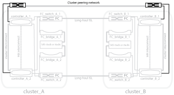

= 集群对等网络的图示
:icons: font
:imagesdir: ../media/

[role="lead"]
MetroCluster 配置中的两个集群通过客户提供的集群对等网络建立对等关系。集群对等支持站点之间的 Storage Virtual Machine （ SVM ，以前称为 Vserver ）的同步镜像。

必须在 MetroCluster 配置中的每个节点上配置集群间 LIF ，并且必须为集群配置对等关系。具有集群间 LIF 的端口将连接到客户提供的集群对等网络。通过配置复制服务在此网络上执行 SVM 配置复制。

link:concept_illustration_of_the_local_ha_pairs_in_a_mcc_configuration.html["MetroCluster 配置中的本地 HA 对示意图"]

link:concept_illustration_of_redundant_fc_to_sas_bridges.html["冗余 FC-SAS 网桥的图示"]

link:concept_redundant_fc_switch_fabrics.html["冗余 FC 交换机网络结构"]

http://docs.netapp.com/ontap-9/topic/com.netapp.doc.exp-clus-peer/home.html["集群和 SVM 对等快速配置"]

link:concept_considerations_peering.html["配置集群对等的注意事项"]

link:task_cable_the_cluster_peering_connections.html["为集群对等连接布线"]

link:concept_configure_the_mcc_software_in_ontap.html["为集群建立对等关系"]
