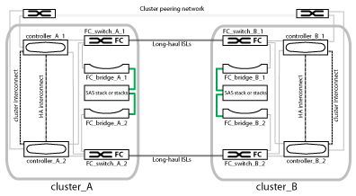

= 光纤 MetroCluster 配置的组成部分
:icons: font
:imagesdir: ../media/

[role="lead"]
在规划 MetroCluster 配置时，您应了解硬件组件及其互连方式。

== 灾难恢复（ DR ）组

一个光纤 MetroCluster 配置包含一个或两个 DR 组，具体取决于 MetroCluster 配置中的节点数。每个 DR 组包含四个节点。

* 一个八节点 MetroCluster 配置包含两个 DR 组。
* 一个四节点 MetroCluster 配置包含一个 DR 组。

下图显示了八节点 MetroCluster 配置中的节点组织：

image::../media/mcc_dr_groups_8_node.gif[MCC DR 组 8 个节点]

下图显示了四节点 MetroCluster 配置中的节点组织：

image::../media/mcc_dr_groups_4_node.gif[MCC DR 组 4 节点]

== 关键硬件要素

MetroCluster 配置包括以下关键硬件元素：

* 存储控制器
+
存储控制器不会直接连接到存储，而是连接到两个冗余 FC 交换机网络结构。

* FC-SAS 网桥
+
FC-SAS 网桥可将 SAS 存储堆栈连接到 FC 交换机，从而在两个协议之间提供桥接。

* FC 交换机
+
FC 交换机可在两个站点之间提供远程输送主干 ISL 。FC 交换机提供了两个存储网络结构，用于向远程存储池镜像数据。

* 集群对等网络
+
集群对等网络可为镜像集群配置（包括 Storage Virtual Machine （ SVM ）配置）提供连接。一个集群上所有 SVM 的配置都会镜像到配对集群。

== 八节点光纤 MetroCluster 配置

一个八节点配置由两个集群组成，每个集群位于不同地理位置的站点上。cluster_A 位于第一个 MetroCluster 站点。cluster_B 位于第二个 MetroCluster 站点。每个站点都有一个 SAS 存储堆栈。支持更多存储堆栈，但每个站点仅显示一个存储堆栈。HA 对配置为无交换机集群，而不使用集群互连交换机。支持有交换机配置，但不会显示此配置。

八节点配置包括以下连接：

* 从每个控制器的 HBA 和 FC-VI 适配器到每个 FC 交换机的 FC 连接
* 从每个 FC-SAS 网桥到 FC 交换机的 FC 连接
* 每个 SAS 磁盘架之间以及从每个堆栈的顶部和底部到 FC-SAS 网桥的 SAS 连接
* 本地 HA 对中的每个控制器之间的 HA 互连
+
如果控制器支持单机箱 HA 对，则 HA 互连是内部的，通过背板进行，这意味着不需要外部互连。

* 从控制器到客户提供的用于集群对等的网络的以太网连接
+
SVM 配置会通过集群对等网络进行复制。

* 本地集群中每个控制器之间的集群互连

== 四节点光纤 MetroCluster 配置

下图显示了一个简化的四节点光纤 MetroCluster 配置视图。对于某些连接，单线表示组件之间的多个冗余连接。未显示数据和管理网络连接。

下图显示了单个 MetroCluster 集群中连接的更详细视图（两个集群的配置相同）：

image::../media/mcc_hardware_architecture_cluster_a_with_7500n.gif[采用 7500n 的 MCC 硬件架构集群 A]

== 双节点光纤 MetroCluster 配置

下图显示了双节点光纤 MetroCluster 配置的简化视图。对于某些连接，单线表示组件之间的多个冗余连接。未显示数据和管理网络连接。

image::../media/mcc_hardware_architecture_both_clusters_2_node_fabric.gif[MCC 硬件架构两个集群的双节点网络结构]

双节点配置由两个集群组成，每个集群位于不同地理位置的站点上。cluster_A 位于第一个 MetroCluster 站点。cluster_B 位于第二个 MetroCluster 站点。每个站点都有一个 SAS 存储堆栈。支持更多存储堆栈，但每个站点仅显示一个存储堆栈。

NOTE: 在双节点配置中，节点不会配置为 HA 对。

下图显示了单个 MetroCluster 集群中连接的更详细视图（两个集群的配置相同）：

image::../media/mcc_hardware_architecture_cluster_a_2_node_with_7500n.gif[MCC 硬件架构集群 A 2 节点，含 7500n]

双节点配置包括以下连接：

* 每个控制器模块上的 FC-VI 适配器之间的 FC 连接
* 从每个控制器模块的 HBA 到每个 SAS 磁盘架堆栈的 FC-SAS 网桥的 FC 连接
* 每个 SAS 磁盘架之间以及从每个堆栈的顶部和底部到 FC-SAS 网桥的 SAS 连接
* 从控制器到客户提供的用于集群对等的网络的以太网连接
+
SVM 配置会通过集群对等网络进行复制。

