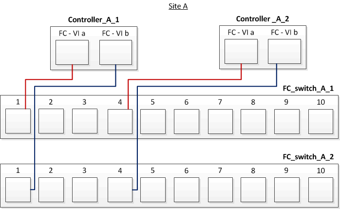

= 在使用阵列 LUN 的四节点光纤连接 MetroCluster 配置中为 FC-VI 和 HBA 端口布线
:allow-uri-read: 
:icons: font
:imagesdir: ../media/

[role="lead"]
如果要设置使用阵列 LUN 的四节点光纤连接 MetroCluster 配置，则必须使用缆线将 FC-VI 端口和 HBA 端口连接到交换机端口。

.关于此任务
* 您必须对两个 MetroCluster 站点上的每个控制器重复此任务。
* 如果您计划在 MetroCluster 配置中除了使用阵列 LUN 外还使用磁盘，则必须使用为使用磁盘配置而指定的 HBA 端口和交换机端口。
+
** link:concept_port_assignments_for_fc_switches_when_using_ontap_9_1_and_later.html["使用 ONTAP 9.1 及更高版本时 FC 交换机的端口分配"]

.步骤
. 使用缆线将每个控制器中的 FC-VI 端口连接到备用 FC 交换机上的端口。
+
以下示例显示了站点 A 上 FC-VI 端口和交换机端口之间的连接：

+

. 在两个 MetroCluster 站点上执行控制器到交换机的布线。
+
您必须确保从控制器到交换机的连接具有冗余性。因此，对于站点上的每个控制器，您必须确保同一端口对中的两个 HBA 端口都连接到备用 FC 交换机。

+
以下示例显示了站点 A 的 HBA 端口和交换机端口之间的连接：

+
image::../media/four_node_mcc_hba_switch_connections.gif[四节点 MCC HBA 交换机连接]

+
下表列出了图中 controller_A_1 上的 HBA 端口与 FC 交换机端口之间的连接：

+
|===

| HBA 端口 | 交换机端口 

2+| * 端口对 * 

 a| 
端口 A
 a| 
FC_switch_A_1 ，端口 2

 a| 
端口 d
 a| 
FC_switch_A_2 ，端口 3

2+| * 端口对 * 

 a| 
端口 b
 a| 
FC_switch_A_2 ，端口 2

 a| 
端口 c
 a| 
FC_switch_A_1 ，端口 3

|===
+
下表列出了图中 controller_A_2 上的 HBA 端口与 FC 交换机端口之间的连接：

+
|===

| HBA 端口 | 交换机端口 

2+| * 端口对 * 

 a| 
端口 A
 a| 
FC_switch_A_1 ，端口 5

 a| 
端口 d
 a| 
FC_switch_A_2 ，端口 6

2+| * 端口对 * 

 a| 
端口 b
 a| 
FC_switch_A_2 ，端口 5

 a| 
端口 c
 a| 
FC_switch_A_1 ，端口 6

|===

.完成后
您应使用缆线连接 MetroCluster 站点中 FC 交换机之间的 ISL 。

.相关信息
在将 ONTAP 系统连接到 FC 交换机以设置使用阵列 LUN 的 MetroCluster 配置时，必须将每个控制器中的 FC-VI 和 HBA 端口连接到特定交换机端口。

link:concept_switch_ports_required_for_a_eight_node_mcc_configuration_with_array_luns.html["使用阵列 LUN 的 MetroCluster 配置所需的交换机端口"]
