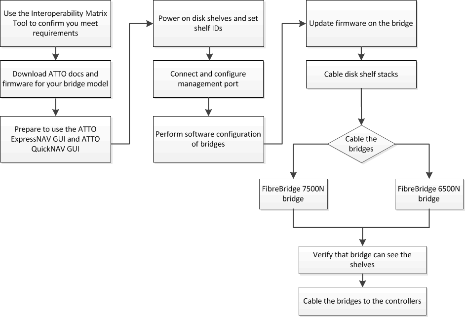

= 安装 FC-SAS 网桥和 SAS 磁盘架
:allow-uri-read: 
:icons: font
:imagesdir: ../media/

[role="lead"]
在向配置添加新存储时，您需要安装 ATTO FibreBridge 网桥和 SAS 磁盘架并为其布线。

.关于此任务
对于从工厂收到的系统， FC-SAS 网桥已进行预配置，不需要进行其他配置。

编写此操作步骤时假定您使用的是建议的网桥管理界面： ATTO ExpressNAV 图形用户界面和 ATTO QuickNAV 实用程序。

您可以使用 ATTO ExpressNAV 图形用户界面配置和管理网桥，以及更新网桥固件。您可以使用 ATTO QuickNAV 实用程序配置网桥以太网管理 1 端口。

如果需要，您可以改用其他管理接口，例如串行端口或 Telnet 来配置和管理网桥并配置以太网管理 1 端口，以及使用 FTP 来更新网桥固件。

此操作步骤使用以下工作流：

== FC-SAS 网桥的带内管理

从使用 FibreBridge 7500N 或 7600N 网桥的 ONTAP 9.5 开始，支持使用网桥的带内管理作为网桥 IP 管理的替代方案。从 ONTAP 9.8 开始，已弃用带外管理。

NOTE: 从 ONTAP 9.8 开始， `storage bridge` 命令将替换为 `ssystem bridge` 。以下步骤显示了 `storage bridge` 命令，但如果您运行的是 ONTAP 9.8 或更高版本，则首选使用 `ssystem bridge` 命令。

使用带内管理时，可以通过 ONTAP 命令行界面通过与网桥的 FC 连接来管理和监控网桥。无需通过网桥以太网端口对网桥进行物理访问，从而减少网桥的安全漏洞。

网桥的带内管理是否可用取决于 ONTAP 的版本：

* 从 ONTAP 9.8 开始，默认情况下，网桥通过带内连接进行管理，而不再使用通过 SNMP 对网桥进行带外管理。
* ONTAP 9.5 至 9.7 ：支持带内管理或带外 SNMP 管理。
* 在 ONTAP 9.5 之前的版本中，仅支持带外 SNMP 管理。

可以从 ONTAP 界面上的 ONTAP interface `storage bridge run-cli -name _bridge_name_ -command _bridge_command_name_` 命令发出网桥命令行界面命令。

NOTE: 建议在禁用IP访问的情况下使用带内管理、以便通过限制与网桥的物理连接来提高安全性。

== 光纤桥7600N和7500 N网桥限制和连接规则

查看连接光纤桥7600N和7500 N网桥时的限制和注意事项。

.光纤桥7600N和7500 N网桥限制
* HDD和SSD驱动器的最大总数为240。
* SSD驱动器的最大数量为96个。
* 每个SAS端口的最大SSD数量为48个。
* 每个SAS端口的最大磁盘架数量为10个。

.光纤桥7600N和7500N网桥连接规则
* 请勿在同一SAS端口上混用SSD和HDD驱动器。
* 在SAS端口之间均匀分布磁盘架。
* 您不应将DS460磁盘架与其他类型的磁盘架(例如、DS212或DS224磁盘架)放置在同一SAS端口上。

.配置示例
下面显示了一个使用SSD驱动器连接四个DS224磁盘架和使用HDD驱动器连接六个DS224磁盘架的配置示例：

[cols="2*"]
|===
| SAS 端口 | 磁盘架和驱动器 

| SAS端口A | 2个带有SSD驱动器的DS224磁盘架 

| SAS端口B | 2个带有SSD驱动器的DS224磁盘架 

| SAS端口C | 3个DS224磁盘架、带HDD驱动器 

| SAS端口D | 3个DS224磁盘架、带HDD驱动器 
|===

== 准备安装

准备在新的 MetroCluster 系统中安装网桥时，必须确保系统满足特定要求，包括满足网桥的设置和配置要求。其他要求包括下载必要的文档， ATTO QuickNAV 实用程序和网桥固件。

.开始之前
* 如果您的系统未安装在系统机柜中，则必须将其安装在机架中。
* 您的配置必须使用支持的硬件型号和软件版本。
+
在中 https://mysupport.netapp.com/matrix["NetApp 互操作性表工具（ IMT ）"]，您可以使用 Storage 解决方案字段选择 MetroCluster 解决方案。您可以使用 * 组件资源管理器 * 来选择组件和 ONTAP 版本以细化搜索范围。您可以单击 * 显示结果 * 以显示与此条件匹配的受支持配置列表。

* 每个 FC 交换机必须有一个 FC 端口可用于连接一个网桥。
* 您必须已熟悉如何处理 SAS 缆线以及磁盘架安装和布线的注意事项和最佳实践。
+
适用于您的磁盘架型号的《安装和服务指南》介绍了注意事项和最佳实践。

* 要使用 ATTO ExpressNAV 图形用户界面，用于设置网桥的计算机必须运行支持 ATTO 的 Web 浏览器。
+
_ATTO 产品发行说明 _ 提供了最新的受支持 Web 浏览器列表。您可以按照以下步骤所述，从 ATTO 网站访问此文档。

.步骤
. 下载适用于您的磁盘架型号的 _Installation and Service Guide_ ：
+
.. 使用为您的 FibreBridge 型号提供的链接访问 ATTO 网站，然后下载手册和 QuickNAV 实用程序。
+
[NOTE]
====
适用于您的型号网桥的 _ATTO FibreBridge 安装和操作手册 _ 提供了有关管理接口的详细信息。

您可以使用 ATTO FibreBridge 说明页面上提供的链接访问此内容以及 ATTO 网站上的其他内容。

====

. 收集使用建议的网桥管理界面， ATTO ExpressNAV GUI 和 ATTO QuickNAV 实用程序所需的硬件和信息：
+
.. 确定非默认用户名和密码（用于访问网桥）。
+
您应更改默认用户名和密码。

.. 如果要配置网桥的 IP 管理，则需要使用网桥随附的屏蔽以太网缆线（用于从网桥以太网管理 1 端口连接到网络）。
.. 如果配置网桥的 IP 管理，则需要每个网桥上以太网管理 1 端口的 IP 地址，子网掩码和网关信息。
.. 在要用于设置的计算机上禁用 VPN 客户端。
+
活动 VPN 客户端对网桥故障进行发生原因 QuickNAV 扫描。

== 安装FC-SAS网桥和SAS磁盘架

确保系统满足 "`准备安装` " 中的所有要求后，您可以安装新系统。

.关于此任务
* 两个站点的磁盘和磁盘架配置应相同。
+
如果使用非镜像聚合，则每个站点的磁盘和磁盘架配置可能会有所不同。

+

NOTE: 灾难恢复组中的所有磁盘都必须使用相同类型的连接，并且对灾难恢复组中的所有节点都可见，而不管用于镜像聚合或非镜像聚合的磁盘是什么。

* 使用 50 微米多模式光缆的磁盘架， FC 交换机和备份磁带设备的最大距离的系统连接要求也适用于 FibreBridge 网桥。
+
https://hwu.netapp.com["NetApp Hardware Universe"^]

[NOTE]
====
支持带内 ACP ，而无需在以下磁盘架和 FibreBridge 7500N 或 7600N 网桥中进行额外布线：

* 采用 ONTAP 9.2 及更高版本的 7500N 或 7600N 网桥背后的 IOM12 （ DS460C ）
* 使用 ONTAP 9.1 及更高版本的 7500N 或 7600N 网桥背后的 IOM12 （ DS212C 和 DS224C ）

====

NOTE: MetroCluster 配置中的 SAS 磁盘架不支持 ACP 布线。

=== 如有必要，在 FibreBridge 7600N 网桥上启用 IP 端口访问

如果您使用的是 9.5 之前的 ONTAP 版本，或者计划使用 telnet 或其他 IP 端口协议和服务（ FTP ， ExpressNAV ， ICMP 或 QuickNAV ）对 FibreBridge 7600N 网桥进行带外访问，则可以通过控制台端口启用访问服务。

.关于此任务
与ATto FABBRIDBRIDge 7500N网桥不同、FABBRIDBRIDge 7600N网桥在出厂时已禁用所有IP端口协议和服务。

从 ONTAP 9.5 开始，支持网桥的带内管理。这意味着可以通过与网桥的 FC 连接从 ONTAP 命令行界面配置和监控网桥。不需要通过网桥以太网端口对网桥进行物理访问，也不需要网桥用户界面。

从 ONTAP 9.8 开始，默认情况下支持网桥的带内管理，并弃用带外 SNMP 管理。

如果您 * 不 * 使用带内管理来管理网桥，则需要执行此任务。在这种情况下，您需要通过以太网管理端口配置网桥。

.步骤
. 将串行缆线连接到光纤桥7600N网桥上的串行端口、以访问网桥控制台界面。
. 使用控制台启用访问服务，然后保存配置：
+
`set closePort none`

+
`saveConfiguration`

+
使用 `set closePort none` 命令可启用网桥上的所有访问服务。

. 如果需要，可发出 `set closePort` 命令并根据需要重复执行此命令，直到禁用所有所需服务为止，以禁用服务：
+
--
`set closePort _service_`

`set closePort` 命令一次禁用一项服务。

参数 ` service_` 可以指定为以下值之一：

** 快速报告
** FTP
** ICMP
** QuickNAV
** SNMP
** Telnet

您可以使用 `get closePort` 命令检查特定协议是否已启用。

--
. 如果要启用 SNMP ，还必须对以下命令执行问题描述：
+
`s设置 SNMP 已启用`

+
SNMP 是唯一需要单独的 enable 命令的协议。

. 保存配置：
+
`saveConfiguration`

=== 配置FC-SAS网桥

在为您的 FC-SAS 网桥型号布线之前，您必须在 FibreBridge 软件中配置设置。

.开始之前
您应决定是否使用网桥的带内管理。

NOTE: 从 ONTAP 9.8 开始， `storage bridge` 命令将替换为 `ssystem bridge` 。以下步骤显示了 `storage bridge` 命令，但如果您运行的是 ONTAP 9.8 或更高版本，则首选使用 `ssystem bridge` 命令。

.关于此任务
如果要使用网桥的带内管理而不是 IP 管理，则可以跳过配置以太网端口和 IP 设置的步骤，如相关步骤中所述。

.步骤
. 通过将端口速度设置为 115000 baud 来配置 ATTO FibreBridge 上的串行控制台端口：
+
[listing]
----
get serialportbaudrate
SerialPortBaudRate = 115200

Ready.

set serialportbaudrate 115200

Ready. *
saveconfiguration
Restart is necessary....
Do you wish to restart (y/n) ? y
----
. 如果配置为带内管理，请使用缆线从 FibreBridge RS -232 串行端口连接到个人计算机上的串行（ COM ）端口。
+
串行连接将用于初始配置，然后通过 ONTAP 进行带内管理， FC 端口可用于监控和管理网桥。

. 如果配置 IP 管理，请使用以太网缆线将每个网桥上的以太网管理 1 端口连接到您的网络。
+
在运行 ONTAP 9.5 或更高版本的系统中，可以使用带内管理通过 FC 端口而非以太网端口访问网桥。从 ONTAP 9.8 开始，仅支持带内管理，而 SNMP 管理已弃用。

+
通过以太网管理 1 端口，您可以快速下载网桥固件（使用 ATTO ExpressNAV 或 FTP 管理界面），并检索核心文件和提取日志。

. 如果要配置 IP 管理，请按照适用于您的网桥型号的 _ATTO FibreBridge 安装和操作手册 _ 第 2.0 节中的操作步骤配置每个网桥的以太网管理 1 端口。
+
在运行 ONTAP 9.5 或更高版本的系统中，可以使用带内管理通过 FC 端口而非以太网端口访问网桥。从 ONTAP 9.8 开始，仅支持带内管理，而 SNMP 管理已弃用。

+
在运行 QuickNAV 配置以太网管理端口时，仅会配置通过以太网缆线连接的以太网管理端口。例如，如果您还希望配置以太网管理 2 端口，则需要将以太网缆线连接到端口 2 并运行 QuickNAV 。

. 配置网桥。
+
您应记下指定的用户名和密码。

+

NOTE: 请勿在 ATTO FibreBridge 7600N 或 7500N 上配置时间同步。在 ONTAP 发现网桥后， ATTO FibreBridge 7600N 或 7500N 的时间同步设置为集群时间。它还会每天定期同步一次。使用的时区为 GMT ，不可更改。

+
.. 如果要配置 IP 管理，请配置网桥的 IP 设置。
+
在运行 ONTAP 9.5 或更高版本的系统中，可以使用带内管理通过 FC 端口而非以太网端口访问网桥。从 ONTAP 9.8 开始，仅支持带内管理，而 SNMP 管理已弃用。

+
要在不使用 QuickNAV 实用程序的情况下设置 IP 地址，您需要与 FibreBridge 建立串行连接。

+
如果使用命令行界面，则必须运行以下命令：

+
`set ipaddress MP1 ip-address`

+
`set ipsubnetmask MP1 subnet-mask`

+
`set ipgateway MP1 x.x.x.x`

+
`set ipdhcp MP1 disabled`

+
`s设定网络速度 MP1 1000`

.. 配置网桥名称。
+
--
在 MetroCluster 配置中，每个网桥都应具有唯一的名称。

每个站点上一个堆栈组的网桥名称示例：

*** bridge_A_1a
*** bridge_A_1b
*** bridge_B_1a
*** bridge_B_1b

如果使用命令行界面，则必须运行以下命令：

`set bridgename _bridge_name_`

--
.. 如果运行的是 ONTAP 9.4 或更早版本，请在网桥上启用 SNMP ：
+
`s设置 SNMP 已启用`

+
在运行 ONTAP 9.5 或更高版本的系统中，可以使用带内管理通过 FC 端口而非以太网端口访问网桥。从 ONTAP 9.8 开始，仅支持带内管理，而 SNMP 管理已弃用。

. 配置网桥 FC 端口。
+
.. 配置网桥 FC 端口的数据速率 / 速度。
+
--
支持的 FC 数据速率取决于您的网桥型号。

*** 此光纤桥接器7600N最多支持32、16或8 Gbps。
*** 此光纤桥接器的速率高达16、8或4 Gbps。

NOTE: 您选择的 FCDataRate 速度限制为网桥端口所连接的控制器模块的网桥和 FC 端口均支持的最大速度。布线距离不得超过 SFP 和其他硬件的限制。

如果使用命令行界面，则必须运行以下命令：

`set FCDataRate <port-number> <port-speed>`

--
.. 如果要配置一个光纤桥接器、请将端口使用的连接模式配置为"ptp-"。
+

NOTE: 配置 FibreBridge 7600N 网桥时，不需要 FCConnMode 设置。

+
如果使用命令行界面，则必须运行以下命令：

+
`set FCConnMode <port-number> ptp`

.. 如果要配置 FibreBridge 7600N 或 7500N 网桥，则必须配置或禁用 FC2 端口。
+
*** 如果使用的是第二个端口，则必须对 FC2 端口重复上述子步骤。
*** 如果不使用第二个端口，则必须禁用此端口：
+
`FCPortDisable <port-number>`

+
以下示例显示了如何禁用 FC 端口 2 ：

+
[listing]
----
FCPortDisable 2

Fibre Channel Port 2 has been disabled.

----

.. 如果要配置 FibreBridge 7600N 或 7500N 网桥，请禁用未使用的 SAS 端口：
+
--
`sasportDisable _SAS-port_`

NOTE: 默认情况下， SAS 端口 A 到 D 处于启用状态。您必须禁用未使用的 SAS 端口。

如果仅使用 SAS 端口 A ，则必须禁用 SAS 端口 B ， C 和 D 。以下示例显示了禁用 SAS 端口 B您必须同样禁用 SAS 端口 C 和 D ：

[listing]
----
SASPortDisable b

SAS Port B has been disabled.
----
--

. 安全访问网桥并保存网桥的配置。根据您的系统运行的 ONTAP 版本，从下方选择一个选项。
+
[cols="1,3"]
|===

| ONTAP 版本 | 步骤 

 a| 
* ONTAP 9.5 或更高版本 *
 a| 
.. 查看网桥的状态：
+
`storage bridge show`

+
输出将显示哪个网桥未受保护。

.. 保护网桥：
+
`securebridge`

 a| 
* ONTAP 9.4 或更早版本 *
 a| 
.. 查看网桥的状态：
+
`storage bridge show`

+
输出将显示哪个网桥未受保护。

.. 检查不安全网桥端口的状态：
+
`信息`

+
输出将显示以太网端口 MP1 和 MP2 的状态。

.. 如果已启用以太网端口 MP1 ，请运行：
+
`sET EthernetPort MP1 disabled`

+
如果以太网端口 MP2 也已启用，请对端口 MP2 重复上述子步骤。

.. 保存网桥的配置。
+
您必须运行以下命令：

+
`saveConfiguration`

+
`FirmwareRestart`

+
系统将提示您重新启动网桥。

|===
. 完成 MetroCluster 配置后，使用 `flashimages` 命令检查您的 FibreBridge 固件版本，如果网桥未使用支持的最新版本，请更新配置中所有网桥上的固件。
+
link:../maintain/index.html["维护 MetroCluster 组件"]

=== 使用缆线将一个光纤桥7600N或7500 N网桥连接到使用IOM12模块的磁盘架

配置网桥后，您可以开始为新系统布线。

.关于此任务
对于磁盘架，您可以插入 SAS 缆线连接器，拉片朝下（位于连接器的下侧）。

.步骤
. 以菊花链方式连接每个堆栈中的磁盘架：
+
.. 从堆栈中的第一个逻辑磁盘架开始、将IOM A端口3连接到下一个磁盘架上的IOM A端口1、直到堆栈中的每个IOM A都已连接。
.. 对 IOM B 重复上述子步骤
.. 对每个堆栈重复上述子步骤。

+
适用于您的磁盘架型号的《安装和服务指南》提供了有关以菊花链方式连接磁盘架的详细信息。

. 打开磁盘架电源，然后设置磁盘架 ID 。
+
** 您必须重新启动每个磁盘架。
** 每个 MetroCluster DR 组（包括两个站点）中的每个 SAS 磁盘架的磁盘架 ID 必须是唯一的。

. 使用缆线将磁盘架连接到 FibreBridge 网桥。
+
.. 对于第一个磁盘架堆栈，使用缆线将第一个磁盘架的 IOM A 连接到 FibreBridge A 上的 SAS 端口 A ，并使用缆线将最后一个磁盘架的 IOM B 连接到 FibreBridge B 上的 SAS 端口 A
.. 对于其他磁盘架堆栈，请使用 FibreBridge 网桥上的下一个可用 SAS 端口重复上一步，第二个堆栈使用端口 B ，第三个堆栈使用端口 C ，第四个堆栈使用端口 D 。
.. 布线时，将基于 IOM12 模块的堆栈连接到同一个桥接器，只要它们连接到单独的 SAS 端口即可。
+
--

NOTE: 每个堆栈可以使用不同型号的 IOM ，但一个堆栈中的所有磁盘架都必须使用相同型号。

下图显示了连接到一对 FibreBridge 7600N 或 7500N 网桥的磁盘架：

image::../media/mcc_cabling_bridge_and_sas3_stack_with_7500n_and_multiple_stacks.gif[具有多个 SAS3 堆栈的 FibreBridge 的MetroCluster布线]

--

=== 验证网桥连接并为网桥FC端口布线

您应验证每个网桥是否可以检测到所有磁盘驱动器，然后使用缆线将每个网桥连接到本地 FC 交换机。

.步骤
. 【【第 1 步网桥】验证每个网桥是否都能检测到它所连接的所有磁盘驱动器和磁盘架：
+
[cols="1,3"]
|===

| 如果您使用的是 ... | 那么 ... 

 a| 
ATTO ExpressNAV 图形用户界面
 a| 
.. 在支持的 Web 浏览器中，在浏览器框中输入网桥的 IP 地址。
+
此时，您将转到输入 IP 地址的网桥的 ATTO FibreBridge 主页，其中包含一个链接。

.. 单击此链接，然后输入您的用户名以及在配置网桥时指定的密码。
+
此时将显示网桥的 ATTO FibreBridge 状态页面，左侧有一个菜单。

.. 单击 * 高级 * 。
.. 使用 sastargets 命令查看已连接的设备，然后单击 * 提交 * 。

 a| 
串行端口连接
 a| 
查看已连接的设备：

`s星网`

|===
+
输出将显示网桥连接到的设备（磁盘和磁盘架）。输出行按顺序编号，以便您可以快速统计设备数量。例如，以下输出显示已连接 10 个磁盘：

+
[listing]
----
Tgt VendorID ProductID        Type        SerialNumber
  0 NETAPP   X410_S15K6288A15 DISK        3QP1CLE300009940UHJV
  1 NETAPP   X410_S15K6288A15 DISK        3QP1ELF600009940V1BV
  2 NETAPP   X410_S15K6288A15 DISK        3QP1G3EW00009940U2M0
  3 NETAPP   X410_S15K6288A15 DISK        3QP1EWMP00009940U1X5
  4 NETAPP   X410_S15K6288A15 DISK        3QP1FZLE00009940G8YU
  5 NETAPP   X410_S15K6288A15 DISK        3QP1FZLF00009940TZKZ
  6 NETAPP   X410_S15K6288A15 DISK        3QP1CEB400009939MGXL
  7 NETAPP   X410_S15K6288A15 DISK        3QP1G7A900009939FNTT
  8 NETAPP   X410_S15K6288A15 DISK        3QP1FY0T00009940G8PA
  9 NETAPP   X410_S15K6288A15 DISK        3QP1FXW600009940VERQ
----
+

NOTE: 如果输出的开头显示文本`response uncated`、则可以使用Telnet连接到网桥并输入相同的命令来查看所有输出。

. 验证命令输出是否显示网桥已连接到其应连接到的堆栈中的所有磁盘和磁盘架。
+
[cols="1,3"]
|===

| 如果输出为 ... | 那么 ... 

 a| 
正确
 a| 
重复 <<step1_bridge,第 1 步>> 其余每个网桥。

 a| 
不正确
 a| 
.. 重复布线，检查 SAS 缆线是否松动或更正 SAS 布线。
+
<<使用缆线将一个光纤桥7600N或7500 N网桥连接到使用IOM12模块的磁盘架>>

.. 重复 <<step1_bridge,第 1 步>>。

|===
. 按照您的配置和交换机型号以及 FC-SAS 网桥型号对应的表中的布线方式，使用缆线将每个网桥连接到本地 FC 交换机：
+

IMPORTANT: 分区完成之前，不应使用缆线连接 FibreBridge 7500N 网桥上的第二个 FC 端口连接。

+
请参见适用于您的 ONTAP 版本的端口分配。

. 对配对站点的网桥重复上述步骤。

.相关信息
您需要验证在连接 FC 交换机时是否使用了指定的端口分配。

link:concept_port_assignments_for_fc_switches_when_using_ontap_9_1_and_later.html["FC 交换机的端口分配"]

== 保护或取消保护 FibreBridge 网桥

要轻松禁用网桥上可能不安全的以太网协议，从 ONTAP 9.5 开始，您可以保护网桥。此操作将禁用网桥的以太网端口。您还可以重新启用以太网访问。

.关于此任务
* 保护网桥将禁用网桥上的 telnet 以及其他 IP 端口协议和服务（ FTP ， ExpressNAV ， ICMP 或 QuickNAV ）。
* 此操作步骤使用 ONTAP 提示符进行带外管理，此提示符从 ONTAP 9.5 开始提供。
+
如果不使用带外管理，则可以从网桥命令行界面对命令进行问题描述。

* 可以使用 `unsecurebridge` 命令重新启用以太网端口。
* 在 ONTAP 9.7 及更早版本中，在 ATTO FibreBridge 上运行 `securebridge` 命令可能无法正确更新配对集群上的网桥状态。如果发生这种情况，请从配对集群运行 `securebridge` 命令。

NOTE: 从 ONTAP 9.8 开始， `storage bridge` 命令将替换为 `ssystem bridge` 。以下步骤显示了 `storage bridge` 命令，但如果您运行的是 ONTAP 9.8 或更高版本，则首选使用 `ssystem bridge` 命令。

.步骤
. 在包含网桥的集群的 ONTAP 提示符处，保护或取消安全网桥。
+
** 以下命令可保护 bridge_A_1 的安全：
+
`cluster_A> storage bridge run-cli -bridge bridge_A_1 -command securebridge`

** 以下命令将取消 bridge_A_1 的安全保护：
+
`cluster_A> storage bridge run-cli -bridge bridge_A_1 -command unsecurebridge`

. 从包含网桥的集群的 ONTAP 提示符处，保存网桥配置：
+
`storage bridge run-cli -bridge _bridge-name_ -command saveconfiguration`

+
以下命令可保护 bridge_A_1 的安全：

+
`cluster_A> storage bridge run-cli -bridge bridge_A_1 -command saveconfiguration`

. 从包含网桥的集群的 ONTAP 提示符处，重新启动网桥的固件：
+
`storage bridge run-cli -bridge _bridge-name_ -command firmwarerestart`

+
以下命令可保护 bridge_A_1 的安全：

+
`cluster_A> storage bridge run-cli -bridge bridge_A_1 -command firmwarerestart`

