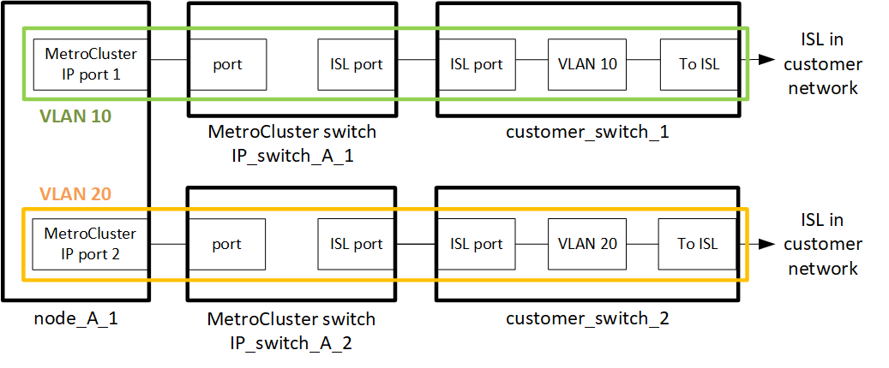

= 在共享的第2层或第3层网络中部署MetroCluster时的注意事项
:allow-uri-read: 

[role="lead"]
根据您的要求、您可以使用共享的第2层或第3层网络来部署MetroCluster。

从ONTAP 9.6开始、使用受支持的Cisco交换机的MetroCluster IP配置可以为交换机间链路(Inter-Switch Link、ISL)共享现有网络、而不是使用专用的MetroCluster ISL。此拓扑称为_shared Layer 2 networks_。

从 ONTAP 9.1.1 开始，可以使用 IP 路由（第 3 层）后端连接实施 MetroCluster IP 配置。此拓扑称为_shared Layer 3 networks_。

[NOTE]
====
* 您必须确认网络容量充足、并且ISL大小适合您的配置。低延迟对于在 MetroCluster 站点之间复制数据至关重要。这些连接上的延迟问题可能会影响客户端 I/O
* 所有提及的MetroCluster后端交换机均指经过NetApp验证或符合MetroCluster的交换机。请参见 link:mcc-compliant-netapp-validated-switches.html["经过NetApp验证且符合MetroCluster标准的交换机"] 有关详细信息：

====

== 第2层和第3层网络的ISL要求

以下适用场景第2层和第3层网络：

* MetroCluster交换机与中间网络交换机之间的速度和数量不需要匹配。同样、中间网络交换机之间的速度也不需要匹配。
+
例如、MetroCluster交换机可以使用一个40 Gbps ISL连接到中间交换机、而中间交换机可以使用两个100 Gbps ISL彼此连接。

* 应在中间网络上配置网络监控、以监控CRL的利用率、错误(丢弃、链路翻盖、损坏等)、 和故障。
* 在传输MetroCluster端到端流量的所有端口上、MTU大小必须设置为9216。
* 任何其他流量的优先级都不能高于服务级别(Class of service、余量) 5。
* 必须在传输端到端MetroCluster流量的所有路径上配置显式拥塞通知(ECN)。
* 传输 MetroCluster 流量的 ISL 必须是交换机之间的原生链路。
+
不支持多协议标签交换（ MPLS ）链路等链路共享服务。

* 第2层VLAN必须本机跨越站点。不支持虚拟可扩展 LAN （ VXLAN ）等 VLAN 覆盖。
* 中间交换机的数量不受限制。但是、NetApp建议您将交换机数量保持在所需的最小值。
* MetroCluster交换机上的ISL配置有以下内容：
+
** 作为LACP端口通道的一部分、交换机端口模式为"TRUN"
** MTU大小为9216
** 未配置本机VLAN
** 仅允许传输跨站点MetroCluster流量的VLAN
** 不允许使用交换机默认VLAN

== 第2层网络的注意事项

MetroCluster后端交换机连接到客户网络。

客户提供的中间交换机必须满足以下要求：

* 中间网络必须在两个站点之间提供相同的VLAN。此VLAN必须与RCF文件中设置的MetroCluster VLAN匹配。
* RcfFileGenerator 不允许使用平台不支持的 VLAN 创建 RCF 文件。
* RcfFileGenerator可能会限制某些VLAN ID的使用、例如、如果这些VLAN ID是将来使用的。通常，预留的 VLAN 最多为 100 个，其中包括 100 个。
* ID 与 MetroCluster VLAN ID 匹配的第 2 层 VLAN 必须跨越共享网络。

.ONTAP中的VLAN配置
只能在创建接口期间指定VLAN。您可以配置默认VLAN 10和20、也可以配置介于101到4096 (或交换机供应商支持的数量、以较低的数量为准)范围内的VLAN。创建MetroCluster接口后、您将无法更改VLAN ID。

NOTE: 某些交换机供应商可能会保留对某些VLAN的使用。

以下系统不需要在ONTAP中配置VLAN。VLAN由交换机端口配置指定：

* FAS8200 和 AFF A300
* AFF A320
* FAS9000和AFF A700
* AFF A800、ASA A800、AFF C800和ASA C800
+

NOTE: 上面列出的系统可能是使用VLAN 100及以下配置的。但是、此范围内的某些VLAN可能会保留供其他或将来使用。

对于所有其他系统、在ONTAP中创建MetroCluster接口时必须配置VLAN。需遵守以下限制：

* 默认VLAN为10和20
* 如果您运行的是ONTAP 9.7或更早版本、则只能使用默认VLAN 10和20。
* 如果您运行的是ONTAP 9.8或更高版本、则可以使用默认VLAN 10和20、也可以使用超过100的VLAN (101及更高版本)。

== 第3层网络的注意事项

MetroCluster 后端交换机连接到路由的 IP 网络，可以直接连接到路由器（如以下简化示例所示），也可以通过其他中间交换机进行连接。

image::../media/mcc_layer3_backend.png[MCC layer3 后端]

MetroCluster 环境作为标准 MetroCluster IP 配置进行配置和布线，如中所述 link:https://docs.netapp.com/us-en/ontap-metrocluster/install-ip/concept_parts_of_an_ip_mcc_configuration_mcc_ip.html["配置 MetroCluster 硬件组件"]。在执行操作步骤安装和布线时、必须执行特定于第3层配置的步骤。以下适用场景第3层配置：

* 您可以将MetroCluster交换机直接连接到路由器或一个或多个中间交换机。
* 您可以将MetroCluster IP接口直接连接到路由器或中间的交换机之一。
* VLAN 必须扩展到网关设备。
* 您可以使用 `-gateway parameter` 使用IP网关地址配置MetroCluster IP接口地址。
* 每个站点上的 MetroCluster VLAN 的 VLAN ID 必须相同。但是，子网可能有所不同。
* MetroCluster 流量不支持动态路由。
* 不支持以下功能：
+
** 八节点 MetroCluster 配置
** 刷新四节点MetroCluster配置
** 从 MetroCluster FC 过渡到 MetroCluster IP

* 每个 MetroCluster 站点需要两个子网—每个网络一个子网。
* 不支持自动 IP 分配。

配置路由器和网关IP地址时、必须满足以下要求：

* 一个节点上的两个接口不能具有相同的网关IP地址。
* 每个站点的 HA 对上的相应接口必须具有相同的网关 IP 地址。
* 节点上的相应接口及其 DR 和 AUX 配对节点不能具有相同的网关 IP 地址。
* 节点上的相应接口及其 DR 和 AUX 配对节点必须具有相同的 VLAN ID 。

== 中间交换机所需的设置

当MetroCluster流量遍历中间网络中的ISL时、您应验证中间交换机的配置是否可确保MetroCluster流量(RDMA和存储)在MetroCluster站点之间的整个路径中满足所需的服务级别。

下图概述了使用经过NetApp验证的Cisco交换机时所需的设置：

image::../media/switch_traffic_with_cisco_switches.png[Cisco 交换机的交换机流量]

下图概述了外部交换机为Broadcom IP交换机时共享网络所需的设置。

image::../media/switch_traffic_with_broadcom_switches.png[使用 Broadcom 交换机传输交换机流量]

在此示例中，将为 MetroCluster 流量创建以下策略和映射：

* 。 `MetroClusterIP_ISL_Ingress` 策略将应用于连接到MetroCluster IP交换机的中间交换机上的端口。
+
。 `MetroClusterIP_ISL_Ingress` 策略会将传入的带标记流量映射到中间交换机上的相应队列。

* 答 `MetroClusterIP_ISL_Egress` 策略将应用于中间交换机上连接到中间交换机之间的ISL的端口。
* 您必须在 MetroCluster IP 交换机之间的路径上为中间交换机配置匹配的 QoS 访问映射，类映射和策略映射。中间交换机会将 RDMA 流量映射到 COS5 ，并将存储流量映射到 COS4 。

以下示例适用于Cisco Nexus 3232C和9336C-尊 从交换机。根据您的交换机供应商和型号、您必须验证中间交换机是否具有适当的配置。

.为中间交换机ISL端口配置类映射
以下示例显示了根据入口时是否需要对流量进行分类或匹配而定义的类映射。

[role="tabbed-block"]
====
.对传入流量进行分类：
--
[listing]
----
ip access-list rdma
  10 permit tcp any eq 10006 any
  20 permit tcp any any eq 10006
ip access-list storage
  10 permit tcp any eq 65200 any
  20 permit tcp any any eq 65200

class-map type qos match-all rdma
  match access-group name rdma
class-map type qos match-all storage
  match access-group name storage
----
--
.匹配入口流量：
--
[listing]
----
class-map type qos match-any c5
  match cos 5
  match dscp 40
class-map type qos match-any c4
  match cos 4
  match dscp 32
----
--
====
.在中间交换机的ISL端口上创建入口策略映射：
以下示例显示了如何根据您是否需要对传入流量进行分类或匹配来创建入口策略映射。

[role="tabbed-block"]
====
.对传入流量进行分类：
--
[listing]
----
policy-map type qos MetroClusterIP_ISL_Ingress_Classify
  class rdma
    set dscp 40
    set cos 5
    set qos-group 5
  class storage
    set dscp 32
    set cos 4
    set qos-group 4
  class class-default
    set qos-group 0
----
--
.与入口流量匹配：
--
[listing]
----
policy-map type qos MetroClusterIP_ISL_Ingress_Match
  class c5
    set dscp 40
    set cos 5
    set qos-group 5
  class c4
    set dscp 32
    set cos 4
    set qos-group 4
  class class-default
    set qos-group 0
----
--
====
.为ISL端口配置传出队列策略
以下示例显示了如何配置外出队列策略：

[listing]
----
policy-map type queuing MetroClusterIP_ISL_Egress
   class type queuing c-out-8q-q7
      priority level 1
   class type queuing c-out-8q-q6
      priority level 2
   class type queuing c-out-8q-q5
      priority level 3
      random-detect threshold burst-optimized ecn
   class type queuing c-out-8q-q4
      priority level 4
      random-detect threshold burst-optimized ecn
   class type queuing c-out-8q-q3
      priority level 5
   class type queuing c-out-8q-q2
      priority level 6
   class type queuing c-out-8q-q1
      priority level 7
   class type queuing c-out-8q-q-default
      bandwidth remaining percent 100
      random-detect threshold burst-optimized ecn
----
必须对传输MetroCluster流量的所有交换机和ISL应用这些设置。

在此示例中、Q4和Q5配置了 `random-detect threshold burst-optimized ecn`。根据您的配置、您可能需要设置最小和最大阈值、如以下示例所示：

[listing]
----
class type queuing c-out-8q-q5
  priority level 3
  random-detect minimum-threshold 3000 kbytes maximum-threshold 4000 kbytes drop-probability 0 weight 0 ecn
class type queuing c-out-8q-q4
  priority level 4
  random-detect minimum-threshold 2000 kbytes maximum-threshold 3000 kbytes drop-probability 0 weight 0 ecn
----

NOTE: 最小值和最大值因交换机和您的要求而异。

.示例1：Cisco
如果您的配置包含Cisco交换机、则无需对中间交换机的第一个传入端口进行分类。然后配置以下映射和策略：

* `class-map type qos match-any c5`
* `class-map type qos match-any c4`
* `MetroClusterIP_ISL_Ingress_Match`

您分配 `MetroClusterIP_ISL_Ingress_Match` 策略映射到传输MetroCluster流量的ISL端口。

.示例2：Broadcom
如果您的配置包含Broadcom交换机、则必须对中间交换机的第一个传入端口进行分类。然后配置以下映射和策略：

* `ip access-list rdma`
* `ip access-list storage`
* `class-map type qos match-all rdma`
* `class-map type qos match-all storage`
* `MetroClusterIP_ISL_Ingress_Classify`
* `MetroClusterIP_ISL_Ingress_Match`

您可以分配 `the MetroClusterIP_ISL_Ingress_Classify` 策略映射到连接Broadcom交换机的中间交换机上的ISL端口。

您分配 `MetroClusterIP_ISL_Ingress_Match` 策略映射到传输MetroCluster流量但未连接Broadcom交换机的中间交换机上的ISL端口。
