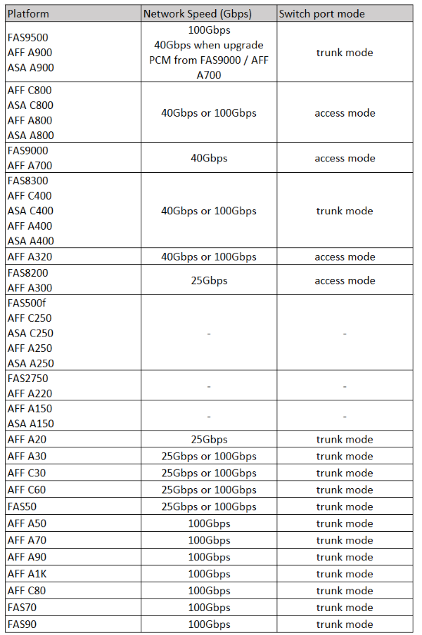

= 适用于MetroCluster兼容交换机的ONTAP平台特定网络速度和交换机端口模式
:allow-uri-read: 
:icons: font
:imagesdir: ../media/

[role="lead"]
如果您使用的是符合MetroCluster的交换机、则应了解特定平台的网络速度和交换机端口模式要求。

下表提供了MetroCluster兼容交换机的平台特定网络速度和交换机端口模式。您应根据表配置交换机端口模式。

[NOTE]
====
* 缺少值表示此平台无法与MetroCluster兼容的交换机结合使用。
* AFF A30、AFF C30、AFF C60和FAS50系统需要在控制器上的卡中安装QSFP-SFP+适配器、才能支持25 Gbps网络速度。

====

