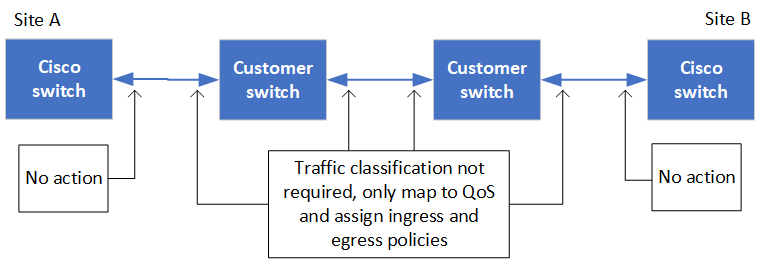
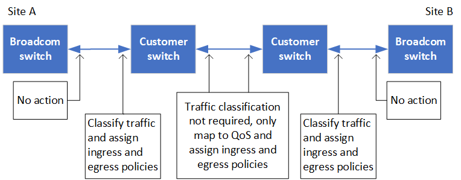

= 共享私有第 2 层网络的注意事项
:icons: font
:imagesdir: ../media/

[role="lead"]
从 ONTAP 9.6 开始，使用支持的 Cisco 交换机的 MetroCluster IP 配置可以共享 ISL 的现有网络，而不是使用专用的 MetroCluster ISL 。早期的 ONTAP 版本需要专用 ISL 。

MetroCluster IP 交换机专用于 MetroCluster 配置，不能共享。因此，一组 MetroCluster IP 交换机只能连接一个 MetroCluster 配置。只有 MetroCluster IP 交换机上的 MetroCluster ISL 端口才能连接到共享交换机。

CAUTION: 如果使用共享网络，则客户负责满足共享网络中的 MetroCluster 网络要求。

== ISL 要求

您必须满足中的要求：

* link:../install-ip/concept_considerations_isls.html#basic-metrocluster-isl-requirements["MetroCluster ISL 的基本要求"]
* link:../install-ip/concept_considerations_isls.html#isl-requirements-in-shared-layer-2-networks["共享第 2 层网络中的 ISL 要求"]

== 中间交换机上的必需设置

在共享网络中共享 ISL 流量时，客户提供的中间交换机配置必须确保 MetroCluster 流量（ RDMA 和存储）在 MetroCluster 站点之间的整个路径上满足所需的服务级别。

以下示例适用于 Cisco Nexus 3000 交换机和 IP Broadcom 交换机。根据交换机供应商和型号，您必须确保中间交换机具有等效配置。

=== Cisco Nexus 交换机

下图概述了外部交换机为 Cisco 交换机时共享网络所需的设置。

在此示例中，将为 MetroCluster 流量创建以下策略和映射：

* MetroClusterIP_Ingress 策略应用于连接到 MetroCluster IP 交换机的中间交换机上的端口。
+
MetroClusterIP_Ingress 策略会将传入的已标记流量映射到中间交换机上的相应队列。标记发生在节点端口上，而不是 ISL 上。在 ISL 上使用相同端口的非 MetroCluster 流量仍会保留在默认队列中。

* MetroClusterIP_Egress 策略应用于中间交换机上连接到中间交换机之间 ISL 的端口

您必须在 MetroCluster IP 交换机之间的路径上为中间交换机配置匹配的 QoS 访问映射，类映射和策略映射。中间交换机会将 RDMA 流量映射到 COS5 ，并将存储流量映射到 COS4 。

以下示例显示了客户提供的 Cisco Nexus 3000 交换机的配置。如果您使用的是 Cisco 交换机，则可以使用示例在路径上配置交换机，而不会遇到太多困难。如果您没有 Cisco 交换机，则必须确定中间交换机并对其应用等效配置。

以下示例显示了类映射定义：

NOTE: 此示例适用于使用 Cisco MetroCluster IP 交换机的配置。无论传输未连接到 MetroCluster IP 交换机的 MetroCluster 流量的交换机类型如何，您都可以按照此示例进行操作。

[listing]
----
class-map type qos match-all rdma
   match cos 5
class-map type qos match-all storage
   match cos 4
----
以下示例显示了策略映射定义：

[listing]
----
policy-map type qos MetroClusterIP_Ingress
   class rdma
      set dscp 40
      set cos 5
      set qos-group 5
   class storage
      set dscp 32
      set cos 4
      set qos-group 4
policy-map type queuing MetroClusterIP_Egress
   class type queuing c-out-8q-q7
      priority level 1
   class type queuing c-out-8q-q6
      priority level 2
   class type queuing c-out-8q-q5
      priority level 3
      random-detect threshold burst-optimized ecn
   class type queuing c-out-8q-q4
      priority level 4
      random-detect threshold burst-optimized ecn
   class type queuing c-out-8q-q3
      priority level 5
   class type queuing c-out-8q-q2
      priority level 6
   class type queuing c-out-8q-q1
      priority level 7
   class type queuing c-out-8q-q-default
      bandwidth remaining percent 100
      random-detect threshold burst-optimized ecn
----

=== MetroCluster IP Broadcom 交换机

下图概述了外部交换机为 IP Broadcom 交换机时共享网络所需的设置。

使用 MetroCluster IP Broadcom 交换机进行配置需要额外配置：

* 对于外部交换机，您必须配置访问和类映射，以便对传入客户网络的流量进行分类。
+

NOTE: 使用 MetroCluster IP 交换机的配置不需要执行此操作。

+
以下示例显示了如何在第一个和最后一个客户交换机上配置访问和类映射，这些交换机在 MetroCluster IP Broadcom 交换机之间连接 ISL 。

[listing]
----
ip access-list storage
  10 permit tcp any eq 65200 any
  20 permit tcp any any eq 65200
ip access-list rdma
  10 permit tcp any eq 10006 any
  20 permit tcp any any eq 10006

class-map type qos match-all storage
  match access-group name storage
class-map type qos match-all rdma
  match access-group name rdma
----
* 您需要将此传入策略分配给第一个客户交换机上的 ISL 交换机端口。
+
以下示例显示了类映射定义：

+

NOTE: 此示例适用于使用 Cisco MetroCluster IP 交换机的配置。无论传输未连接到 MetroCluster IP 交换机的 MetroCluster 流量的交换机类型如何，您都可以按照此示例进行操作。

+
[listing]
----
class-map type qos match-all rdma
   match cos 5
class-map type qos match-all storage
   match cos 4
----
+
以下示例显示了策略映射定义：

+
[listing]
----
policy-map type qos MetroClusterIP_Ingress
   class rdma
      set dscp 40
      set cos 5
      set qos-group 5
   class storage
      set dscp 32
      set cos 4
      set qos-group 4
policy-map type queuing MetroClusterIP_Egress
   class type queuing c-out-8q-q7
      priority level 1
   class type queuing c-out-8q-q6
      priority level 2
   class type queuing c-out-8q-q5
      priority level 3
      random-detect threshold burst-optimized ecn
   class type queuing c-out-8q-q4
      priority level 4
      random-detect threshold burst-optimized ecn
   class type queuing c-out-8q-q3
      priority level 5
   class type queuing c-out-8q-q2
      priority level 6
   class type queuing c-out-8q-q1
      priority level 7
   class type queuing c-out-8q-q-default
      bandwidth remaining percent 100
      random-detect threshold burst-optimized ecn
----

=== 中间客户交换机

* 对于中间客户交换机，您必须将出口策略分配给 ISL 交换机端口。
* 对于路径上传输 MetroCluster 流量的所有其他内部交换机，请按照 _Cisco Nexus 3000 交换机 _ 一节中的类映射和策略映射示例进行操作。

== MetroCluster 网络拓扑示例

从 ONTAP 9.6 开始， MetroCluster IP 配置支持某些共享 ISL 网络配置。

=== 使用直接链路的共享网络配置

在此拓扑中，两个不同的站点通过直接链路进行连接。这些链路可以位于波长分复用设备（ xWDM ）或交换机之间。ISL 的容量不专用于 MetroCluster 流量，而是与其他流量共享。

ISL 容量必须满足最低要求。根据您使用的是 xWDM 设备还是交换机，可能会采用不同的网络配置组合。

image::../media/mcc_ip_networking_with_shared_isls.gif[使用共享 ISL 建立 MCC IP 网络]

=== 使用中间网络的共享基础架构

在此拓扑中， MetroCluster IP 核心交换机流量和主机流量通过非 NetApp 提供的网络传输。网络基础架构和链路（包括租用的直接链路）不在 MetroCluster 配置中。网络可以包含一系列 xWDM 和交换机，但与直接 ISL 的共享配置不同，这些链路不会在站点之间直接建立。根据站点之间的基础架构，可以任意组合网络配置。中间基础架构表示为 "`云` " （站点之间可以存在多个设备），但它仍由客户控制。通过此中间基础架构的容量不专用于 MetroCluster 流量，而是与其他流量共享。

VLAN 和网络 xWDM 或交换机配置必须满足最低要求。

image::../media/mcc_ip_networking_with_intermediate_private_networks.gif[使用中间专用网络的 MCC IP 网络]

=== 两个 MetroCluster 配置共享一个中间网络

在此拓扑中，两个单独的 MetroCluster 配置共享同一个中间网络。在此示例中， MetroCluster One switch_A_1 和 MetroCluster two switch_A_1 均连接到同一中间交换机。

此示例仅供说明之用：

image::../media/mcc_ip_two_mccs_sharing_the_same_shared_network_sx.gif[MCC IP 两个 MCC 共享同一共享网络 sx]

=== 两个 MetroCluster 配置，其中一个直接连接到中间网络

从 ONTAP 9.7 开始，支持此拓扑。两个单独的 MetroCluster 配置共享同一个中间网络，一个 MetroCluster 配置的节点直接连接到中间交换机。

MetroCluster One 是一种使用 NetApp 验证的交换机， ONTAP 9.6 和共享拓扑的 MetroCluster 配置。MetroCluster 2 是一种使用 NetApp 兼容交换机和 ONTAP 9.7 的 MetroCluster 配置。

NOTE: 中间交换机必须符合 NetApp 规格。

此示例仅供说明之用：

image::../media/mcc_ip_unsupported_two_mccs_direct_to_shared_switches.png[MCC IP 不支持两个直接连接到共享交换机的 MCC]
