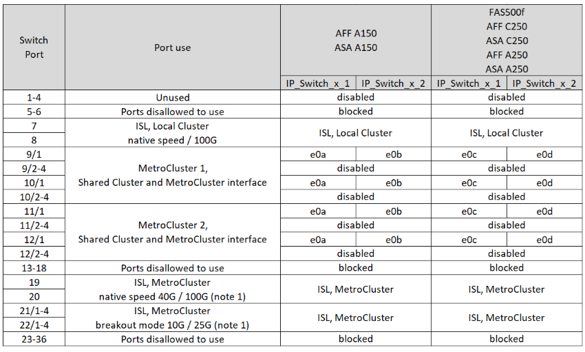

= MetroCluster IP 配置中 12 端口Cisco 9336C-FX2 交换机的平台端口分配
:allow-uri-read: 
:icons: font
:imagesdir: ../media/

[role="lead"]
MetroCluster IP 配置中的端口使用情况取决于交换机型号和平台类型。

在使用配置表之前、请查看以下注意事项：

* 本节中的表格适用于 12 端口 Cisco 9336C-FX2 交换机。
+
如果您有 36 端口 Cisco 9336C-FX2 交换机，但未连接 NS224 机架，请使用link:port_usage_3232c_9336c.html["Cisco 3232C 或 36 端口 Cisco 9336C-FX2 交换机的平台端口分配"] 。

+
如果您有 36 端口 Cisco 9336C-FX2 交换机，并且至少一个 MetroCluster 配置或 DR 组将 NS224 机架连接到 MetroCluster 交换机，请使用link:port_usage_9336c_shared.html["连接 NS224 存储的 36 端口 Cisco 9336C-FX2 交换机的平台端口分配"] 。

NOTE: 12 端口 Cisco 9336C-FX2 交换机不支持将 NS224 架连接到 MetroCluster 交换机。

* 下表显示了站点 A 的端口使用情况站点 B 使用相同的布线方式
* 您不能为交换机配置不同速度的端口（例如，100 Gbps 端口和 40 Gbps 端口的混合）。
* 如果要使用交换机配置单个 MetroCluster ，请使用 * MetroCluster 1* 端口组。
+
跟踪 MetroCluster 端口组（MetroCluster 1、MetroCluster 2）。如本配置过程后面所述，在使用 RcfFileGenerator 工具时会用到它。

* 适用于 MetroCluster IP 的 RcfFileGenerator 还提供了每个交换机的每端口布线概览。

== 为您的配置选择正确的布线表

使用下表确定您应遵循的布线表。

[cols="25,75"]
|===
| 您的系统 | 使用此布线表... 

| AFF A150、ASA A150 FAS500f AFF C250、ASA C250 AFF A250、ASA A250 | <<table_1_cisco_12port_9336c,Cisco 9336C-FX2 12 端口平台端口分配（第 1 组）>> 

| AFF A20 | <<table_2_cisco_12port_9336c,Cisco 9336C-FX2 12 端口平台端口分配（第 2 组）>> 

| AFF A30、AFF C30 FAS50 AFF C60  a| 
下表取决于您使用的是25G (第3a组)还是100G (第3b组)以太网卡。

* <<table_3a_cisco_12port_9336c,Cisco 9336C-FX2 12 端口平台端口分配（组 3a - 25G）>>
* <<table_3b_cisco_12port_9336c,Cisco 9336C-FX2 12 端口平台端口分配（组 3b - 100G）>>

| FAS8300、AFF C400、ASA C400、FAS8700 AFF A400、ASA A400 | <<table_4_cisco_12port_9336c,Cisco 9336C-FX2 12 端口平台端口分配（第 4 组）>> 

| AFF A50 | <<table_5_cisco_12port_9336c,Cisco 9336C-FX2 12 端口平台端口分配（第 5 组）>> 

| AFF C800、ASA C800、AFF A800、ASA A800 FAS9500、AFF A900、ASA A900 | <<table_6_cisco_12port_9336c,Cisco 9336C-FX2 12 端口平台端口分配（第 6 组）>> 

| FAS70、AFF A70 AFF C80 FAS90、AFF A90 AFF A1K | <<table_7_cisco_12port_9336c,Cisco 9336C-FX2 12 端口平台端口分配（第 7 组）>> 
|===
.Cisco 9336C-FX2 12 端口平台端口分配（第 1 组）
查看平台端口分配，以将 AFF A150、ASA A150、FAS500f、AFF C250、ASA C250、AFF A250 或 ASA A250 系统连接到 12 端口 Cisco 9336C-FX2 交换机：

*注 1：*您只能配置端口 19 和 20 *或* 端口 21 和 22。如果您先使用端口 19 和 20，则端口 21 和 22 将被阻止。如果您先使用端口 21 和 22，则端口 19 和 20 将被阻止。

.Cisco 9336C-FX2 12 端口平台端口分配（第 2 组）
查看平台端口分配，以将 AFF A20 系统连接到 12 端口 Cisco 9336C-FX2 交换机：

image:../media/mccip-cabling-9336c-12-port-a20.png["显示 Cisco 9336C-FX2 12 端口平台端口分配"]

*注 1：*您只能配置端口 19 和 20 *或* 端口 21 和 22。如果您先使用端口 19 和 20，则端口 21 和 22 将被阻止。如果您先使用端口 21 和 22，则端口 19 和 20 将被阻止。

.Cisco 9336C-FX2 12 端口平台端口分配（组 3a）
查看平台端口分配，以使用四端口 25G 以太网卡将 AFF A30、AFF C30、AFF C60 或 FAS50 系统连接到 12 端口 Cisco 9336C-FX2 交换机。

NOTE: 此配置需要在插槽4中安装一个四端口25G以太网卡、以连接本地集群和HA接口。

image:../media/mccip-cabling-9336c-12-port-a30-c30-fas50-c60-25g.png["显示 Cisco 9336C-FX2 12 端口平台端口分配"]

*注 1：*您只能配置端口 19 和 20 *或* 端口 21 和 22。如果您先使用端口 19 和 20，则端口 21 和 22 将被阻止。如果您先使用端口 21 和 22，则端口 19 和 20 将被阻止。

.Cisco 9336C-FX2 12 端口平台端口分配（组 3b）
查看平台端口分配，以便使用双端口 100G 以太网卡将 AFF A30、AFF C30、AFF C60 或 FAS50 系统连接到 12 端口 Cisco 9336C-FX2 交换机。

NOTE: 此配置要求插槽4中有一个双端口100G以太网卡、用于连接本地集群和HA接口。

image:../media/mccip-cabling-9336c-12-port-a30-c30-fas50-c60-100g.png["显示 Cisco 9336C-FX2 12 端口平台端口分配"]

*注 1：*您只能配置端口 19 和 20 *或* 端口 21 和 22。如果您先使用端口 19 和 20，则端口 21 和 22 将被阻止。如果您先使用端口 21 和 22，则端口 19 和 20 将被阻止。

.Cisco 9336C-FX2 12 端口平台端口分配（第 4 组）
查看平台端口分配，以将 FAS8300、AFF C400、ASA C400、FAS8700、AFF A400 或 ASA A400 系统连接到 12 端口 Cisco 9336C-FX2 交换机：

image::../media/mccip-cabling-9336c-12-port-a400-c400-fas8300-fas8700.png[显示 Cisco 9336C-FX2 12 端口平台端口分配]

*注 1：*您只能配置端口 19 和 20 *或* 端口 21 和 22。如果您先使用端口 19 和 20，则端口 21 和 22 将被阻止。如果您先使用端口 21 和 22，则端口 19 和 20 将被阻止。

.Cisco 9336C-FX2 12 端口平台端口分配（第 5 组）
查看平台端口分配，以将 AFF A50 系统连接到 12 端口 Cisco 9336C-FX2 交换机：

image::../media/mccip-cabling-9336c-12-port-a50.png[显示 Cisco 9336C-FX2 12 端口平台端口分配]

*注 1：*您只能配置端口 19 和 20 *或* 端口 21 和 22。如果您先使用端口 19 和 20，则端口 21 和 22 将被阻止。如果您先使用端口 21 和 22，则端口 19 和 20 将被阻止。

.Cisco 9336C-FX2 12 端口平台端口分配（第 6 组）
查看平台端口分配，以将 AFF C800、ASA C800、AFF A800、ASA A800、FAS9500、AFF A900 或 ASA A900 系统连接到 12 端口 Cisco 9336C-FX2 交换机：

image::../media/mccip-cabling-9336c-12-port-c800-a800-fas9500-a900.png[显示 Cisco 9336C-FX2 12 端口平台端口分配]

*注 1：*您只能配置端口 19 和 20 *或* 端口 21 和 22。如果您先使用端口 19 和 20，则端口 21 和 22 将被阻止。如果您先使用端口 21 和 22，则端口 19 和 20 将被阻止。

*注 2：*如果您使用的是 X91440A 适配器 (40Gbps)，请使用端口 e4a 和 e4e 或 e4a 和 e8a。如果使用的是X91153A适配器(100Gbps)、请使用端口e4a和e4b或e4a和e8a。

.Cisco 9336C-FX2 12 端口平台端口分配（第 7 组）
查看平台端口分配，以将 AFF A70、FAS70、AFF C80、FAS90、AFF A90 或 AFF A1K 系统连接到 12 端口 Cisco 9336C-FX2 交换机：

image:../media/mccip-cabling-9336c-12-port-fas70-a70-c80-fas90-a90-a1k.png["显示 Cisco 9336C-FX2 12 端口平台端口分配"]

*注 1：*您只能配置端口 19 和 20 *或* 端口 21 和 22。如果您先使用端口 19 和 20，则端口 21 和 22 将被阻止。如果您先使用端口 21 和 22，则端口 19 和 20 将被阻止。
