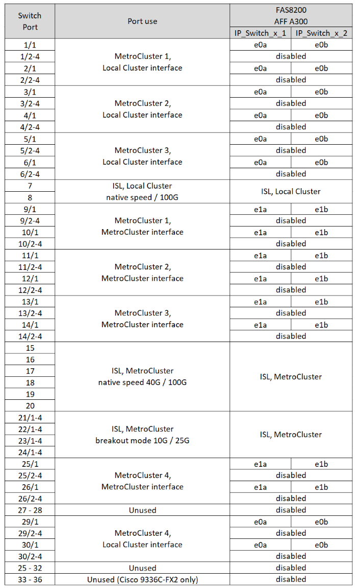
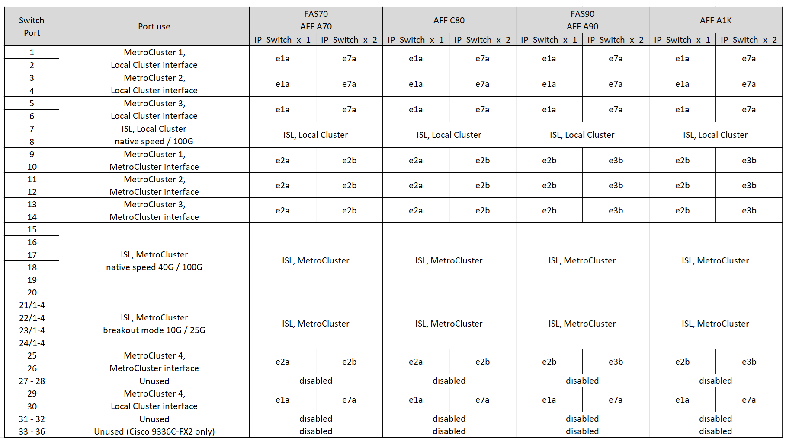

= MetroCluster IP 配置中Cisco 3232C 或 36 端口Cisco 9336C 交换机的平台端口分配
:allow-uri-read: 
:icons: font
:imagesdir: ../media/

[role="lead"]
MetroCluster IP 配置中的端口使用情况取决于交换机型号和平台类型。

在使用配置表之前、请查看以下注意事项：

* 本节中的表格适用于未连接 NS224 存储的 Cisco 3232C 交换机或 36 端口 Cisco 9336C-FX2 交换机。
+
如果您有 12 端口 Cisco 9336C-FX2 交换机，请使用link:port-usage-9336c-fx-2-12-port.html["12 端口 Cisco 9336C-FX2 交换机的平台端口分配"] 。

+
如果您有 36 端口 Cisco 9336C-FX2 交换机，并且至少一个 MetroCluster 配置或 DR 组将 NS224 机架连接到 MetroCluster 交换机，请使用link:port_usage_9336c_shared.html["连接 NS224 存储的 36 端口 Cisco 9336C-FX2 交换机的平台端口分配"] 。

* 下表显示了站点 A 的端口使用情况站点 B 使用相同的布线方式
* 您不能为交换机配置不同速度的端口（例如，100 Gbps 端口和 40 Gbps 端口的混合）。
* 如果要使用交换机配置单个 MetroCluster ，请使用 * MetroCluster 1* 端口组。
+
跟踪MetroCluster端口组(MetroCluster 1、MetroCluster 2、MetroCluster 3或MetroCluster 4)。使用 RcfFileGenerator 工具时需要此工具，如此配置操作步骤后面所述。

* 适用于 MetroCluster IP 的 RcfFileGenerator 还提供了每个交换机的每端口布线概览。
+
使用此布线概述来验证布线情况。

* 对于MetroCluster ISL、25G分支模式需要使用RCF文件v2.10或更高版本。
* 要在"FAS4" MetroCluster组中使用8200或AFF A300以外的平台、需要使用ONTAP 9.13.1或更高版本以及RCF文件版本2.00。

NOTE: RCF文件版本与用于生成文件的RCF文件生成器工具版本不同。例如、您可以使用RCF文件生成器v1.6c生成2.00版RCF文件。

== 为您的配置选择正确的布线表

使用下表确定您应遵循的布线表。

[cols="25,75"]
|===
| 您的系统 | 使用此布线表... 

| AFF A150、ASA A150 FAS2750、AFF A220 FAS500f、AFF C250、ASA C250 AFF A250、ASA A250 | <<table_1_cisco_3232c_9336c,Cisco 3232C或Cisco 9336C-FX2平台端口分配(第1组)>> 

| AFF A20 | <<table_2_cisco_3232c_9336c,Cisco 3232C或Cisco 9336C-FX2平台端口分配(第2组)>> 

| AFF A30、AFF C30 FAS50 AFF C60  a| 
下表取决于您使用的是25G (第3a组)还是100G (第3b组)以太网卡。

* <<table_3a_cisco_3232c_9336c,Cisco 3232C或Cisco 9336C-FlexClone平台端口分配(组3a - 25G)>>
* <<table_3b_cisco_3232c_9336c,Cisco 3232C或Cisco 9336C-拧2平台端口分配(第3b组- 100G)>>

| FAS8200、AFF A300 | <<table_4_cisco_3232c_9336c,Cisco 3232C或Cisco 9336C-FX2平台端口分配(第4组)>> 

| AFF A320 FAS9300、AFF C400、ASA C400、FAS4700 AFF A400、ASA A400 | <<table_5_cisco_3232c_9336c,Cisco 3232C或Cisco 9336C-FX2平台端口分配(第5组)>> 

| AFF A50 | <<table_6_cisco_3232c_9336c,Cisco 3232C或Cisco 9336C-FX2平台端口分配(第6组)>> 

| FAS9000、AFF A700 AFF C800、ASA C800、AFF A800、ASA A800 FAS9500、AFF A900、 ASA A900 | <<table_7_cisco_3232c_9336c,Cisco 3232C或Cisco 9336C-FX2平台端口分配(第7组)>> 

| FAS70、AFF A70 AFF C80 FAS90、AFF A90 AFF A1K | <<table_8_cisco_3232c_9336c,Cisco 3232C或Cisco 9336C-FX2平台端口分配(第8组)>> 
|===
.Cisco 3232C或Cisco 9336C-FX2平台端口分配(第1组)
查看为AFF A150、ASA A150、FAS2750、AFF A220、FAS500f布线所需的平台端口分配。 将AFF C250、ASA C250、AFF A250或ASA A250系统连接到Cisco 3232C或9336C-FX2交换机：

image:../media/mcc-ip-cabling-a150-a220-a250-to-a-cisco-3232c-or-cisco-9336c-switch-9161.png["显示了Cisco 3232C或Cisco 9336C-FX2平台端口分配"]

.Cisco 3232C或Cisco 9336C-FX2平台端口分配(第2组)
查看将AFF A20系统连接到Cisco 3232C或9336C-FX2交换机的平台端口分配：

image:../media/mcc-ip-cabling-aff-a20-9161.png["显示了Cisco 3232C或Cisco 9336C-FX2平台端口分配"]

.Cisco 3232C或Cisco 9335C-966平台端口分配(第3a组)
查看使用四端口25G以太网卡将AFF A30、AFF C30、AFF C60或FAS50系统连接到Cisco 3232C或9336C-算 出的平台端口分配。

NOTE: 此配置需要在插槽4中安装一个四端口25G以太网卡、以连接本地集群和HA接口。

image:../media/mccip-cabling-a30-c30-fas50-c60-25G.png["显示了Cisco 3232C或Cisco 9336C-FX2平台端口分配"]

.Cisco 3232C或Cisco 9335C-966平台端口分配(第3b组)
查看使用双端口100G以太网卡将AFF A30、AFF C30、AFF C60或FAS50系统连接到Cisco 3232C或9336C-查2交换机的平台端口分配。

NOTE: 此配置要求插槽4中有一个双端口100G以太网卡、用于连接本地集群和HA接口。

image:../media/mccip-cabling-a30-c30-fas50-c60-100G.png["显示了Cisco 3232C或Cisco 9336C-FX2平台端口分配"]

.Cisco 3232C或Cisco 9336C-FX2平台端口分配(第4组)
查看使用缆线将FAS8200或AFF A300系统连接到Cisco 3232C或9336C-FX2交换机的平台端口分配：

如果要从旧版MetroCluster文件升级、则布线配置可能正在使用"RCF4"组中的端口(端口25/ 26和29/30)。

.Cisco 3232C或Cisco 9336C-FX2平台端口分配(第5组)
查看为AFF A320、FAS9300、AFF C400、ASA C400、FAS8700布线所需的平台端口分配。 将AFF A400或ASA A400系统连接到Cisco 3232C或9336C-FX2交换机：

image::../media/mcc_ip_cabling_a320_a400_cisco_3232C_or_9336c_switch.png[显示了Cisco 3232C或Cisco 9336C-FX2平台端口分配]

NOTE: 使用MetroCluster 4组中的端口需要使用ONTAP 9.13.1.或更高版本。

.Cisco 3232C或Cisco 9336C-FX2平台端口分配(第6组)
查看将AFF A50系统连接到Cisco 3232C或9336C-FX2交换机的平台端口分配：

image::../media/mcc-ip-cabling-aff-a50-cisco-3232c-9336c-9161.png[显示了Cisco 3232C或Cisco 9336C-FX2平台端口分配]

.Cisco 3232C或Cisco 9336C-FX2平台端口分配(第7组)
查看使用缆线连接FAS9000、AFF A700、AFF C800、ASA C800、AFF A800的平台端口分配 将ASA A800、FAS9500、AFF A900或ASA A900系统连接到Cisco 3232C或9336C-FX2交换机：

image::../media/mcc_ip_cabling_fas9000_a700_fas9500_a800_a900_cisco_3232C_or_9336c_switch.png[显示了Cisco 3232C或Cisco 9336C-FX2平台端口分配]

*注1*:如果您使用的是X91440A适配器40GBps，请使用端口e4a和e4e或e4a和e8a。如果使用的是X91153A适配器(100Gbps)、请使用端口e4a和e4b或e4a和e8a。

NOTE: 使用MetroCluster 4组中的端口需要使用ONTAP 9.13.1.或更高版本。

.Cisco 3232C或Cisco 9336C-FX2平台端口分配(第8组)
查看使用缆线将AFF A70、FAS70、AFF C80、FAS90、AFF A90或AFF A1K系统连接到Cisco 3232C或9335C-拧2交换机的平台端口分配：

