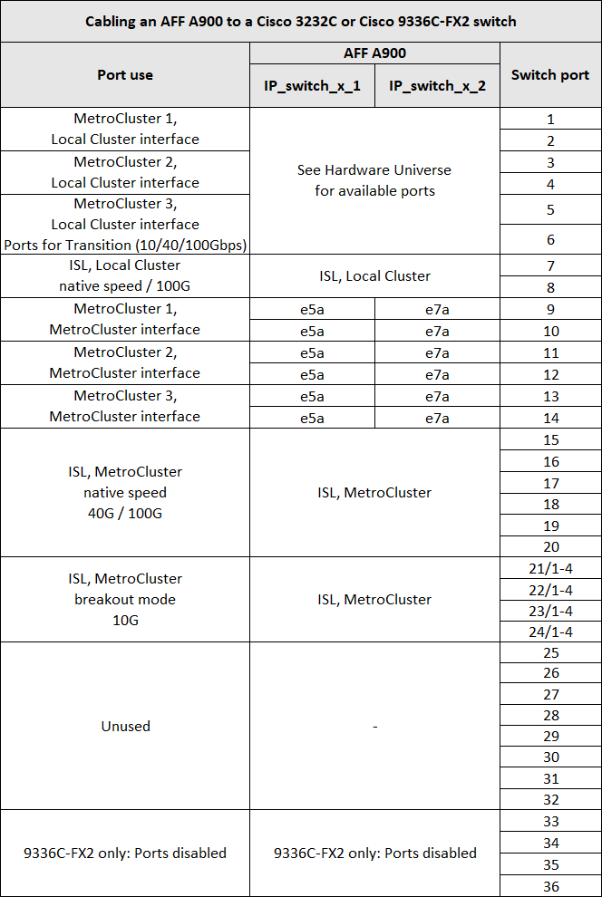

= Cisco 3232C 或 Cisco 9336C 交换机的平台端口分配
:icons: font
:imagesdir: ../media/

[role="lead"]
MetroCluster IP 配置中的端口使用情况取决于交换机型号和平台类型。

在使用表之前，请查看以下注意事项：

* 下表显示了站点 A 的端口使用情况站点 B 使用相同的布线方式
* 不能为交换机配置速度不同的端口（例如， 100 Gbps 端口和 40 Gbps 端口的混合）。
* 如果要使用交换机配置单个 MetroCluster ，请使用 * MetroCluster 1* 端口组。
+
跟踪 MetroCluster 端口组（ MetroCluster 1 ， MetroCluster 2 或 MetroCluster 3 ）。使用 RcfFileGenerator 工具时需要此工具，如此配置操作步骤后面所述。

* 适用于 MetroCluster IP 的 RcfFileGenerator 还提供了每个交换机的每端口布线概览。
+
使用此布线概述来验证布线情况。

== 使用缆线将两个 MetroCluster 配置连接到交换机

如果使用缆线将多个 MetroCluster 配置连接到一个 Cisco 3132Q-V 交换机，请根据相应表为每个 MetroCluster 布线。例如，如果使用缆线将 FAS2750 和 A700 连接到同一个 Cisco 3132Q-V 交换机。然后，按照表 1 中的 " MetroCluster 1" 连接 FAS2750 ，按照表 2 中的 " MetroCluster 2" 或 " MetroCluster 3" 连接 A700 。您不能将 FAS2750 和 A700 以物理方式连接为 MetroCluster 1 。

== 使用缆线将 FAS2750 或 AFF A220 系统连接到 Cisco 3232C 或 Cisco 9336C 交换机

image::../media/mcc_ip_cabling_an_aff_a220_or_fas2750_to_a_cisco_3232c_or_cisco_9336c_switch.png[通过 MCC IP 将 AFF a220 或 fas2750 连接到 Cisco 3232c 或 Cisco 9336c 交换机]

== 使用缆线将 AFF A300 或 FAS8200 连接到 Cisco 3232C 或 Cisco 9336C 交换机

image::../media/mcc_ip_cabling_a_aff_a300_or_fas8200_to_a_cisco_3232c_or_cisco_9336c_switch.png[通过 MCC IP 将 AFF a300 或 fas8200 连接到 Cisco 3232c 或 Cisco 9336c 交换机]

== 使用缆线将 AFF A250 或 FAS500f 连接到 Cisco 3232C 或 Cisco 9336C 交换机

image::../media/mcc_ip_cabling_an_aff_a250_or_fas500f_to_a_cisco_3232c_or_cisco_9336c_switch.png[通过 MCC IP 将 AFF A250 或 fas500f 连接到 Cisco 3232c 或 Cisco 9336c 交换机]

== 使用缆线将 AFF A320 连接到 Cisco 3232C 或 Cisco 9336C 交换机

image::../media/cabling_a_aff_a320_to_a_cisco_3232c_or_cisco_9336c_switch.png[使用缆线将 AFF A320 连接到 Cisco 3232c 或 Cisco 9336c 交换机]

== 使用缆线将 AFF A400 ， FAS8300 或 FAS8700 连接到 Cisco 3232C 或 Cisco 9336C 交换机

image::../media/cabling_a_mcc_ip_aff_a400_fas8300_or_fas8700_to_a_cisco_3232c_or_cisco_9336c_switch.png[使用缆线将 MCC IP AFF a400 fas8300 或 fas8700 连接到 Cisco 3232c 或 Cisco 9336c 交换机]

== 使用缆线将 AFF A700 或 FAS9000 连接到 Cisco 3232C 或 Cisco 9336C 交换机

image::../media/mcc_ip_cabling_a_aff_a700_or_fas9000_to_a_cisco_3232c_or_cisco_9336c_switch.png[通过 MCC IP 将 AFF a700 或 fas9000 连接到 Cisco 3232c 或 Cisco 9336c 交换机]

== 使用缆线将 AFF A800 连接到 Cisco 3232C 或 Cisco 9336C 交换机

image::../media/cabling_an_aff_a800_to_a_cisco_3232c_or_cisco_9336c_switch.png[使用缆线将 AFF a800 连接到 Cisco 3232c 或 Cisco 9336c 交换机]

== 使用缆线将 AFF A900 连接到 Cisco 3232C 或 Cisco 9336C 交换机

== 使用缆线将 AFF A320 ， AFF A400 ， AFF A700 或 AFF A800 连接到 Cisco 9336C-x2 共享交换机

image::../media/mcc_ip_cabling_aff_a320_a400_a700_a800_to_cisco_9336c_shared_switch.png[MCC IP 使用缆线将 AFF A320 a400 a700 a800 连接到 Cisco 9336c 共享交换机]

image::../media/mcc_interfaces_per_platform_9336-shared.png[每个平台 9336 共享的 MCC 接口]
