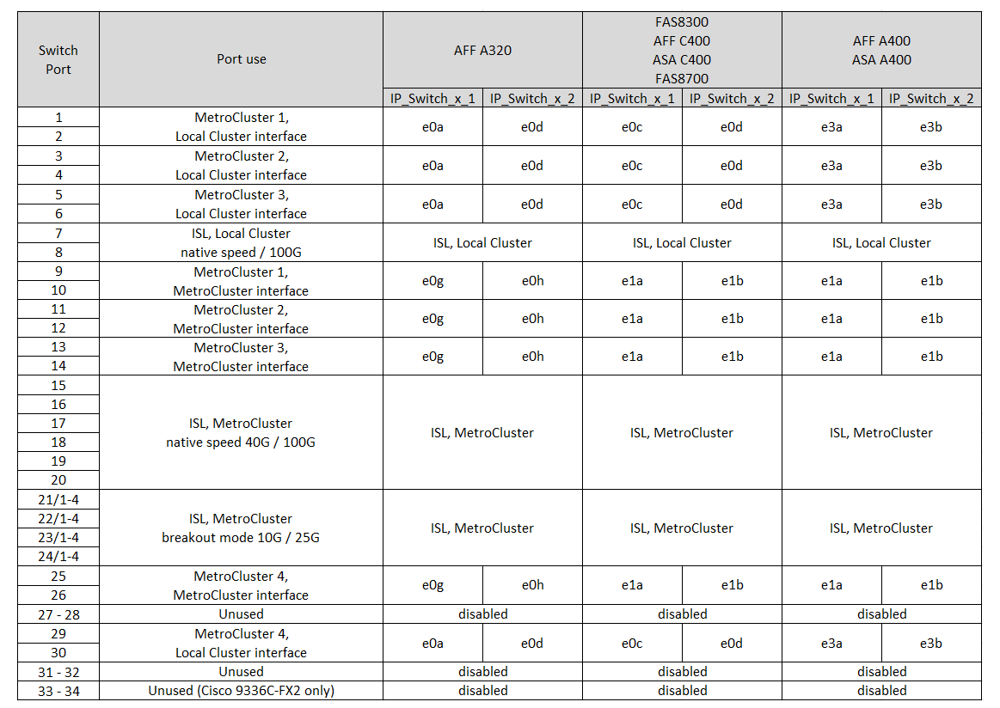
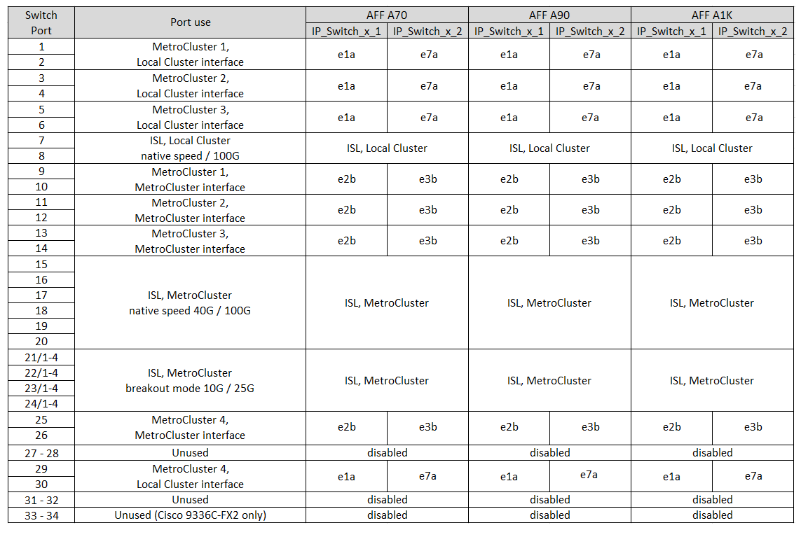

= Cisco 3232C 或 Cisco 9336C 交换机的平台端口分配
:allow-uri-read: 
:icons: font
:imagesdir: ../media/

[role="lead"]
MetroCluster IP 配置中的端口使用情况取决于交换机型号和平台类型。

在使用表之前，请查看以下注意事项：

* 下表显示了站点 A 的端口使用情况站点 B 使用相同的布线方式
* 不能为交换机配置速度不同的端口（例如， 100 Gbps 端口和 40 Gbps 端口的混合）。
* 如果要使用交换机配置单个 MetroCluster ，请使用 * MetroCluster 1* 端口组。
+
跟踪MetroCluster端口组(MetroCluster 1、MetroCluster 2、MetroCluster 3或MetroCluster 4)。使用 RcfFileGenerator 工具时需要此工具，如此配置操作步骤后面所述。

* 适用于 MetroCluster IP 的 RcfFileGenerator 还提供了每个交换机的每端口布线概览。
+
使用此布线概述来验证布线情况。

* 对于MetroCluster ISL、25G分支模式需要使用RCF文件v2.10或更高版本。
* 要在"FAS4" MetroCluster组中使用8200或AFF A300以外的平台、需要使用ONTAP 9.13.1或更高版本以及RCF文件版本2.00。

== 使用缆线将两个 MetroCluster 配置连接到交换机

如果使用缆线将多个MetroCluster 配置连接到一个Cisco 3132Q-V交换机、则必须根据相应表为每个MetroCluster 布线。例如、如果使用缆线将FAS2750和AFF A700连接到同一个Cisco 3132Q-V交换机。然后、按照表1中的"FAS2750"和AFF 表2中的"FAS2" MetroCluster 或MetroCluster MetroCluster 3"为FAS2750布线。您不能将FAS2750和AFF A700以物理方式连接为MetroCluster 1。

== 为您的配置选择正确的布线表

使用下表确定您应遵循的布线表。

[cols="2*"]
|===
| 您的系统 | 使用此布线表... 

 a| 
AFF A150、ASA A150、FAS2750、AFF A220

FAS500f、AFF C250、ASA C250、AFF A250、ASA A250
| <<table_1_cisco_3232c_9336c,Cisco 3232C或Cisco 9336C平台端口分配(组1)>> 

| FAS8200、AFF A300 | <<table_2_cisco_3232c_9336c,Cisco 3232C或Cisco 9336C平台端口分配(第2组)>> 

| AFF A320 FAS9300、AFF C400、ASA C400、FAS4700 AFF A400、ASA A400 | <<table_3_cisco_3232c_9336c,Cisco 3232C或Cisco 9336C平台端口分配(第3组)>> 

| FAS9000、AFF A700 AFF C800、ASA C800、AFF A800、ASA A800 FAS9500、AFF A900、 ASA A900 | <<table_4_cisco_3232c_9336c,Cisco 3232C或Cisco 9336C平台端口分配(第4组)>> 

| AFF A70 AFF A90 AFF A1K *注：*这些系统需要ONTAP 9.15.1.或更高版本。 | <<table_5_cisco_3232c_9336c,Cisco 3232C或Cisco 9336C平台端口分配(第5组)>> 
|===
.Cisco 3232C或Cisco 9336C平台端口分配(组1)
查看为AFF A150、ASA A150、FAS2750、AFF A220、FAS500f布线所需的平台端口分配。 将AFF C250、ASA C250、AFF A250或ASA A250系统连接到Cisco 3232C或9336C交换机：

image::../media/mcc-ip-cabling-a150-a220-a250-to-a-cisco-3232c-or-cisco-9336c-switch.png[显示了Cisco 3232C或Cisco 9336C平台端口分配]

.Cisco 3232C或Cisco 9336C平台端口分配(第2组)
查看使用缆线将FAS8200或AFF A300系统连接到Cisco 3232C或9336C交换机的平台端口分配：

image::../media/mcc-ip-cabling-a-aff-a300-or-fas8200-to-a-cisco-3232c-or-cisco-9336c-switch.png[显示了Cisco 3232C或Cisco 9336C平台端口分配]

如果要从旧版MetroCluster文件升级、则布线配置可能正在使用"RCF4"组中的端口(端口25/ 26和29/30)。

.Cisco 3232C或Cisco 9336C平台端口分配(第3组)
查看为AFF A320、FAS9300、AFF C400、ASA C400、FAS8700布线所需的平台端口分配。 将AFF A400或ASA A400系统连接到Cisco 3232C或9336C交换机：

*注1*:如果使用X91440A适配器(40Gbps),则使用端口e4a和e4e或e4a和e8a。如果您使用的是X91153A适配器(100Gbps)、请使用端口e4a和e4b或e4a和e8a。

NOTE: 使用MetroCluster 4组中的端口需要使用ONTAP 9.13.1.或更高版本。

.Cisco 3232C或Cisco 9336C平台端口分配(第4组)
查看使用缆线连接FAS9000、AFF A700、AFF C800、ASA C800、AFF A800的平台端口分配 将ASA A800、FAS9500、AFF A900或ASA A900系统连接到Cisco 3232C或9336C交换机：

image::../media/mcc_ip_cabling_fas9000_a700_fas9500_a800_a900_cisco_3232C_or_9336c_switch.png[显示了Cisco 3232C或Cisco 9336C平台端口分配]

*注1*:如果使用X91440A适配器(40Gbps),则使用端口e4a和e4e或e4a和e8a。如果您使用的是X91153A适配器(100Gbps)、请使用端口e4a和e4b或e4a和e8a。

NOTE: 使用MetroCluster 4组中的端口需要使用ONTAP 9.13.1.或更高版本。

.Cisco 3232C或Cisco 9336C平台端口分配(第5组)
查看将AFF A70、AFF A90或AFF A1K系统连接到Cisco 3232C或9336C交换机的平台端口分配：

NOTE: 此表中的系统需要ONTAP 9.151或更高版本。

