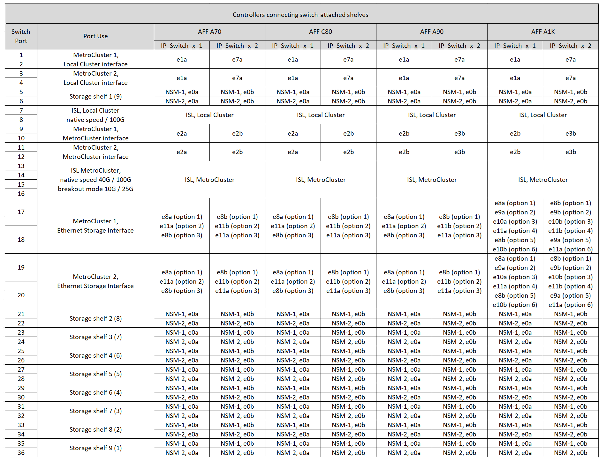

= 连接NS224存储的Cisco 9336A-拧 动交换机的平台端口分配
:allow-uri-read: 
:icons: font
:imagesdir: ../media/

[role="lead"]
MetroCluster IP 配置中的端口使用情况取决于交换机型号和平台类型。

在使用配置表之前、请查看以下注意事项：

* 在使用缆线连接Cisco 9336E-拧2交换机以连接NS224存储时、最多只能有两个MetroCluster配置或DR组、至少一个MetroCluster配置或DR组必须支持交换机连接的NS224磁盘架。不支持交换机连接的NS224磁盘架的平台只能作为第二个MetroCluster配置或第二个DR组进行连接。
+

CAUTION: 只有在至少有一个MetroCluster配置或DR组将NS224磁盘架连接到MetroCluster交换机时、才可以使用这些表。如果使用专用存储交换机连接NS224磁盘架，请根据中的表为交换机布线link:port_usage_3232c_9336c.html["Cisco 3232C 或 Cisco 9336C-FX2 交换机的平台端口分配"]。

* 只有在选择第一个平台时、RcfFileGenerator才会显示符合条件的平台。
* 连接一个八节点或两个四节点MetroCluster配置需要使用ONTAP 9.14.1或更高版本。

== 为您的配置选择正确的布线表

查看适用于您的配置的正确端口分配表。本节包含两组布线表：

* <<tables_connecting_ns224,用于连接交换机连接的NS224磁盘架的控制器的布线表>>
* <<tables_not_connecting_ns224,未连接交换机连接的NS224磁盘架的控制器的布线表>>

=== 连接交换机连接的NS224磁盘架的控制器

确定连接交换机连接的NS224磁盘架的控制器应遵循的端口分配表。

[cols="25,75"]
|===
| 平台 | 使用此布线表... 

| AFF C30、AFF A30 AFF C60  a| 
下表取决于您使用的是25G (第1a组)还是100G (第1b组)以太网卡。

* <<table_1a_cisco_9336c_fx2,连接NS224存储平台的Cisco 9336C)交换机端口分配(组1a - 25G)>>
* <<table_1b_cisco_9336c_fx2,连接NS224存储平台的Cisco 9336C)交换机端口分配(第1b组- 100G组)>>

| AFF A320 AFF C400、ASA C400 AFF A400、ASA A400 | <<table_2_cisco_9336c_fx2,连接NS224存储平台的Cisco 9336C)交换机端口分配(组2)>> 

| AFF A50 | <<table_3_cisco_9336c_fx2,连接NS224存储平台的Cisco 9336C)交换机端口分配(第3组)>> 

| AFF A700 AFF C800、ASA C800、AFF A800 AFF A900、ASA A900 | <<table_4_cisco_9336c_fx2,连接NS224存储平台的Cisco 9336C)交换机端口分配(第4组)>> 

| AFF A70 AFF C80 AFF A90 AFF A1K | <<table_5_cisco_9336c_fx2,连接NS224存储平台的Cisco 9336C)交换机端口分配(第5组)>> 
|===
.连接NS224存储平台的Cisco 9336C)交换机端口分配(第1a组)
查看平台端口分配、以便使用四端口25G以太网卡为AFF A30、AFF C30或AFF C60系统布线、以便将交换机连接的NSS24磁盘架连接到Cisco 9336C-拧 发2交换机。

NOTE: 此配置需要在插槽4中安装一个四端口25G以太网卡、以连接本地集群和HA接口。

image:../media/mccip-cabling-greeley-connecting-a30-c30-fas50-c60-25G.png["显示了连接NS224存储平台的Cisco 9336A-拧 动交换机的端口分配"]

.连接NS224存储平台的Cisco 9336C)交换机端口分配(第1b组)
查看平台端口分配、以便使用双端口100G以太网卡为AFF A30、AFF C30或AFF C60系统布线、以便将交换机连接的NSS24磁盘架连接到Cisco 9336C-查2交换机。

NOTE: 此配置要求插槽4中有一个双端口100G以太网卡、用于连接本地集群和HA接口。

image:../media/mccip-cabling-greeley-connecting-a30-c30-fas50-c60-100G.png["显示了连接NS224存储平台的Cisco 9336A-拧 动交换机的端口分配"]

.连接NS224存储平台的Cisco 9336C)交换机端口分配(组2)
查看用于为将交换机连接的NSS24磁盘架连接到Cisco 9336－查2交换机的AFF A320、AFF C400、ASA C400、AFF A400或ASA A400系统布线的平台端口分配：

image::../media/mcc_ip_cabling_a320_c400_a400_to_cisco_9336c_shared_switch.png[显示了连接NS224存储平台的Cisco 9336A-拧 动交换机的端口分配]

.连接NS224存储平台的Cisco 9336C)交换机端口分配(第3组)
查看将交换机连接的NSS24磁盘架连接到Cisco 9336委员会-查2交换机的AFF A50系统的平台端口分配情况：

image:../media/mccip-cabling-greeley-connecting-a50-updated.png["显示了连接NS224存储平台的Cisco 9336A-拧 动交换机的端口分配"]

.连接NS224存储平台的Cisco 9336C)交换机端口分配(第4组)
查看用于为将交换机连接的NSS24磁盘架连接到Cisco 9336－查2交换机的AFF A700、AFF A900、ASA C800、AFF A800、AFF C800或ASA A900系统布线的平台端口分配：

image:../media/mcc_ip_cabling_a700_c800_a800_a900_to_cisco_9336c_shared_switch.png["显示了连接NS224存储平台的Cisco 9336A-拧 动交换机的端口分配"]

*注1*:如果您使用的是X91440A适配器40GBps，请使用端口e4a和e4e或e4a和e8a。如果使用的是X91153A适配器(100Gbps)、请使用端口e4a和e4b或e4a和e8a。

.连接NS224存储平台的Cisco 9336C)交换机端口分配(第5组)
查看用于为将交换机连接的NSS24磁盘架连接到Cisco 9336 C-拧2交换机的AFF A70、AFF C80、AFF A90或AFF A1K系统布线的平台端口分配：

=== 控制器未连接交换机连接的NS224磁盘架

确定未连接交换机连接的NS224磁盘架的控制器应遵循的端口分配表。

[cols="25,75"]
|===
| 平台 | 使用此布线表... 

| AFF A150、ASA A150 FAS2750、AFF A220 | <<table_6_cisco_9336c_fx2,Cisco 9336C)交换机未连接NS224存储平台端口分配(第6组)>> 

| AFF A20 | <<table_7_cisco_9336c_fx2,Cisco 9336C)交换机未连接NS224存储平台端口分配(第7组)>> 

| FAS500f AFF C250、ASA C250 AFF A250、ASA A250 | <<table_8_cisco_9336c_fx2,Cisco 9336C)交换机未连接NS224存储平台端口分配(第8组)>> 

| AFF C30、AFF A30 FAS50 AFF C60  a| 
下表取决于您使用的是25G (组9a)还是100G (组9b)以太网卡。

* <<table_9a_cisco_9336c_fx2,Cisco 9336C)交换机未连接NS224存储平台端口分配(组9a)>>
* <<table_9b_cisco_9336c_fx2,Cisco 9336C)交换机未连接NS224存储平台端口分配(组9b)>>

| FAS8200、AFF A300 | <<table_10_cisco_9336c_fx2,Cisco 9336C)交换机未连接NS224存储平台端口分配(第10组)>> 

| AFF A320 FAS9300、AFF C400、ASA C400、FAS4700 AFF A400、ASA A400 | <<table_11_cisco_9336c_fx2,Cisco 9336C)交换机未连接NS224存储平台端口分配(第11组)>> 

| AFF A50 | <<table_12_cisco_9336c_fx2,Cisco 9336C)交换机未连接NS224存储平台端口分配(第12组)>> 

| FAS9000、AFF A700 AFF C800、ASA C800、AFF A800、ASA A800 FAS9500、AFF A900、 ASA A900 | <<table_13_cisco_9336c_fx2,Cisco 9336C)交换机未连接NS224存储平台端口分配(第13组)>> 

| FAS70、AFF A70 AFF C80 FAS90、AFF A90 AFF A1K | <<table_14_cisco_9336c_fx2,Cisco 9336C)交换机未连接NS224存储平台端口分配(第14组)>> 
|===
.Cisco 9336C)交换机未连接NS224存储平台端口分配(第6组)
查看平台端口分配、以便为未将交换机连接的NSS24磁盘架连接到Cisco 9336：查对AFF A150、ASA A150、FAS2750或AFF A220系统进行布线：

image::../media/mcc-ip-cabling-a-aff-a150-asa-a150-fas2750-aff-a220-to-a-cisco-9336c-shared-switch.png[显示了未连接NS224存储平台端口分配的Cisco 9336E-算 例]

.Cisco 9336C)交换机未连接NS224存储平台端口分配(第7组)
查看平台端口分配情况、以便为未将交换机连接的NSS24磁盘架连接到Cisco 9336：查对交换机的AFF 2020系统布线：

image:../media/mcc-ip-aff-a20-to-a-cisco-9336c-shared-switch-not-connecting.png["显示了未连接NS224存储平台端口分配的Cisco 9336E-算 例"]

.Cisco 9336C)交换机未连接NS224存储平台端口分配(第8组)
查看平台端口分配情况、以便为未将交换机连接的NSS24磁盘架连接到Cisco 9336－查2交换机的FAS500f、AFF C250、ASA C250、AFF A250或ASA A250系统布线：

image::../media/mcc-ip-cabling-c250-asa-c250-a250-asa-a250-to-cisco-9336c-shared-switch.png[显示了未连接NS224存储平台端口分配的Cisco 9336E-算 例]

.Cisco 9336C)交换机未连接NS224存储平台端口分配(组9a)
查看平台端口分配、以便使用四端口25G以太网卡将未连接交换机连接的NSS24磁盘架的AFF A30、AFF C30、AFF C60或FAS50系统连接到Cisco 9336C-拧2交换机：

NOTE: 此配置需要在插槽4中安装一个四端口25G以太网卡、以连接本地集群和HA接口。

image:../media/mccip-cabling-greeley-not-connecting-a30-c30-fas50-c60-25G.png["显示了未连接NS224存储平台端口分配的Cisco 9336E-算 例"]

.Cisco 9336C)交换机未连接NS224存储平台端口分配(组9b)
查看平台端口分配、以便使用双端口100G以太网卡将未连接交换机连接的NSS24磁盘架的AFF A30、AFF C30、AFF C60或FAS50系统连接到Cisco 9336C-拧2交换机：

NOTE: 此配置要求插槽4中有一个双端口100G以太网卡、用于连接本地集群和HA接口。

image:../media/mccip-cabling-greeley-not-connecting-a30-c30-fas50-c60-100G.png["显示了连接NS224存储平台的Cisco 9336A-拧 动交换机的端口分配"]

.Cisco 9336C)交换机未连接NS224存储平台端口分配(第10组)
查看平台端口分配情况、以便为未将交换机连接的NSS24磁盘架连接到Cisco 9336－查2交换机的FAS8200或AFF A300系统布线：

image::../media/mcc-ip-cabling-fas8200-affa300-to-cisco-9336c-shared-switch.png[显示了连接NS224存储平台的Cisco 9336A-拧 动交换机的端口分配]

.Cisco 9336C)交换机未连接NS224存储平台端口分配(第11组)
查看平台端口分配、以便为未将交换机连接的NSS24磁盘架连接到Cisco 9336：查对AFF A320、FAS8700、AFF A400、ASA C400、FAS8300、AFF C400或ASA A400系统进行布线：

image::../media/mcc_ip_cabling_a320_fas8300_a400_fas8700_to_a_cisco_9336c_shared_switch.png[显示了未连接NS224存储平台端口分配的Cisco 9336E-算 例]

.Cisco 9336C)交换机未连接NS224存储平台端口分配(第12组)
查看平台端口分配、以便为未将交换机连接的NSS24磁盘架连接到Cisco 9336：查对交换机的AFF A50系统布线：

image::../media/mcc-ip-cabling-aff-a50-cisco-9336c-shared-switch-not-connecting.png[显示了未连接NS224存储平台端口分配的Cisco 9336E-算 例]

.Cisco 9336C)交换机未连接NS224存储平台端口分配(第13组)
查看未将交换机连接的NSS24磁盘架连接到ASA C800 Cisco 9334c-查 对FAS9000、AFF A800 AFF A900、ASA A800 ASA A900、FAS9500、AFF A700或AFF C800系统进行缆线连接的平台端口分配：

image::../media/mcc_ip_cabling_a700_a800_fas9000_fas9500_to_cisco_9336c_shared_switch.png[显示了未连接NS224存储平台端口分配的Cisco 9336E-算 例]

*注1*:如果您使用的是X91440A适配器40GBps，请使用端口e4a和e4e或e4a和e8a。如果使用的是X91153A适配器(100Gbps)、请使用端口e4a和e4b或e4a和e8a。

.Cisco 9336C)交换机未连接NS224存储平台端口分配(第14组)
查看未将交换机连接的NSS24磁盘架连接到Cisco 9336 C-拧2交换机的AFF A70、FAS70、AFF C80、FAS90、AFF A90或AFF A1K系统的平台端口分配：

image::../media/mccip-cabling-greeley-not-connecting-a70-c80-a-90-fas90-a1k.png[显示了未连接NS224存储平台端口分配的Cisco 9336E-算 例]
