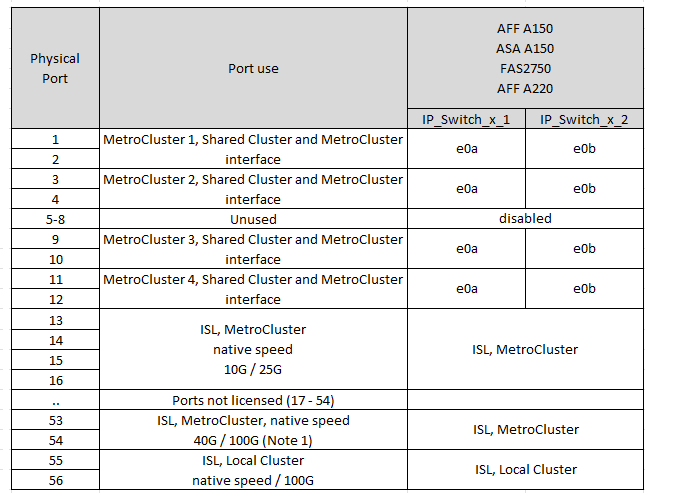
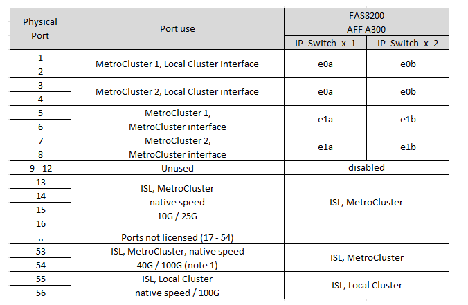

= 为 Broadcom 支持的 BES-53248 IP 交换机分配平台端口
:allow-uri-read: 
:icons: font
:imagesdir: ../media/

[role="lead"]
MetroCluster IP 配置中的端口使用情况取决于交换机型号和平台类型。

在使用配置表之前、请查看以下注意事项：

* 您不能使用具有不同速度的远程ISL端口的交换机(例如、连接到10 Gbps ISL端口的25 Gbps端口)。
* 如果为交换机配置MetroCluster FC到IP过渡、则会根据您选择的目标平台使用以下端口：
+
[cols="75,25"]
|===
| 目标平台 | 端口 

| FAS500f、AFF C250、ASA C250、AFF A250、ASA A250、 FAS9300、AFF C400、ASA C400、AFF A400、ASA A400、 或FAS4700平台 | 端口1 - 6、10Gbps 

| FAS8200或AFF A300平台 | 端口3 - 4和9 - 12、10 Gbps 
|===
* 配置了 Broadcom BES-53248 交换机的 AFF A320 系统可能不支持所有功能。
+
不支持要求将本地集群连接到交换机的任何配置或功能。例如，不支持以下配置和过程：

+
** 八节点 MetroCluster 配置
** 从 MetroCluster FC 过渡到 MetroCluster IP 配置
** 刷新四节点 MetroCluster IP 配置（ ONTAP 9.8 及更高版本）

== 为您的配置选择正确的布线表

使用下表确定您应遵循的布线表。

[cols="25,75"]
|===
| 您的系统 | 使用此布线表... 

 a| 
AFF A150、ASA A150

FAS2750

AFF A220
| <<table_1_bes_53248,Broadcom BES-53248平台端口分配(组1)>> 

| FAS500f AFF C250、ASA C250 AFF A250、ASA A250 | <<table_2_bes_53248,Broadcom BES-53248平台端口分配(组2)>> 

| AFF A20 | <<table_3_bes_53248,Broadcom BES-53248平台端口分配(第3组)>> 

| AFF C30、AFF A30 FAS50 AFF C60 | <<table_4_bes_53248,Broadcom BES-53248平台端口分配(第4组)>> 

| FAS8200、AFF A300 | <<table_5_bes_53248,Broadcom BES-53248平台端口分配(第5组)>> 

| AFF A320 | <<table_6_bes_53248,Broadcom BES-53248平台端口分配(第6组)>> 

| FAS9300 AFF C400、ASA C400 AFF A400、ASA A400 FAS4700 | <<table_7_bes_53248,Broadcom BES-53248平台端口分配(第7组)>> 
|===
.Broadcom BES-53248平台端口分配(组1)
查看将AFF A150、ASA A150、FAS2750或AFF A220系统连接到Broadcom BES-53248交换机的平台端口分配：

* *注1*:使用这些端口需要额外的许可证。
* 如果两个MetroCluster配置使用相同的平台、NetApp建议为一个配置选择组MetroCluster 3、为另一个配置选择组MetroCluster 4。如果平台不同、则必须为第一个配置选择MetroCluster 3或MetroCluster 4、为第二个配置选择MetroCluster 1或MetroCluster 2。

.Broadcom BES-53248平台端口分配(组2)
查看使用缆线将FAS500f、AFF C250、ASA C250、AFF A250或ASA A250系统连接到Broadcom BES-53248交换机的平台端口分配：

image::../media/mcc_ip_cabling_a_aff_asa_c250_a250_fas500f_to_a_broadcom_bes_53248_switch.png[显示了Broadcom BES-53248平台端口分配]

* *注1*:使用这些端口需要额外的许可证。
* 如果两个MetroCluster配置使用相同的平台、NetApp建议为一个配置选择组MetroCluster 3、为另一个配置选择组MetroCluster 4。如果平台不同、则必须为第一个配置选择MetroCluster 3或MetroCluster 4、为第二个配置选择MetroCluster 1或MetroCluster 2。

.Broadcom BES-53248平台端口分配(第3组)
查看将AFF A20系统连接到Broadcom BES-53248交换机的平台端口分配：

image:../media/mccip-cabling-bes-a20-updated.png["显示了Broadcom BES-53248平台端口分配"]

* *注1*:使用这些端口需要额外的许可证。

.Broadcom BES-53248平台端口分配(第4组)
查看使用四端口25G以太网卡将AFF A30、AFF C30、AFF C60或FAS50系统连接到Broadcom BES-53248交换机的平台端口分配。

[NOTE]
====
* 此配置需要在插槽4中安装一个四端口25G以太网卡、以连接本地集群和HA接口。
* 此配置要求控制器上的卡中具有QSFP-SFP+适配器、以支持25 Gbps网络速度。

====
image:../media/mccip-cabling-bes-a30-c30-fas50-c60-25G.png["显示了Broadcom BES-53248平台端口分配"]

* *注1*:使用这些端口需要额外的许可证。

.Broadcom BES-53248平台端口分配(第5组)
查看使用缆线将FAS8200或AFF A300系统连接到Broadcom BES-53248交换机的平台端口分配：

* *注1*:使用这些端口需要额外的许可证。

.Broadcom BES-53248平台端口分配(第6组)
查看将AFF A320系统连接到Broadcom BES-53248交换机的平台端口分配：

image::../media/mcc-ip-cabling-a-aff-a320-to-a-broadcom-bes-53248-switch.png[显示了Broadcom BES-53248平台端口分配]

* *注1*:使用这些端口需要额外的许可证。
* *注2*:只能将一个使用AFF A320系统的四节点MetroCluster连接到交换机。
+
此配置不支持需要有交换机集群的功能。其中包括MetroCluster FC到IP的过渡和技术更新过程。

.Broadcom BES-53248平台端口分配(第7组)
查看使用缆线连接FAS9300、AFF C400、ASA C400、AFF A400、ASA A400的平台端口分配、 或FAS4700系统连接到Broadcom BES-53248交换机：

image::../media/mcc-ip-cabling-a-fas8300-a400-c400-or-fas8700-to-a-broadcom-bes-53248-switch.png[显示了Broadcom BES-53248平台端口分配]

* *注1*:使用这些端口需要额外的许可证。
* *注2*:只能将一个使用AFF A320系统的四节点MetroCluster连接到交换机。
+
此配置不支持需要有交换机集群的功能。其中包括MetroCluster FC到IP的过渡和技术更新过程。

