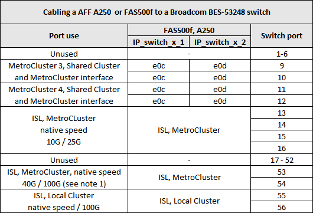

= 为 Broadcom 支持的 BES-53248 IP 交换机分配平台端口
:allow-uri-read: 
:icons: font
:imagesdir: ../media/

[role="lead"]
MetroCluster IP 配置中的端口使用情况取决于交换机型号和平台类型。

这些交换机不能与速度不同的远程 ISL 端口（例如，连接到 10 Gbps ISL 端口的 25 Gbps 端口）结合使用。

.下表注释：
. 对于某些平台，您可以使用端口 49 - 54 进行 MetroCluster ISL 或 MetroCluster 接口连接。
+
这些端口需要额外的许可证。

. 只能将使用 A320 系统的单个四节点 MetroCluster 连接到交换机。
+
此配置不支持需要交换集群的功能，包括 MetroCluster FC 到 IP 过渡和技术更新过程。

. 配置了 Broadcom BES-53248 交换机的 AFF A320 系统可能不支持所有功能。
+
不支持要求将本地集群连接到交换机的任何配置或功能。例如，不支持以下配置和过程：

+
** 八节点 MetroCluster 配置
** 从 MetroCluster FC 过渡到 MetroCluster IP 配置
** 刷新四节点 MetroCluster IP 配置（ ONTAP 9.8 及更高版本）

. 如果您连接两个MetroCluster 配置、并且这两个配置都使用相同的控制器类型、则必须使用MetroCluster 端口组3和4。如果控制器不同、则必须对一种类型使用MetroCluster 端口组3和4、而对另一种类型使用MetroCluster 端口组1和2。
+
** 例如、如果您连接：
+
*** 两种MetroCluster 配置仅包含FAS2750/AFF A220或仅包含FAS500f/AFF A250、您必须选择MetroCluster 端口组3和4。
*** 两种MetroCluster 配置、其中一个MetroCluster 的类型为FAS2750/AFF A220、另一个为FAS500f/AFF A250、您必须为一个选择端口组3和4、为另一个选择端口组1和2。在中 https://mysupport.netapp.com/site/tools/tool-eula/rcffilegenerator["适用于 MetroCluster IP 的 RcfFileGenerator"]、下拉字段1和2仅在下拉字段3和4中选择平台后才会填充受支持的平台。请参见 link:../install-ip/using_rcf_generator.html["在 RcfFileGenerator 工具或多个 MetroCluster 配置中使用端口表"] 有关如何使用端口表的详细信息、请参见。

== AFF A220 或 FAS2750 系统的交换机端口使用情况

image::../media/mcc_ip_cabling_a_aff_a220_or_fas2750_to_a_broadcom_bes_53248_switch.png[通过 MCC IP 将 AFF a220 或 fas2750 连接到 Broadcom bes 53248 交换机]

== AFF A250 或 FAS500f 系统的交换机端口使用情况

== AFF A250或FAS500f以及AFF A220或FAS2750系统的交换机端口使用情况

image::../media/mcc_ip_cabling_aff_a250_and_ a220_to_a_broadcom_bes_53248_switch.png[通过MCC IP将AFF A250和a220连接到Broadcom bes 53248交换机]

== AFF A300 或 FAS8200 系统的交换机端口使用情况

image::../media/mcc_ip_cabling_a_aff_a300_or_fas8200_to_a_broadcom_bes_53248_switch.png[通过 MCC IP 将 AFF a300 或 fas8200 连接到 Broadcom bes 53248 交换机]

image::../media/mcc_ip_cabling_a_aff_a320_to_a_broadcom_bes_53248_switch.png[通过 MCC IP 将 AFF A320 连接到 Broadcom Bes 53248 交换机]

== AFF A400 ， FAS8300 或 FAS8700 系统的交换机端口使用情况

image::../media/mcc_ip_cabling_a_fas8300_a400_or_fas8700_to_a_broadcom_bes_53248_switch.png[通过 MCC IP 将 fas8300 a400 或 fas8700 连接到 Broadcom 53248 交换机]
