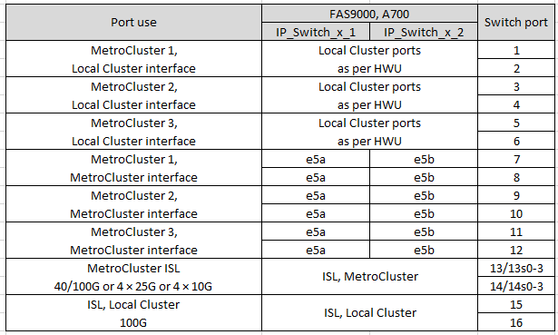

= NVIDIA支持的SN2100 IP交换机的平台端口分配
:allow-uri-read: 
:icons: font
:imagesdir: ../media/

[role="lead"]
MetroCluster IP 配置中的端口使用情况取决于交换机型号和平台类型。

== 支持的配置

目前支持以下平台：

* FAS500f / AFF A250
* FAS8300 / AFF A400
* FAS8700
* FAS9000/FASA700 AFF
* AFF A800

目前不支持以下平台和配置：

* MetroCluster FC-IP过渡
* 八节点MetroCluster 配置

.在使用配置表之前、请查看这些注意事项
如果使用缆线连接多个MetroCluster 配置、请按照相应的表进行操作。例如：

* 如果您使用缆线连接两个类型为AFF A700的四节点MetroCluster 配置、请连接AFF A700表中显示为MetroCluster 1的第一个MetroCluster 和显示为MetroCluster 2的第二个MetroCluster。

NOTE: 端口13和14可以在支持40 Gbps和100 Gbps的原生 速度模式下使用、也可以在分支模式下使用以支持4×25 Gbps或4×10 Gbps。如果它们使用原生 速度模式、则表示为端口13和14。如果它们使用分支模式4×25 Gbps或4×10 Gbps、则表示为13s0-3和14s0-3。

以下各节将介绍物理布线概述。您也可以参考 https://mysupport.netapp.com/site/tools/tool-eula/rcffilegenerator["RcfFileGenerator"] 有关详细的布线信息。

== AFF A250 或 FAS500f 系统的交换机端口使用情况

image::../media/mcc_ip_cabling_A250_MSN2100.png[MCC IP布线A250 MSN2100]

== AFF A400 ， FAS8300 或 FAS8700 系统的交换机端口使用情况

image::../media/mcc_ip_cabling_A400_MSN2100.png[MCC IP布线A400 MSN2100]

== AFF A700或FAS9000的交换机端口使用情况

== AFF A800的交换机端口使用情况

image::../media/mcc_ip_cabling_A800_MSN2100.png[MCC IP布线A800 MSN2100]
