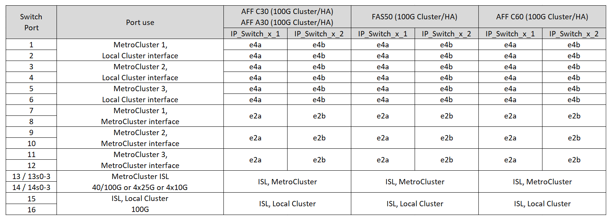

= MetroCluster IP 配置中NVIDIA支持的 SN2100 IP 交换机的平台端口分配
:allow-uri-read: 
:icons: font
:imagesdir: ../media/

[role="lead"]
MetroCluster IP 配置中的端口使用情况取决于交换机型号和平台类型。

在使用配置表之前、请查看以下注意事项：

* 要连接八节点或两个四节点MetroCluster配置、需要使用ONTAP 9.14.1或更高版本以及RCF文件2.00或更高版本。
+

NOTE: RCF文件版本与用于生成文件的RCF文件生成器工具版本不同。例如、您可以使用RCF文件生成器v1.6c生成2.00版RCF文件。

* 如果使用缆线连接多个MetroCluster 配置、请按照相应的表进行操作。例如：
+
** 如果您使用缆线连接两个类型为AFF A700的四节点MetroCluster 配置、请连接AFF A700表中显示为MetroCluster 1的第一个MetroCluster 和显示为MetroCluster 2的第二个MetroCluster。

NOTE: 端口13和14可以在支持40 Gbps和100 Gbps的原生 速度模式下使用、也可以在分支模式下使用以支持4×25 Gbps或4×10 Gbps。如果它们使用本机速度模式、则表示为端口13和14。如果它们使用分支模式4×25 Gbps或4×10 Gbps、则表示为端口13s0-3和14s0-3。

以下各节将介绍物理布线概述。您也可以参考 https://mysupport.netapp.com/site/tools/tool-eula/rcffilegenerator["RcfFileGenerator"] 有关详细的布线信息。

== 为您的配置选择正确的布线表

使用下表确定您应遵循的布线表。

[cols="25,75"]
|===
| 您的系统 | 使用此布线表... 

 a| 
AFF A150、ASA A150

FAS500f

AFF C250、ASA C250

AFF A250、ASA A250
| <<table_1_nvidia_sn2100,NVIDIA SN2100平台端口分配(组1)>> 

| AFF A20 | <<table_2_nvidia_sn2100,NVIDIA SN2100平台端口分配(第2组)>> 

| AFF C30、AFF A30 FAS50 AFF C60  a| 
下表取决于您使用的是25G (第3a组)还是100G (第3b组)以太网卡。

* <<table_3a_nvidia_sn2100,NVIDIA SN2100平台端口分配(组3a -25G)>>
* <<table_3b_nvidia_sn2100,NVIDIA SN2100平台端口分配(第3b组-100G组)>>

| FAS9300 AFF C400、ASA C400 AFF A400、ASA A400 FAS4700 FAS9000、AFF A700 | <<table_4_nvidia_sn2100,NVIDIA SN2100平台端口分配(第4组)>> 

| AFF A50 | <<table_5_nvidia_sn2100,NVIDIA SN2100平台端口分配(第5组)>> 

| AFF C800、ASA C800 AFF A800、ASA A800 FAS9500 AFF A900、ASA A900 | <<table_6_nvidia_sn2100,NVIDIA SN2100平台端口分配(第6组)>> 

| FAS70、AFF A70 AFF C80 FAS90、AFF A90 AFF A1K | <<table_7_nvidia_sn2100,NVIDIA SN2100平台端口分配(第7组)>> 
|===
.NVIDIA SN2100平台端口分配(组1)
查看为AFF A150、ASA A150、FAS500f、AFF C250、ASA C250、 将AFF A250或ASA A250系统连接到NVIDIA SN2100交换机：

[#table_1_nvidia_sn2100]
image::../media/mcc-ip-cabling-aff-asa-a150-fas500f-a25-c250-MSN2100.png[显示了NVIDIA SN2100平台端口分配]

.NVIDIA SN2100平台端口分配(第2组)
查看将AFF A20系统连接到NVIDIA SN2100交换机所需的平台端口分配：

[#table_2_nvidia_sn2100]
image::../media/mccip-cabling-nvidia-a20-updated.png[显示了NVIDIA SN2100平台端口分配]

.NVIDIA SN2100平台端口分配(第3a组)
查看使用四端口25G以太网卡将AFF A30、AFF C30、AFF C60或FAS50系统连接到NVIDIA SN2100交换机的平台端口分配：

NOTE: 此配置需要在插槽4中安装一个四端口25G以太网卡、以连接本地集群和HA接口。

[#table_3a_nvidia_sn2100]
image::../media/mccip-cabling-nvidia-a30-c30-fas50-c60-25G.png[显示了NVIDIA SN2100平台端口分配]

.NVIDIA SN2100平台端口分配(第3b组)
查看使用双端口100G以太网卡将AFF A30、AFF C30、AFF C60或FAS50系统连接到NVIDIA SN2100交换机的平台端口分配：

NOTE: 此配置要求插槽4中有一个双端口100G以太网卡、用于连接本地集群和HA接口。

[#table_3b_nvidia_sn2100]

.NVIDIA SN2100平台端口分配(第4组)
查看使用缆线连接FAS9300、AFF C400、ASA C400、AFF A400、ASA A400的平台端口分配、 将FAS4700、FAS9000或AFF A700系统连接到NVIDIA SN2100交换机：

image::../media/mccip-cabling-fas8300-aff-a400-c400-a700-fas900-nvidaia-sn2100.png[显示了NVIDIA SN2100平台端口分配]

*注1*:如果您使用的是X91440A适配器40GBps，请使用端口e4a和e4e或e4a和e8a。如果使用的是X91153A适配器(100Gbps)、请使用端口e4a和e4b或e4a和e8a。

.NVIDIA SN2100平台端口分配(第5组)
查看将AFF A50系统连接到NVIDIA SN2100交换机所需的平台端口分配：

[#table_5_nvidia_sn2100]
image::../media/mccip-cabling-aff-a50-nvidia-sn2100.png[显示了NVIDIA SN2100平台端口分配]

.NVIDIA SN2100平台端口分配(第6组)
查看为AFF C800、ASA C800、AFF A800、ASA A800、FAS9500、 将AFF A900或ASA A900系统连接到NVIDIA SN2100交换机：

image::../media/mcc_ip_cabling_fas8300_aff_asa_a800_a900_fas9500_MSN2100.png[显示了NVIDIA SN2100平台端口分配]

*注1*:如果您使用的是X91440A适配器40GBps，请使用端口e4a和e4e或e4a和e8a。如果使用的是X91153A适配器(100Gbps)、请使用端口e4a和e4b或e4a和e8a。

.NVIDIA SN2100平台端口分配(第7组)
查看使用缆线将FAS70、AFF A70、AFF C80、FAS90、AFF A90或AFF A1K系统连接到NVIDIA SN2100交换机的平台端口分配：

