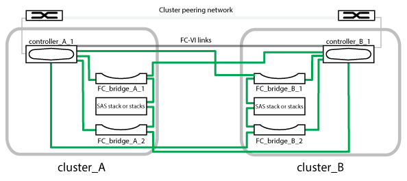

= 双节点桥接延伸型 MetroCluster 配置的组成部分
:allow-uri-read: 
:icons: font
:imagesdir: ../media/

[role="lead"]
在规划 MetroCluster 配置时，您应了解配置的各个部分及其协同工作的方式。

MetroCluster 配置包括以下主要硬件元素：

* 存储控制器
+
存储控制器不会直接连接到存储，而是连接到 FC-SAS 网桥。存储控制器通过每个控制器的 FC-VI 适配器之间的 FC 缆线相互连接。

+
每个存储控制器都会配置为配对站点上某个存储控制器的 DR 配对节点。

* FC-SAS 网桥
+
FC-SAS 网桥可将 SAS 存储堆栈连接到控制器上的 FC 启动程序端口，从而在两个协议之间提供桥接。

* 集群对等网络
+
集群对等网络可为 Storage Virtual Machine （ SVM ）配置的镜像提供连接。一个集群上所有 SVM 的配置都会镜像到配对集群。

下图显示了 MetroCluster 配置的简化视图。对于某些连接，单线表示组件之间的多个冗余连接。未显示数据和管理网络连接。

* 此配置包含两个单节点集群。
* 每个站点都有一个或多个 SAS 存储堆栈。
+

NOTE: MetroCluster 配置中的 SAS 磁盘架不支持 ACP 布线。

+
支持更多存储堆栈，但每个站点仅显示一个存储堆栈。

