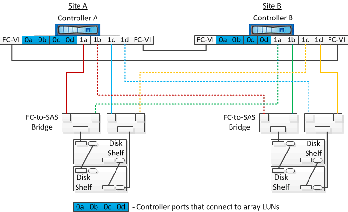

= 使用磁盘和阵列 LUN 的双节点延伸型 MetroCluster 配置示例
:icons: font
:imagesdir: ../media/

[role="lead"]
要设置使用原生磁盘和阵列 LUN 的延伸型 MetroCluster 配置，必须使用 FC-SAS 网桥或 SAS 光缆将 ONTAP 系统连接到磁盘架。必须使用 FC 交换机将阵列 LUN 连接到 ONTAP 系统。

要使 ONTAP 系统同时连接到原生磁盘和阵列 LUN ，至少需要八个 HBA 端口。

以下示例显示了使用磁盘和阵列 LUN 的双节点延伸型 MetroCluster 配置，其中， HBA 端口 0a 到 0d 用于连接阵列 LUN ，而端口 1a 到 1d 用于连接原生磁盘。

下图显示了双节点延伸型 MetroCluster 配置，其中，原生磁盘通过 SAS 光缆连接到 ONTAP 系统：

image::../media/two_node_mcc_combined_glowworm.gif[双节点 MCC 组合式萤火虫]

下图显示了双节点延伸型 MetroCluster 配置，其中，原生磁盘通过 FC-SAS 网桥连接到 ONTAP 系统：

下图显示了具有阵列 LUN 连接的双节点延伸型 MetroCluster 配置：

image::../media/two_node_mcc_combined_array_luns.gif[双节点 MCC 组合阵列 LUN]

NOTE: 如果需要，您还可以使用相同的 FC 交换机将原生磁盘和阵列 LUN 连接到 MetroCluster 配置中的控制器。

https://docs.netapp.com/us-en/ontap-metrocluster/install-fc/index.html["光纤连接的 MetroCluster 安装和配置"]
