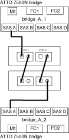

= 使用缆线将 FibreBridge 7600N 或 7500N 网桥连接到使用 IOM6 或 IOM3 模块的磁盘架
:icons: font
:imagesdir: ../media/

[role="lead"]
配置网桥后，您可以开始为系统布线。FibreBridge 7600N 或 7500N 网桥使用迷你 SAS 连接器，并支持使用 IOM6 或 IOM3 模块的磁盘架。

FibreBridge 7600N 网桥不支持 IOM3 模块。

对于磁盘架，您可以插入 SAS 缆线连接器，拉片朝下（位于连接器的下侧）。

.步骤
. 以菊花链方式连接每个堆栈中的磁盘架。
+
.. 对于第一个磁盘架堆栈，使用缆线将第一个磁盘架的 IOM A 方形端口连接到 FibreBridge A 上的 SAS 端口 A
.. 对于第一个磁盘架堆栈，使用缆线将最后一个磁盘架的 IOM B 圆形端口连接到 FibreBridge B 上的 SAS 端口 A
+
适用于您的磁盘架型号的安装和服务指南提供了有关以菊花链方式连接磁盘架的详细信息。

+
https://library.netapp.com/ecm/ecm_download_file/ECMP1119629["《适用于 DS4243 ， DS2246 ， DS4486 和 DS4246 的 SAS 磁盘架安装和服务指南》"]

+
下图显示了一组连接到磁盘架堆栈的网桥：

+

. 对于其他磁盘架堆栈，请使用 FibreBridge 网桥上的下一个可用 SAS 端口重复上述步骤。使用端口 B 表示第二个堆栈，使用端口 C 表示第三个堆栈，使用端口 D 表示第四个堆栈。
+
下图显示了连接到一对 FibreBridge 7600N 或 7500N 网桥的四个堆栈。

+
image::../media/mcc_cabling_bridge_and_sas_stack_with_7500n_four_stacks.gif[MCC 布线网桥和 SAS 堆栈，包含 7500n 四个堆栈]

