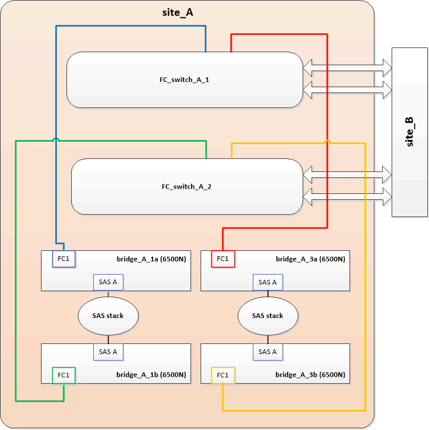

= 将一对 FibreBridge 6500N 网桥更换为 7600N 或 7500N 网桥
:allow-uri-read: 
:icons: font
:imagesdir: ../media/

[role="lead"]
为了利用 FibreBridge 7600N 或 7500N 网桥上的额外 FC2 端口并降低机架利用率，您可以无中断地更换 6500N 网桥，并在一对 FibreBridge 7600N 或 7500N 网桥下整合多达四个存储堆栈。

.开始之前
您需要管理员密码以及对 FTP 或 SCP 服务器的访问权限。

.关于此任务
在以下情况下，应使用此操作步骤：

* 您要将一对 FibreBridge 6500N 网桥更换为 FibreBridge 7600N 或 7500N 网桥。
+
更换后，对中的两个网桥必须为相同型号。

* 您先前已将一个 FibreBridge 6500N 网桥更换为 7600N 或 7500N 网桥，现在正在更换此网桥对中的第二个网桥。
* 您有一对具有可用 SAS 端口的 FibreBridge 7600N 或 7500N 网桥，并且您正在整合当前使用 FibreBridge 6500N 网桥连接的 SAS 存储堆栈。

此操作步骤不会造成系统中断，大约需要两小时才能完成。

.相关信息
link:task_replace_a_sle_fc_to_sas_bridge.html["更换单个 FC-SAS 网桥"]

== 验证存储连接

在更换网桥之前，您应验证网桥和存储连接。熟悉命令输出后，您可以在更改配置后确认连接。

您可以从正在维护的站点上 MetroCluster 配置中任何控制器模块的管理提示符处问题描述这些命令。

. 在任意一个 MetroCluster 节点上输入以下命令，以确认与磁盘的连接：
+
`运行本地 sysconfig -v`

+
输出显示了连接到控制器上启动程序端口的磁盘，并标识了连接到 FC-SAS 网桥的磁盘架：

+
[listing]
----

node_A_1> run local sysconfig -v
NetApp Release 9.3.2X18: Sun Dec 13 01:23:24 PST 2017
System ID: 4068741258 (node_A_1); partner ID: 4068741260 (node_B_1)
System Serial Number: 940001025471 (node_A_1)
System Rev: 70
System Storage Configuration: Multi-Path HA**<=== Configuration should be multi-path HA**
.
.
.
slot 0: FC Host Adapter 0g (QLogic 8324 rev. 2, N-port, <UP>)**<=== Initiator port**
		Firmware rev:      7.5.0
		Flash rev:         0.0.0
		Host Port Id:      0x60130
		FC Node Name:      5:00a:098201:bae312
		FC Port Name:      5:00a:098201:bae312
		SFP Vendor:        UTILITIES CORP.
		SFP Part Number:   FTLF8529P3BCVAN1
		SFP Serial Number: URQ0Q9R
		SFP Capabilities:  4, 8 or 16 Gbit
		Link Data Rate:    16 Gbit
		Switch Port:       brcd6505-fcs40:1
  **<List of disks visible to port\>**
		 ID     Vendor   Model            FW    Size
		brcd6505-fcs29:12.126L1527     : NETAPP   X302_HJUPI01TSSM NA04 847.5GB (1953525168 512B/sect)
		brcd6505-fcs29:12.126L1528     : NETAPP   X302_HJUPI01TSSA NA02 847.5GB (1953525168 512B/sect)
		.
		.
		.
		**<List of FC-to-SAS bridges visible to port\>**
		FC-to-SAS Bridge:
		brcd6505-fcs40:12.126L0        : ATTO     FibreBridge6500N 1.61  FB6500N102980
		brcd6505-fcs42:13.126L0        : ATTO     FibreBridge6500N 1.61  FB6500N102980
		brcd6505-fcs42:6.126L0         : ATTO     FibreBridge6500N 1.61  FB6500N101167
		brcd6505-fcs42:7.126L0         : ATTO     FibreBridge6500N 1.61  FB6500N102974
		.
		.
		.
  **<List of storage shelves visible to port\>**
		brcd6505-fcs40:12.shelf6: DS4243  Firmware rev. IOM3 A: 0200  IOM3 B: 0200
		brcd6505-fcs40:12.shelf8: DS4243  Firmware rev. IOM3 A: 0200  IOM3 B: 0200
		.
		.
		.
----

== 热插拔 FibreBridge 6500N 网桥以创建一对 FibreBridge 7600N 或 7500N 网桥

要热插拔一个或两个 FibreBridge 6500N 网桥以创建使用一对 FibreBridge 7600N 或 7500N 网桥的配置，您必须一次更换一个网桥并按照正确的布线操作步骤进行操作。新布线与原始布线不同。

.关于此任务
如果满足以下条件，也可以使用此操作步骤：

* 您要更换一对连接到同一 SAS 存储堆栈的 FibreBridge 6500N 网桥。
* 您先前已更换此网桥对中的一个 FibreBridge 6500N 网桥，而您的存储堆栈配置了一个 FibreBridge 6500N 网桥和一个 FibreBridge 7600N 或 7500N 网桥。
+
在这种情况下，您应从以下步骤开始，将 "`底部` " FibreBridge 6500N 网桥热插拔为 FibreBridge 7600N 或 7500N 网桥。

下图显示了一个初始配置示例，其中四个 FibreBridge 6500N 网桥连接两个 SAS 存储堆栈：

.步骤
. 按照以下准则，使用中的操作步骤热插拔 "`Top` FibreBridge 6500N 网桥与 FibreBridge 7600N 或 7500N 网桥 link:task_replace_a_sle_fc_to_sas_bridge.html#hot_swap_6500n["热插拔 FibreBridge 6500N 网桥和 FibreBridge 7600N 或 7500N 网桥"]：
+
** 将 FibreBridge 7600N 或 7500N 网桥 FC1 端口连接到交换机或控制器。
+
此连接与 FibreBridge 6500N 网桥 FC1 端口的连接相同。

** 此时请勿连接 FibreBridge 7600N 或 7500N 网桥 FC2 端口。下图显示 bridge_A_1a 已被更换，现在是 FibreBridge 7600N 或 7500N 网桥：

+
image::../media/consolidating_stacks_1st_7500n_in_place.gif[整合第一个 7500n 堆栈]

. 确认连接到网桥连接的磁盘，并且新的 FibreBridge 7500N 在配置中可见：
+
`运行本地 sysconfig -v`

+
[listing]
----

node_A_1> run local sysconfig -v
NetApp Release 9.3.2X18: Sun Dec 13 01:23:24 PST 2015
System ID: 0536872165 (node_A_1); partner ID: 0536872141 (node_B_1)
System Serial Number: 940001025465 (node_A_1)
System Rev: 70
System Storage Configuration: Multi-Path HA**<=== Configuration should be multi-path HA**
.
.
.
slot 0: FC Host Adapter 0g (QLogic 8324 rev. 2, N-port, <UP>)**<=== Initiator port**
		Firmware rev:      7.5.0
		Flash rev:         0.0.0
		Host Port Id:      0x60100
		FC Node Name:      5:00a:098201:bae312
		FC Port Name:      5:00a:098201:bae312
		SFP Vendor:        FINISAR CORP.
		SFP Part Number:   FTLF8529P3BCVAN1
		SFP Serial Number: URQ0R1R
		SFP Capabilities:  4, 8 or 16 Gbit
		Link Data Rate:    16 Gbit
		Switch Port:       brcd6505-fcs40:1
  **<List of disks visible to port\>**
		 ID     Vendor   Model            FW    Size
		brcd6505-fcs40:12.126L1527     : NETAPP   X302_HJUPI01TSSM NA04 847.5GB (1953525168 512B/sect)
		brcd6505-fcs40:12.126L1528     : NETAPP   X302_HJUPI01TSSA NA02 847.5GB (1953525168 512B/sect)
		.
		.
		.
		**<List of FC-to-SAS bridges visible to port\>**
		FC-to-SAS Bridge:
		brcd6505-fcs40:12.126L0        : ATTO     FibreBridge7500N A30H  FB7500N100104**<===**
		brcd6505-fcs42:13.126L0        : ATTO     FibreBridge6500N 1.61  FB6500N102980
		brcd6505-fcs42:6.126L0         : ATTO     FibreBridge6500N 1.61  FB6500N101167
		brcd6505-fcs42:7.126L0         : ATTO     FibreBridge6500N 1.61  FB6500N102974
		.
		.
		.
  **<List of storage shelves visible to port\>**
		brcd6505-fcs40:12.shelf6: DS4243  Firmware rev. IOM3 A: 0200  IOM3 B: 0200
		brcd6505-fcs40:12.shelf8: DS4243  Firmware rev. IOM3 A: 0200  IOM3 B: 0200
		.
		.
		.
----
. 按照以下准则，使用中的操作步骤热插拔 "`底部` FibreBridge 6500N 网桥与 FibreBridge 7600N 或 7500N 网桥 link:task_replace_a_sle_fc_to_sas_bridge.html#hot_swap_6500n["热插拔 FibreBridge 6500N 网桥和 FibreBridge 7600N 或 7500N 网桥"]：
+
** 将 FibreBridge 7600N 或 7500N 网桥 FC2 端口连接到交换机或控制器。
+
此连接与 FibreBridge 6500N 网桥 FC1 端口的连接相同。

** 此时请勿连接 FibreBridge 7600N 或 7500N 网桥 FC1 端口。image:../media/consolidating_stacks_2nd_7500n_in_place.gif[""]

. 确认与网桥连接磁盘的连接：
+
`运行本地 sysconfig -v`

+
输出显示了连接到控制器上启动程序端口的磁盘，并标识了连接到 FC-SAS 网桥的磁盘架：

+
[listing]
----

node_A_1> run local sysconfig -v
NetApp Release 9.3.2X18: Sun Dec 13 01:23:24 PST 2015
System ID: 0536872165 (node_A_1); partner ID: 0536872141 (node_B_1)
System Serial Number: 940001025465 (node_A_1)
System Rev: 70
System Storage Configuration: Multi-Path HA**<=== Configuration should be multi-path HA**
.
.
.
slot 0: FC Host Adapter 0g (QLogic 8324 rev. 2, N-port, <UP>)**<=== Initiator port**
		Firmware rev:      7.5.0
		Flash rev:         0.0.0
		Host Port Id:      0x60100
		FC Node Name:      5:00a:098201:bae312
		FC Port Name:      5:00a:098201:bae312
		SFP Vendor:        FINISAR CORP.
		SFP Part Number:   FTLF8529P3BCVAN1
		SFP Serial Number: URQ0R1R
		SFP Capabilities:  4, 8 or 16 Gbit
		Link Data Rate:    16 Gbit
		Switch Port:       brcd6505-fcs40:1
  **<List of disks visible to port\>**
		 ID     Vendor   Model            FW    Size
		brcd6505-fcs40:12.126L1527     : NETAPP   X302_HJUPI01TSSM NA04 847.5GB (1953525168 512B/sect)
		brcd6505-fcs40:12.126L1528     : NETAPP   X302_HJUPI01TSSA NA02 847.5GB (1953525168 512B/sect)
		.
		.
		.
		**<List of FC-to-SAS bridges visible to port\>**
		FC-to-SAS Bridge:
		brcd6505-fcs40:12.126L0        : ATTO     FibreBridge7500N A30H  FB7500N100104
		brcd6505-fcs42:13.126L0        : ATTO     FibreBridge7500N A30H  FB7500N100104
		.
		.
		.
  **<List of storage shelves visible to port\>**
		brcd6505-fcs40:12.shelf6: DS4243  Firmware rev. IOM3 A: 0200  IOM3 B: 0200
		brcd6505-fcs40:12.shelf8: DS4243  Firmware rev. IOM3 A: 0200  IOM3 B: 0200
		.
		.
		.
----

== 在 FibreBridge 7600N 或 7500N 网桥后面整合存储时，为网桥 SAS 端口布线

在使用可用 SAS 端口将多个 SAS 存储堆栈整合到一对 FibreBridge 7600N 或 7500N 网桥之后时，必须将顶部和底部 SAS 缆线移至新网桥。

.关于此任务
FibreBridge 6500N 网桥 SAS 端口使用 QSFP 连接器。FibreBridge 7600N 或 7500N 网桥 SAS 端口使用迷你 SAS 连接器。

IMPORTANT: 如果将 SAS 缆线插入错误的端口，则在从 SAS 端口拔下缆线时，必须至少等待 120 秒，然后再将缆线插入其他 SAS 端口。如果您未能执行此操作，系统将无法识别此缆线已移至其他端口。

NOTE: 请至少等待 10 秒，然后再连接端口。SAS 缆线连接器具有方向性；正确连接到 SAS 端口时，连接器会卡入到位，磁盘架 SAS 端口 LNK LED 会呈绿色亮起。对于磁盘架，您可以插入 SAS 缆线连接器，拉片朝下（位于连接器的下侧）。

.步骤
. 拔下将顶部 FibreBridge 6500N 网桥的 SAS A 端口连接到顶部 SAS 磁盘架的缆线，请务必记下存储架上与其连接的 SAS 端口。
+
在以下示例中，此缆线显示为蓝色：

+
image::../media/consolidating_stacks_sas_top_before.gif[整合堆栈之前的 SAS 最重要组件]

. 使用带有迷你 SAS 连接器的缆线，将存储架上的相同 SAS 端口连接到顶部 FibreBridge 7600N 或 7500N 网桥的 SAS B 端口。
+
在以下示例中，此缆线显示为蓝色：

+
image::../media/consolidating_stacks_sas_top_after.gif[整合堆栈 SAS 的首要任务]

. 拔下将底部 FibreBridge 6500N 网桥的 SAS A 端口连接到顶部 SAS 磁盘架的缆线，请务必记下存储架上与其连接的 SAS 端口。
+
在以下示例中，此缆线显示为绿色：

+
image::../media/consolidating_stacks_sas_bottom_before.gif[将堆栈整合到底层]

. 使用带有迷你 SAS 连接器的缆线，将存储架上的相同 SAS 端口连接到底部 FibreBridge 7600N 或 7500N 网桥的 SAS B 端口。
+
在以下示例中，此缆线显示为绿色：

+
image::../media/consolidating_stacks_sas_bottom_after.gif[之后再整合堆栈 SAS]

. 确认与网桥连接磁盘的连接：
+
`运行本地 sysconfig -v`

+
输出显示了连接到控制器上启动程序端口的磁盘，并标识了连接到 FC-SAS 网桥的磁盘架：

+
[listing]
----

node_A_1> run local sysconfig -v
NetApp Release 9.3.2X18: Sun Dec 13 01:23:24 PST 2015
System ID: 0536872165 (node_A_1); partner ID: 0536872141 (node_B_1)
System Serial Number: 940001025465 (node_A_1)
System Rev: 70
System Storage Configuration: Multi-Path HA**<=== Configuration should be multi-path HA**
.
.
.
slot 0: FC Host Adapter 0g (QLogic 8324 rev. 2, N-port, <UP>)**<=== Initiator port**
		Firmware rev:      7.5.0
		Flash rev:         0.0.0
		Host Port Id:      0x60100
		FC Node Name:      5:00a:098201:bae312
		FC Port Name:      5:00a:098201:bae312
		SFP Vendor:        FINISAR CORP.
		SFP Part Number:   FTLF8529P3BCVAN1
		SFP Serial Number: URQ0R1R
		SFP Capabilities:  4, 8 or 16 Gbit
		Link Data Rate:    16 Gbit
		Switch Port:       brcd6505-fcs40:1
  **<List of disks visible to port\>**
		 ID     Vendor   Model            FW    Size
		brcd6505-fcs40:12.126L1527     : NETAPP   X302_HJUPI01TSSM NA04 847.5GB (1953525168 512B/sect)
		brcd6505-fcs40:12.126L1528     : NETAPP   X302_HJUPI01TSSA NA02 847.5GB (1953525168 512B/sect)
		.
		.
		.
		**<List of FC-to-SAS bridges visible to port\>**
		FC-to-SAS Bridge:
		brcd6505-fcs40:12.126L0        : ATTO     FibreBridge7500N A30H  FB7500N100104
		brcd6505-fcs42:13.126L0        : ATTO     FibreBridge7500N A30H  FB7500N100104
		.
		.
		.
  **<List of storage shelves visible to port\>**
		brcd6505-fcs40:12.shelf6: DS4243  Firmware rev. IOM3 A: 0200  IOM3 B: 0200
		brcd6505-fcs40:12.shelf8: DS4243  Firmware rev. IOM3 A: 0200  IOM3 B: 0200
		.
		.
		.
----
. 卸下不再连接到 SAS 存储的旧 FibreBridge 6500N 网桥。
. 等待两分钟，让系统识别所做的更改。
. 如果系统布线不正确，请拔下缆线，更正布线，然后重新连接正确的缆线。
. 如有必要，请重复上述步骤，依次使用 SAS 端口 C 和 D ，将最多两个额外的 SAS 堆栈移至新的 FibreBridge 7600N 或 7500N 网桥后面
+
每个 SAS 堆栈都必须连接到顶部和底部网桥上的相同 SAS 端口。例如，如果堆栈的顶部连接连接到顶部网桥 SAS B 端口，则底部连接必须连接到底部网桥的 SAS B 端口。

+
image::../media/consolidation_sas_bottom_connection_4_stacks.gif[整合 SAS 底部连接 4 个堆栈]

== 向配置中添加 FibreBridge 7600N 或 7500N 网桥时更新分区

如果要将 FibreBridge 6500N 网桥更换为 FibreBridge 7600N 或 7500N 网桥并使用 FibreBridge 7600N 或 7500N 网桥上的两个 FC 端口，则必须更改分区。所需的更改取决于您运行的 ONTAP 版本是否早于 9.1 或 9.1 及更高版本。

=== 将 FibreBridge 7500N 网桥添加到配置时更新分区（ ONTAP 9.1 之前）

如果要将 FibreBridge 6500N 网桥更换为 FibreBridge 7500N 网桥并使用 FibreBridge 7500N 网桥上的两个 FC 端口，则必须更改分区。每个分区的启动程序端口不能超过四个。您使用的分区取决于您运行的是 9.1 或 9.1 及更高版本的 ONTAP

.关于此任务
此任务中的特定分区适用于 9.1 之前的 ONTAP 版本。

为了避免 ONTAP 出现问题，需要进行分区更改，因为 要求一个磁盘的路径不能超过四个 FC 启动程序端口。重新布线以整合磁盘架后，现有分区将导致每个磁盘可通过八个 FC 端口访问。您必须更改分区，以将每个分区中的启动程序端口减少为四个。

下图显示了更改前 site_A 上的分区：

image::../media/zoning_consolidation_site_a_before.gif[之前对整合站点 A 进行分区]

.步骤
. 通过从每个现有分区中删除一半的启动程序端口并为 FibreBridge 7500N FC2 端口创建新分区来更新 FC 交换机的存储分区。
+
新 FC2 端口的分区将包含从现有分区中删除的启动程序端口。在图中，这些分区以虚线显示。

+
有关分区命令的详细信息，请参见中的 FC 交换机部分 link:../install-fc/index.html["光纤连接的 MetroCluster 安装和配置"] 或 link:../install-stretch/concept_considerations_differences.html["延伸型 MetroCluster 安装和配置"]。

+
以下示例显示了整合前后每个分区中的存储分区和端口。这些端口由 _domain ， port_ 对标识。

+
** 域 5 由交换机 FC_switch_A_1 组成。
** 域 6 由交换机 FC_switch_A_2 组成。
** 域 7 由交换机 FC_switch_B_1 组成。
** 域 8 由交换机 FC_switch_B_2 组成。

|===

| 整合前或整合后 | 分区 | 域和端口 | 图中的颜色（此图仅显示站点 A ） 

 a| 
整合前的分区。四个 FibreBridge 6500N 网桥上的每个 FC 端口都有一个分区。
 a| 
STOR_A_1a-FC1
 a| 
5 ， 1 ， 5 ， 2 ， 5 ， 4 ， 5 ， 7 ， 1 ； 7 ， 2 ； 7 ， 4 ； 7 ， 5 ； 5 ， 6
 a| 
紫色 + 紫色虚线 + 蓝色

 a| 
STOR_A_1b-FC1
 a| 
6 ， 1 ， 6 ， 2 ， 6 ， 4 ， 6 ， 5 ， 8 ， 1 ； 8 ， 2 ， 8 ， 4 ， 8 ， 5 ， 6
 a| 
棕色 + 棕色虚线 + 绿色

 a| 
STOR_A_2a-FC1
 a| 
5 ， 1 ， 5 ， 2 ， 5 ， 4 ， 5 ， 7 ， 1 ； 7 ， 2 ； 7 ， 4 ； 7 ， 5 ； 5 ， 7
 a| 
紫色 + 紫色虚线 + 红色

 a| 
STOR_A_2b-FC1
 a| 
6 ， 1 ， 6 ， 2 ， 6 ， 4 ， 6 ， 5 ， 8 ， 1 ； 8 ， 2 ； 8 ， 4 ； 8 ， 5 ； 6 ， 7
 a| 
棕色 + 棕色虚线 + 橙色

 a| 
整合后的分区。两个 FibreBridge 7500N 网桥上的每个 FC 端口都有一个分区。
 a| 
STOR_A_1a-FC1
 a| 
7 ， 1 ， 7 ， 4 ， 5 ， 1 ， 5 ， 4 ， 5 ， 6
 a| 
紫色 + 蓝色

 a| 
STOR_A_1b-FC1
 a| 
7 ， 2 ； 7 ， 5 ； 5 ， 2 ； 5 ， 5 ； 5 ， 7
 a| 
紫色虚线 + 红色

 a| 
STOR_A_1a-FC2
 a| 
8 ， 1 ； 8 ， 4 ； 6 ， 1 ； 6 ， 4 ； 6 ， 6
 a| 
棕色 + 绿色

 a| 
STOR_A_1b-FC2
 a| 
8 ， 2 ， 8 ， 5 ， 6 ， 2 ， 6 ， 5 ， 6 ， 7
 a| 
棕色虚线 + 橙色

|===
下图显示了整合后 site_A 的分区：

image::../media/zoning_consolidation_site_a_after.gif[对整合站点 A 进行分区]

=== 将 FibreBridge 7600N 或 7500N 网桥添加到配置时更新分区（ ONTAP 9.1 及更高版本）

如果要将 FibreBridge 6500N 网桥更换为 FibreBridge 7600N 或 7500N 网桥并使用 FibreBridge 7600N 或 7500N 网桥上的两个 FC 端口，则必须更改分区。每个分区的启动程序端口不能超过四个。

.关于此任务
* 此任务为适用场景 ONTAP 9.1 及更高版本。
* ONTAP 9.6 及更高版本支持 FibreBridge 7600N 网桥。
* 此任务中的特定分区适用于 ONTAP 9.1 及更高版本。
* 为了避免 ONTAP 出现问题，需要进行分区更改，因为 要求一个磁盘的路径不能超过四个 FC 启动程序端口。
+
重新布线以整合磁盘架后，现有分区将导致每个磁盘可通过八个 FC 端口访问。您必须更改分区，以将每个分区中的启动程序端口减少为四个。

.步骤
. 通过从每个现有分区中删除一半启动程序端口并为 FibreBridge 7600N 或 7500N FC2 端口创建新分区来更新 FC 交换机的存储分区。
+
新 FC2 端口的分区将包含从现有分区中删除的启动程序端口。

+
请参阅的 FC 交换机部分 link:../install-fc/index.html["光纤连接的 MetroCluster 安装和配置"] 有关分区命令的详细信息。

== 将 FibreBridge 7600N 或 7500N 网桥添加到配置时，为第二个网桥 FC 端口布线

要为存储堆栈提供多条路径，您可以在将 FibreBridge 7600N 或 7500N 网桥添加到配置中后为每个 FibreBridge 7600N 或 7500N 网桥上的第二个 FC 端口布线。

.开始之前
分区必须已进行调整，以便为第二个 FC 端口提供分区。

.步骤
. 使用缆线将顶部网桥的 FC2 端口连接到 FC_switch_A_2 上的正确端口。
+
image::../media/consolidating_stacks_sas_ports_recabled.gif[整合堆栈 SAS 端口已重新布线]

. 使用缆线将底部网桥的 FC1 端口连接到 FC_switch_A_1 上的正确端口。
+
image::../media/consolidating_stacks_final.gif[最终整合堆栈]

. 确认与网桥连接磁盘的连接：
+
`运行本地 sysconfig -v`

+
输出显示了连接到控制器上启动程序端口的磁盘，并标识了连接到 FC-SAS 网桥的磁盘架：

+
[listing]
----

node_A_1> run local sysconfig -v
NetApp Release 9.3.2X18: Sun Dec 13 01:23:24 PST 2015
System ID: 0536872165 (node_A_1); partner ID: 0536872141 (node_B_1)
System Serial Number: 940001025465 (node_A_1)
System Rev: 70
System Storage Configuration: Multi-Path HA**<=== Configuration should be multi-path HA**
.
.
.
slot 0: FC Host Adapter 0g (QLogic 8324 rev. 2, N-port, <UP>)**<=== Initiator port**
		Firmware rev:      7.5.0
		Flash rev:         0.0.0
		Host Port Id:      0x60100
		FC Node Name:      5:00a:098201:bae312
		FC Port Name:      5:00a:098201:bae312
		SFP Vendor:        FINISAR CORP.
		SFP Part Number:   FTLF8529P3BCVAN1
		SFP Serial Number: URQ0R1R
		SFP Capabilities:  4, 8 or 16 Gbit
		Link Data Rate:    16 Gbit
		Switch Port:       brcd6505-fcs40:1
  **<List of disks visible to port\>**
		 ID     Vendor   Model            FW    Size
		brcd6505-fcs40:12.126L1527     : NETAPP   X302_HJUPI01TSSM NA04 847.5GB (1953525168 512B/sect)
		brcd6505-fcs40:12.126L1528     : NETAPP   X302_HJUPI01TSSA NA02 847.5GB (1953525168 512B/sect)
		.
		.
		.
		**<List of FC-to-SAS bridges visible to port\>**
		FC-to-SAS Bridge:
		brcd6505-fcs40:12.126L0        : ATTO     FibreBridge7500N A30H  FB7500N100104
		brcd6505-fcs42:13.126L0        : ATTO     FibreBridge7500N A30H  FB7500N100104
		.
		.
		.
  **<List of storage shelves visible to port\>**
		brcd6505-fcs40:12.shelf6: DS4243  Firmware rev. IOM3 A: 0200  IOM3 B: 0200
		brcd6505-fcs40:12.shelf8: DS4243  Firmware rev. IOM3 A: 0200  IOM3 B: 0200
		.
		.
		.
----

== 禁用 FC-SAS 网桥上未使用的 SAS 端口

更改网桥的布线后，您应禁用 FC-SAS 网桥上任何未使用的 SAS 端口，以避免出现与未使用的端口相关的运行状况监控器警报。

.步骤
. 禁用顶部 FC-SAS 网桥上未使用的 SAS 端口：
+
.. 登录到网桥命令行界面。
.. 禁用所有未使用的端口。
+
[NOTE]
====
如果已配置 ATTO 7500N 网桥，则默认情况下会启用所有 SAS 端口（ A 到 D ），并且必须禁用未使用的 SAS 端口：

`sasportDisable _SAS port_`

====
+
如果使用 SAS 端口 A 和 B ，则必须禁用 SAS 端口 C 和 D 。在以下示例中，禁用了未使用的 SAS 端口 C 和 D ：

+
[listing]
----
Ready. *
SASPortDisable C

SAS Port C has been disabled.

Ready. *
SASPortDisable D

SAS Port D has been disabled.

Ready. *
----
.. 保存网桥配置： + `SaveConfiguration`
+
以下示例显示已禁用 SAS 端口 C 和 D 。请注意，不再显示星号，表示配置已保存。

+
[listing]
----
Ready. *
SaveConfiguration

Ready.
----

. 对底部 FC-SAS 网桥重复上述步骤。

