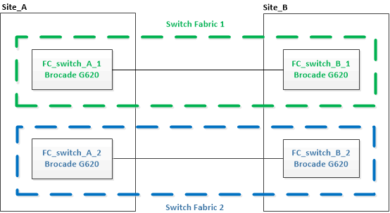

= 升级到新的 Brocade FC 交换机
:allow-uri-read: 
:icons: font
:imagesdir: ../media/

[role="lead"]
如果要升级到新的 Brocade FC 交换机，则必须更换第一个网络结构中的交换机，验证 MetroCluster 配置是否完全正常运行，然后更换第二个网络结构中的交换机。

* MetroCluster 配置必须运行正常。
* MetroCluster 交换机网络结构由四个 Brocade 交换机组成。
+
以下步骤中的图显示了当前交换机。

* 交换机必须运行最新支持的固件。
+
https://mysupport.netapp.com/matrix["NetApp 互操作性表工具"^]

* 此操作步骤不会造成系统中断，大约需要两小时才能完成。
* 您需要管理员密码以及对 FTP 或 SCP 服务器的访问权限。

交换机网络结构一次升级一个。

此操作步骤结束时，所有四个交换机都将升级到新交换机。

.步骤
. 禁用第一个交换机网络结构：
+
` * FC_switch_A_1 ： admin> switchCfgPersistentDisable*`

+
[listing]
----
FC_switch_A_1:admin> switchCfgPersistentDisable
----
+
image::../media/brocade_upgr_to_g620_fab_1_down.gif[Brocade 与 G620 Fab 1 的升级已关闭]

. 更换一个 MetroCluster 站点上的旧交换机。
+
.. 拔下已禁用交换机的缆线并将其卸下。
.. 在机架中安装新交换机。
+
image::../media/brocade_upgr_to_g620_replaced_a_1.gif[Brocade 与 G620 的升级取代了 A 1]

.. 禁用新交换机：
+
`sswitchcfgpersistentdisable`

+
命令将禁用交换机网络结构中的两个交换机。

+
[listing]
----
FC_switch_A_1:admin> switchCfgPersistentDisable
----
.. 使用建议的端口分配为新交换机布线。
+
link:concept_port_assignments_for_fc_switches_when_using_ontap_9_1_and_later.html["使用 ONTAP 9.1 及更高版本时 FC 交换机的端口分配"]

.. 在配对 MetroCluster 站点上重复这些子步骤，以更换第一个交换机网络结构中的第二个交换机。
+
已更换网络结构 1 中的两个交换机。

+
image::../media/brocade_upgr_to_g620_replaced_b_1.gif[Brocade 与 G620 的升级已取代 b 1.]

. 启动新交换机并让其启动。
. 下载新交换机的 RCF 文件。
. 按照下载页面上的说明，将 RCF 文件应用于网络结构中的两个新交换机。
. 保存交换机配置：
+
`cfgsave`

. 等待 10 分钟，使配置保持稳定。
. 在任意一个 MetroCluster 节点上输入以下命令，以确认与磁盘的连接：
+
`运行本地 sysconfig -v`

+
输出显示了连接到控制器上启动程序端口的磁盘，并标识了连接到 FC-SAS 网桥的磁盘架：

+
[listing]
----

node_A_1> run local sysconfig -v
NetApp Release 9.3.2X18: Sun Dec 13 01:23:24 PST 2017
System ID: 4068741258 (node_A_1); partner ID: 4068741260 (node_B_1)
System Serial Number: 940001025471 (node_A_1)
System Rev: 70
System Storage Configuration: Multi-Path HA**<=== Configuration should be multi-path HA**
.
.
.
slot 0: FC Host Adapter 0g (QLogic 8324 rev. 2, N-port, <UP>)**<=== Initiator port**
		Firmware rev:      7.5.0
		Flash rev:         0.0.0
		Host Port Id:      0x60130
		FC Node Name:      5:00a:098201:bae312
		FC Port Name:      5:00a:098201:bae312
		SFP Vendor:        UTILITIES CORP.
		SFP Part Number:   FTLF8529P3BCVAN1
		SFP Serial Number: URQ0Q9R
		SFP Capabilities:  4, 8 or 16 Gbit
		Link Data Rate:    16 Gbit
		Switch Port:       brcd6505-fcs40:1
  **<List of disks visible to port\>**
		 ID     Vendor   Model            FW    Size
		brcd6505-fcs29:12.126L1527     : NETAPP   X302_HJUPI01TSSM NA04 847.5GB (1953525168 512B/sect)
		brcd6505-fcs29:12.126L1528     : NETAPP   X302_HJUPI01TSSA NA02 847.5GB (1953525168 512B/sect)
		.
		.
		.
		**<List of FC-to-SAS bridges visible to port\>**
		FC-to-SAS Bridge:
		brcd6505-fcs40:12.126L0        : ATTO     FibreBridge6500N 1.61  FB6500N102980
		brcd6505-fcs42:13.126L0        : ATTO     FibreBridge6500N 1.61  FB6500N102980
		brcd6505-fcs42:6.126L0         : ATTO     FibreBridge6500N 1.61  FB6500N101167
		brcd6505-fcs42:7.126L0         : ATTO     FibreBridge6500N 1.61  FB6500N102974
		.
		.
		.
  **<List of storage shelves visible to port\>**
		brcd6505-fcs40:12.shelf6: DS4243  Firmware rev. IOM3 A: 0200  IOM3 B: 0200
		brcd6505-fcs40:12.shelf8: DS4243  Firmware rev. IOM3 A: 0200  IOM3 B: 0200
		.
		.
		.
----
. 返回到交换机提示符，验证交换机固件版本：
+
`固件`

+
交换机必须运行最新支持的固件。

+
https://mysupport.netapp.com/matrix["NetApp 互操作性表工具"]

. 模拟切换操作：
+
.. 在任何节点的提示符处，更改为高级权限级别： + `set -privilege advanced`
+
在系统提示您继续进入高级模式并查看高级模式提示符（ * > ）时，您需要使用 "`y` " 进行响应。

.. 使用 ` -simulate` 参数执行切换操作：
+
`MetroCluster switchover -simulate`

.. 返回到管理权限级别：
+
`set -privilege admin`

. 对第二个交换机网络结构重复上述步骤。

重复执行这些步骤后，所有四个交换机均已升级，并且 MetroCluster 配置运行正常。

