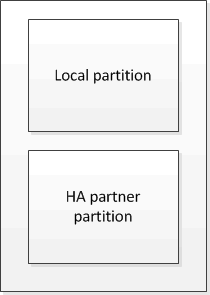

= 了解 MetroCluster 数据保护和灾难恢复
:allow-uri-read: 
:icons: font
:imagesdir: ../media/

[role="lead"]
了解 MetroCluster 如何保护数据并提供透明的故障恢复，以便您可以轻松高效地管理切换和切回活动，这很有帮助。

MetroCluster 使用镜像来保护集群中的数据。它可通过单个 MetroCluster 命令提供灾难恢复，该命令可激活幸存站点上的二级站点，以提供受灾难影响的主站点最初拥有的镜像数据。

== 八节点和四节点 MetroCluster 配置如何提供本地故障转移和切换

八节点和四节点 MetroCluster 配置可在本地级别和集群级别保护数据。如果您要设置 MetroCluster 配置，则需要了解 MetroCluster 配置如何保护数据。

MetroCluster 配置使用两个物理隔离的镜像集群来保护数据。每个集群同步镜像另一个集群的数据和 Storage Virtual Machine （ SVM ）配置。当一个站点发生灾难时，管理员可以激活镜像的 SVM 并开始从运行正常的站点提供镜像的数据。此外，每个集群中的节点都配置为 HA 对，从而提供一定程度的本地故障转移。

=== 本地 HA 数据保护在 MetroCluster 配置中的工作原理

您需要了解 HA 对在 MetroCluster 配置中的工作原理。

对等网络中的两个集群提供双向灾难恢复，其中每个集群可以是另一个集群的源和备份。每个集群包含两个节点，这些节点配置为 HA 对。如果单个节点的配置发生故障或需要维护，存储故障转移可以将该节点的操作传输到其本地 HA 配对节点。

下图显示了 MetroCluster FC 配置。MetroCluster IP 配置中的 HA 功能相同，只是 HA 互连由集群交换机提供。

image::../media/mcc_hw_architecture_local_ha.gif[MCC 硬件架构本地 ha]

.相关信息
link:https://docs.netapp.com/us-en/ontap/high-availability/index.html["高可用性配置"^]

== MetroCluster 配置如何提供数据和配置复制

MetroCluster 配置使用多种 ONTAP 功能在两个 MetroCluster 站点之间同步复制数据和配置。

=== 使用配置复制服务进行配置保护

ONTAP 配置复制服务（ CRS ）通过自动将信息复制到 DR 配对节点来保护 MetroCluster 配置。

CRS 会将本地节点配置同步复制到配对集群中的 DR 配对节点。此复制通过集群对等网络执行。

复制的信息包括集群配置和 SVM 配置。

=== 在 MetroCluster 操作期间复制 SVM

ONTAP 配置复制服务（ CRS ）可为属于 SVM 的数据卷提供冗余数据服务器配置和镜像。如果发生切换，则源 SVM 将关闭，而运行正常的集群上的目标 SVM 将变为活动状态。

NOTE: MetroCluster 配置中的目标 SVM 的名称会自动附加后缀 "` -mc` " ，以帮助识别它们。MetroCluster 配置会将后缀 "` -mc` " 附加到目标 SVM 的名称中，如果 SVM 名称包含句点，则会在第一个句点之前应用后缀 "` -mc` " 。例如，如果 SVM 名称为 svm.dns.name ，则后缀 "` -mc` " 将附加为 svm-mc.dns.name 。

以下示例显示了 MetroCluster 配置的 SVM ，其中 `SVM_cluster_A` 是源站点上的 SVM ， `SVM_cluster_A-mc` 是灾难恢复站点上的 sync-destination 聚合。

* SVM_cluster_A 在集群 A 上提供数据
+
它是一个 sync-source SVM ，表示 SVM 配置（ LIF ，协议和服务）以及属于 SVM 的卷中的数据。配置和数据会复制到 SVM_cluster_A-mc ， SVM_cluster_A-mc 是位于集群 B 上的 sync-destination SVM

* SVM_cluster_B 在集群 B 上提供数据
+
它是一个 sync-source SVM ，表示集群 A 上 SVM_cluster_B-mc 的配置和数据

* SVM_cluster_B-mc 是 sync-destination SVM ，它会在 MetroCluster 配置运行正常且运行正常期间停止。
+
成功从集群 B 切换到集群 A 时， SVM_cluster_B 将停止， SVM_cluster_B-mc 将激活并开始从集群 A 提供数据

* SVM_cluster_A-mc 是 sync-destination SVM ，它会在 MetroCluster 配置运行正常，运行状况良好时停止。
+
成功从集群 A 切换到集群 B 时， SVM_cluster_A 将停止， SVM_cluster_A-mc 将激活并开始从集群 B 提供数据

image::../media/mcc_mirroring_of_svms.gif[SVM 的 MCC 镜像]

如果发生切换，则正常运行的集群上的远程丛会联机，并且二级 SVM 会开始提供数据。

image::../media/mcc_svms_after_switchover.gif[切换后的 MCC SVM]

切换后远程丛的可用性取决于 MetroCluster 配置类型：

* 对于 MetroCluster FC 配置，如果灾难站点存储可通过 ISL 访问，则在切换后，本地丛和远程丛均保持联机。
+
如果 ISL 发生故障且灾难站点存储不可用，则 sync-destination SVM 将开始从正常运行的站点提供数据。

* 对于 MetroCluster IP 配置，远程丛的可用性取决于 ONTAP 版本：
+
** 从 ONTAP 9.5 开始，如果灾难站点节点仍处于启动状态，则本地丛和远程丛都会保持联机状态。
** 在 ONTAP 9.5 之前的版本中，只能从运行正常的站点上的本地丛中获取存储。
+
sync-destination SVM 开始从运行正常的站点提供数据。

.相关信息
https://docs.netapp.com/ontap-9/topic/com.netapp.doc.dot-cm-sag/home.html["系统管理"^]

=== MetroCluster 配置如何使用 SyncMirror 提供数据冗余

使用 SyncMirror 功能的镜像聚合可提供数据冗余，并包含源和目标 Storage Virtual Machine （ SVM ）所拥有的卷。数据会复制到配对集群上的磁盘池中。此外，还支持未镜像聚合。

下表显示了切换后未镜像聚合的状态（联机或脱机）：

|===

| 切换类型 | 状态 

 a| 
协商切换（ NSO ）
 a| 
联机

 a| 
自动计划外切换（ AUSO ）
 a| 
联机

 a| 
计划外切换（ USO ）
 a| 
* 如果存储不可用：脱机
* 如果存储可用：联机

|===

NOTE: 切换后，如果未镜像聚合位于 DR 配对节点上，并且交换机间链路（ ISL ）出现故障，则此本地节点可能会失败。

下图显示了如何在配对集群之间镜像磁盘池。本地丛（在 pool0 中）中的数据将复制到远程丛（在 pool1 中）。

IMPORTANT: 如果使用混合聚合，则在 SyncMirror 丛因固态磁盘（ SSD ）层填满而发生故障后，性能可能会下降。

image::../media/mcc_mirroring_of_pools.gif[池的 MCC 镜像]

=== NVRAM 或 NVMEM 缓存镜像和动态镜像在 MetroCluster 配置中的工作原理

存储控制器中的非易失性内存（ NVRAM 或 NVMEM ，具体取决于平台型号）会在本地镜像到本地 HA 配对节点，并远程镜像到配对站点上的远程灾难恢复（ DR ）配对节点。如果发生本地故障转移或切换，则此配置可以保留非易失性缓存中的数据。

在不属于 MetroCluster 配置的 HA 对中，每个存储控制器都维护两个非易失性缓存分区：一个用于自身，一个用于其 HA 配对节点。

在四节点 MetroCluster 配置中，每个存储控制器的非易失性缓存分为四个分区。在双节点 MetroCluster 配置中，不会使用 HA 配对分区和 DR 辅助分区，因为存储控制器未配置为 HA 对。

|===

2+| 存储控制器的非易失性缓存 

| 在 MetroCluster 配置中 | 在非 MetroCluster HA 对中 

 a| 
image:../media/mcc_nvram_quartering.gif[""]
 a| 

|===
非易失性缓存存储以下内容：

* 本地分区用于存放存储控制器尚未写入磁盘的数据。
* HA 配对分区用于保存存储控制器的 HA 配对节点的本地缓存副本。
+
在双节点 MetroCluster 配置中，不存在 HA 配对分区，因为存储控制器未配置为 HA 对。

* DR 配对分区用于保存存储控制器的 DR 配对节点的本地缓存的副本。
+
DR 配对节点是配对集群中与本地节点配对的节点。

* DR 辅助配对分区用于保存存储控制器的 DR 辅助配对分区的本地缓存副本。
+
DR 辅助配对节点是本地节点的 DR 配对节点的 HA 配对节点。如果发生 HA 接管（在配置正常运行时或在 MetroCluster 切换后），则需要此缓存。

+
在双节点 MetroCluster 配置中，不存在 DR 辅助配对分区，因为存储控制器未配置为 HA 对。

例如，节点（ node_A_1 ）的本地缓存会在 MetroCluster 站点上进行本地和远程镜像。下图显示 node_A_1 的本地缓存已镜像到 HA 配对节点（ node_A_2 ）和 DR 配对节点（ node_B_1 ）：

image::../media/mcc_nvram_mirroring_example.gif[MCC NVRAM 镜像示例]

==== 发生本地 HA 接管时的动态镜像

如果在四节点 MetroCluster 配置中发生本地 HA 接管，则接管节点将无法再充当其 DR 配对节点的镜像。要继续执行灾难恢复镜像，此镜像将自动切换到灾难恢复辅助配对节点。成功交还后，镜像将自动返回到 DR 配对节点。

例如， node_B_1 发生故障，由 node_B_2 接管。node_A_1 的本地缓存无法再镜像到 node_B_1 。镜像将切换到 DR 辅助配对节点 node_B_2 。

image::../media/mcc_nvram_mirroring_example_dynamic_dr_aux.gif[MCC NVRAM 镜像示例动态灾难恢复辅助]

== 灾难类型和恢复方法

您需要熟悉不同类型的故障和灾难，以便使用 MetroCluster 配置做出适当的响应。

* 单节点故障
+
本地 HA 对中的一个组件出现故障。

+
在四节点 MetroCluster 配置中，此故障可能会导致受损节点的自动接管或协商接管，具体取决于发生故障的组件。中介绍了数据恢复 link:https://docs.netapp.com/us-en/ontap/high-availability/index.html["高可用性对管理"^] 。

+
在双节点 MetroCluster 配置中，此故障会导致自动计划外切换（ AUSO ）。

* 站点级控制器故障
+
由于断电，更换设备或发生灾难，站点上的所有控制器模块都发生故障。通常， MetroCluster 配置无法区分故障和灾难。但是， MetroCluster Tiebreaker 软件等见证软件可以区分它们。如果交换机间链路（ ISL ）和交换机已启动且存储可访问，则站点级控制器故障情况可能会导致自动切换。

+
link:https://docs.netapp.com/us-en/ontap/high-availability/index.html["高可用性对管理"^] 了解有关如何从不包括控制器故障的站点级控制器故障以及包括一个或多个控制器的故障中恢复的详细信息。

* ISL 故障
+
站点之间的链路失败。MetroCluster 配置不执行任何操作。每个节点都会继续正常提供数据，但镜像不会写入相应的灾难恢复站点，因为对这些站点的访问将丢失。

* 多个连续故障
+
多个组件依次出现故障。例如，控制器模块，交换机网络结构和磁盘架相继发生故障，从而导致存储故障转移，网络结构冗余和 SyncMirror 按顺序防止停机和数据丢失。

下表显示了故障类型以及相应的灾难恢复（ DR ）机制和恢复方法：

NOTE: MetroCluster IP配置不支持AUSO (自动计划外切换)。

|===

.2+| 故障类型 2+| DR 机制 2+| 恢复方法摘要 

| 四节点配置 | 双节点配置 | 四节点配置 | 双节点配置 

| 单节点故障 | 本地 HA 故障转移 | AUSO | 如果启用了自动故障转移和交还，则不需要执行此操作。 | 还原节点后，需要使用 `MetroCluster heal -phase aggregates` ， `MetroCluster heal -phase root-aggregates` 和 `MetroCluster switchback` 命令手动修复和切回。注意：运行 ONTAP 9.5 或更高版本的 MetroCluster IP 配置不需要使用 `MetroCluster heal` 命令。 

| 站点故障 2+| MetroCluster 切换 2.3+| 还原节点后，需要使用 `MetroCluster healing` 和 `MetroCluster switchback` 命令手动修复和切回。运行 ONTAP 9.5 的 MetroCluster IP 配置不需要 `MetroCluster heal` 命令。 

| 站点级控制器故障 | 仅当灾难站点上的存储可访问时才会发生 AUSO 。 | AUSO （与单节点故障相同） 

| 多个连续故障 | 本地 HA 故障转移，然后使用 MetroCluster switchover -forced-on-disaster 命令执行 MetroCluster 强制切换。注意：根据出现故障的组件，可能不需要强制切换。 | 使用 `MetroCluster switchover -forced-on-disaster` 命令执行 MetroCluster 强制切换。 

| ISL 故障 2+| 不进行 MetroCluster 切换；两个集群独立提供数据 2+| 此类故障不需要。还原连接后，存储将自动重新同步。 
|===

== 八节点或四节点 MetroCluster 配置如何提供无中断运行

如果问题描述仅限于单个节点，则本地 HA 对中的故障转移和交还可提供持续的无中断运行。在这种情况下， MetroCluster 配置不需要切换到远程站点。

由于八节点或四节点 MetroCluster 配置在每个站点上包含一个或多个 HA 对，因此每个站点都可以承受本地故障并执行无中断操作，而无需切换到配对站点。HA 对的操作与非 MetroCluster 配置中的 HA 对相同。

对于四节点和八节点 MetroCluster 配置，由于崩溃或断电而导致的节点故障可以发生原因自动切换。

link:https://docs.netapp.com/us-en/ontap/high-availability/index.html["高可用性对管理"^]

如果在本地故障转移后发生第二个故障，则 MetroCluster 切换事件将提供持续的无中断操作。同样，在执行切换操作后，如果某个正常运行的节点发生第二次故障，则本地故障转移事件将提供持续的无中断操作。在这种情况下，单个运行正常的节点为 DR 组中的其他三个节点提供数据。

=== 在 MetroCluster 过渡期间切换和切回

MetroCluster FC-IP 过渡涉及将 MetroCluster IP 节点和 IP 交换机添加到现有 MetroCluster FC 配置中，然后停用 MetroCluster FC 节点。根据过渡过程的阶段， MetroCluster 切换，修复和切回操作使用不同的工作流。

请参见 http://docs.netapp.com/ontap-9/topic/com.netapp.doc.dot-mcc-upgrade/GUID-1870FDC4-1774-4604-86A7-5C979C297ADA.html["过渡期间的切换，修复和切回操作"^]。

=== 切换后本地故障转移的后果

如果发生 MetroCluster 切换，然后在正常运行的站点上出现问题描述，则本地故障转移可以提供持续的无中断运行。但是，系统存在风险，因为它不再采用冗余配置。

如果在发生切换后发生本地故障转移，则单个控制器将为 MetroCluster 配置中的所有存储系统提供数据，从而可能导致资源问题，并且容易受到其他故障的影响。

== 双节点 MetroCluster 配置如何提供无中断运行

如果两个站点中的一个站点由于崩溃而具有问题描述，则 MetroCluster 切换可提供持续无中断运行。如果断电同时影响节点和存储，则切换不会自动进行，并且会发生中断，直到发出 `MetroCluster switchover` 命令为止。

由于所有存储都是镜像的，因此，如果站点发生故障，可以使用切换操作提供无中断故障恢复能力，就像发生节点故障时在 HA 对中进行存储故障转移时所发现的那样。

对于双节点配置，在 HA 对中触发自动存储故障转移的事件也会触发自动计划外切换（ AUSO ）。这意味着双节点 MetroCluster 配置具有与 HA 对相同的保护级别。

.相关信息
link:concept_understanding_mcc_data_protection_and_disaster_recovery.html["MetroCluster FC 配置中的自动计划外切换"]

== 切换过程概述

通过 MetroCluster 切换操作，可以将存储和客户端访问从源集群移动到远程站点，从而在发生灾难后立即恢复服务。您必须了解预期会发生哪些变化，以及在发生切换时需要执行哪些操作。

在切换操作期间，系统会执行以下操作：

* 属于灾难站点的磁盘的所有权将更改为灾难恢复（ DR ）配对节点。
+
这与高可用性（ HA ）对中的本地故障转移类似，在这种情况下，属于已关闭的配对节点的磁盘的所有权将更改为运行正常的配对节点。

* 位于运行正常的站点上但属于灾难集群中节点的运行正常的丛将在运行正常的站点的集群上联机。
* 只有在协商切换期间，属于灾难站点的 sync-source Storage Virtual Machine （ SVM ）才会关闭。
+

NOTE: 这仅适用于协商切换。

* 启动属于灾难站点的 sync-destination SVM 。

在切换期间， DR 配对节点的根聚合不会联机。

`MetroCluster switchover` 命令可切换 MetroCluster 配置中所有 DR 组中的节点。例如，在八节点 MetroCluster 配置中，它会切换两个 DR 组中的节点。

如果您仅将服务切换到远程站点，则应执行协商切换而不隔离站点。如果存储或设备不可靠，则应隔离灾难站点，然后执行计划外切换。隔离功能可防止在磁盘交错启动时进行 RAID 重建。

NOTE: 只有当另一站点稳定且不打算脱机时，才应使用此操作步骤。

=== 切换期间命令的可用性

下表显示了切换期间命令的可用性：

|===

| 命令 | 可用性 

 a| 
`s存储聚合创建`
 a| 
您可以创建聚合：

* 如果该节点属于运行正常的集群的一部分

您不能创建聚合：

* 灾难站点上的节点
* 对于运行正常的集群中的节点

 a| 
`s存储聚合删除`
 a| 
您可以删除数据聚合。

 a| 
`s存储聚合镜像`
 a| 
您可以为非镜像聚合创建丛。

 a| 
`s存储聚合丛删除`
 a| 
您可以删除镜像聚合的丛。

 a| 
`vserver create`
 a| 
您可以创建 SVM ：

* 如果其根卷位于运行正常的集群所拥有的数据聚合中

不能创建 SVM ：

* 根卷位于灾难站点集群所拥有的数据聚合中

 a| 
`SVM delete`
 a| 
您可以同时删除 sync-source 和 sync-destination SVM 。

 a| 
`network interface create -lif`
 a| 
您可以为 sync-source 和 sync-destination SVM 创建数据 SVM LIF 。

 a| 
`network interface delete -lif`
 a| 
您可以删除 sync-source 和 sync-destination SVM 的数据 SVM LIF 。

 a| 
`volume create`
 a| 
您可以为 sync-source 和 sync-destination SVM 创建卷。

* 对于 sync-source SVM ，卷必须位于运行正常的集群所拥有的数据聚合中
* 对于 sync-destination SVM ，卷必须位于灾难站点集群所拥有的数据聚合中

 a| 
`volume delete`
 a| 
您可以删除 sync-source 和 sync-destination SVM 的卷。

 a| 
`卷移动`
 a| 
您可以移动 sync-source 和 sync-destination SVM 的卷。

* 对于 sync-source SVM ，正常运行的集群必须拥有目标聚合
* 对于 sync-destination SVM ，灾难站点集群必须拥有目标聚合

 a| 
`snapmirror break`
 a| 
您可以中断数据保护镜像的源端点和目标端点之间的 SnapMirror 关系。

|===

=== MetroCluster FC 和 IP 配置之间的切换差异

在 MetroCluster IP 配置中，由于远程磁盘是通过充当 iSCSI 目标的远程 DR 配对节点访问的，因此在切换操作中关闭远程节点后，无法访问这些远程磁盘。这与 MetroCluster FC 配置不同：

* 本地集群拥有的镜像聚合将降级。
* 从远程集群切换的镜像聚合将降级。

NOTE: 如果 MetroCluster IP 配置支持未镜像聚合，则无法访问未从远程集群切换的未镜像聚合。

=== 在四节点 MetroCluster 配置中，磁盘所有权会在 HA 接管和 MetroCluster 切换期间发生更改

在高可用性和 MetroCluster 操作期间，磁盘所有权会临时自动更改。了解系统如何跟踪哪个节点拥有哪些磁盘非常有用。

在 ONTAP 中，控制器模块的唯一系统 ID （从节点的 NVRAM 卡或 NVMEM 板获取）用于标识哪个节点拥有特定磁盘。根据系统的 HA 或 DR 状态，磁盘的所有权可能会暂时更改。如果所有权因 HA 接管或灾难恢复切换而发生更改，则系统会记录哪个节点是磁盘的原始（称为 "`home` " ）所有者，以便在 HA 交还或灾难恢复切回后返回所有权。系统使用以下字段跟踪磁盘所有权：

* 所有者
* 主所有者
* DR Home 所有者

在 MetroCluster 配置中，如果发生切换，节点可以接管最初由配对集群中的节点拥有的聚合。此类聚合称为集群 - 外部聚合。集群 - 外部聚合的显著特点是，它是集群当前不知道的聚合，因此使用 DR Home owner 字段来显示它由配对集群中的节点拥有。HA 对中的传统外部聚合通过不同的 Owner 和 Home owner 值进行标识，但集群 - 外部聚合的 Owner 和 Home owner 值相同；因此，您可以通过 DR Home owner 值来标识集群 - 外部聚合。

随着系统状态的变化，字段值也会发生变化，如下表所示：

|===

.2+| 字段 4+| 期间的值 ... 

| 正常运行 | 本地 HA 接管 | MetroCluster 切换 | 在切换期间接管 

 a| 
所有者
 a| 
可访问磁盘的节点的 ID 。
 a| 
临时有权访问磁盘的 HA 配对节点的 ID 。
 a| 
临时有权访问磁盘的 DR 配对节点的 ID 。
 a| 
临时有权访问磁盘的 DR 辅助配对节点的 ID 。

 a| 
主所有者
 a| 
HA 对中磁盘的原始所有者的 ID 。
 a| 
HA 对中磁盘的原始所有者的 ID 。
 a| 
DR 配对节点的 ID ，在切换期间，此配对节点是 HA 对中的主所有者。
 a| 
DR 配对节点的 ID ，在切换期间，此配对节点是 HA 对中的主所有者。

 a| 
DR Home 所有者
 a| 
空
 a| 
空
 a| 
MetroCluster 配置中磁盘的原始所有者的 ID 。
 a| 
MetroCluster 配置中磁盘的原始所有者的 ID 。

|===
下图和表举例说明了实际位于 cluster_B 的 node_A_1 磁盘池 1 中的磁盘所有权如何变化

image::../media/mcc_disk_ownership.gif[MCC 磁盘所有权]

|===

| MetroCluster 状态 | 所有者 | 主所有者 | DR Home 所有者 | 注释： 

 a| 
正常，所有节点均完全正常运行。
 a| 
node_A_1
 a| 
node_A_1
 a| 
不适用
 a| 

 a| 
本地 HA 接管， node_A_2 已接管属于其 HA 配对节点 node_A_1 的磁盘。
 a| 
node_A_2
 a| 
node_A_1
 a| 
不适用
 a| 

 a| 
DR 切换， node_B_1 接管了属于其 DR 配对节点 node_A_1 的磁盘。
 a| 
node_B_1
 a| 
node_B_1
 a| 
node_A_1
 a| 
原始主节点 ID 将移至 DR Home owner 字段。在聚合切回或修复之后，所有权返回到 node_A_1 。

 a| 
在灾难恢复切换和本地 HA 接管（双重故障）中， node_B_2 接管了属于其 HA node_B_1 的磁盘。
 a| 
node_B_2
 a| 
node_B_1
 a| 
node_A_1
 a| 
交还后，所有权返回到 node_B_1 。切回或修复后，所有权返回到 node_A_1 。

 a| 
在 HA 交还和灾难恢复切回之后，所有节点均可完全正常运行。
 a| 
node_A_1
 a| 
node_A_1
 a| 
不适用
 a| 

|===

=== 使用未镜像聚合时的注意事项

如果您的配置包含未镜像聚合，则必须注意在执行切换操作后可能出现的访问问题。

==== 执行需要关闭电源的维护时的未镜像聚合注意事项

如果出于维护原因而执行协商切换，需要在站点范围内关闭电源，则应首先手动使灾难站点拥有的任何未镜像聚合脱机。

否则，运行正常的站点上的节点可能会因多磁盘崩溃而关闭。如果切换后的未镜像聚合脱机或由于断电或 ISL 丢失而与灾难站点上的存储断开连接，则可能发生这种情况。

==== 未镜像聚合和分层命名空间的注意事项

如果您使用的是分层命名空间，则应配置接合路径，以使该路径中的所有卷要么仅位于镜像聚合上，要么仅位于未镜像聚合上。在接合路径中混合配置未镜像聚合和镜像聚合可能会阻止在切换操作后访问未镜像聚合。

==== 未镜像聚合和 CRS 元数据卷以及数据 SVM 根卷的注意事项

配置复制服务（ CRS ）元数据卷和数据 SVM 根卷必须位于镜像聚合上。您不能将这些卷移动到未镜像聚合。如果它们位于未镜像聚合上，则协商切换和切回操作将被否决。此时， `MetroCluster check` 命令会发出警告。

==== 未镜像聚合和 SVM 的注意事项

SVM 只能在镜像聚合上配置，也只能在未镜像聚合上配置。配置未镜像聚合和镜像聚合可能会导致切换操作超过 120 秒，如果未镜像聚合未联机，则会导致数据中断。

==== 未镜像聚合和 SAN 的注意事项

LUN 不应位于未镜像聚合上。在未镜像聚合上配置 LUN 可能会导致切换操作超过 120 秒并导致数据中断。

=== MetroCluster FC 配置中的自动计划外切换

在 MetroCluster FC 配置中，如果站点级控制器发生故障，某些情况可能会触发自动计划外切换（ AUSO ）以提供无中断操作。如果需要，可以禁用 AUSO 。

NOTE: MetroCluster IP 配置不支持自动计划外切换。

在 MetroCluster FC 配置中，如果站点上的所有节点由于以下原因而出现故障，则可能会触发 AUSO ：

* 关闭电源
* 断电
* 崩溃

NOTE: 在八节点 MetroCluster FC 配置中，您可以设置一个选项，以便在 HA 对中的两个节点都发生故障时触发 AUSO 。

由于在双节点 MetroCluster 配置中没有可用的本地 HA 故障转移，因此系统会执行 AUSO ，以便在控制器出现故障后继续运行。此功能类似于 HA 对中的 HA 接管功能。在双节点 MetroCluster 配置中，以下情况下可能会触发 AUSO ：

* 节点关闭
* 节点断电
* 节点崩溃
* 节点重新启动

如果发生 AUSO ，受损节点的 pool0 和 pool1 磁盘的磁盘所有权将更改为灾难恢复（ DR ）配对节点。此所有权更改可防止聚合在切换后进入降级状态。

自动切换后，您必须手动执行修复和切回操作，以使控制器恢复正常运行。

==== 双节点 MetroCluster 配置中的硬件辅助 AUSO

在双节点 MetroCluster 配置中，控制器模块的服务处理器（ Service Processor ， SP ）会监控配置。在某些情况下， SP 检测到故障的速度比 ONTAP 软件更快。在这种情况下， SP 会触发 AUSO 。此功能将自动启用。

SP 向其 DR 配对节点发送和接收 SNMP 流量，以监控其运行状况。

==== 更改 MetroCluster FC 配置中的 AUSO 设置

默认情况下、AUSO设置为auso-on-cluster-Disaster。其状态可在中查看 `metrocluster show` 命令：

NOTE: AUSO 设置不适用于 MetroCluster IP 配置。

您可以使用 `MetroCluster modify -auto-switchover-failure-domain auto-disabled` 命令禁用 AUSO 。此命令可防止在灾难恢复站点范围的控制器发生故障时触发 AUSO 。如果要在两个站点上禁用 AUSO ，则应在两个站点上运行此命令。

可以使用 `MetroCluster modify -auto-switchover-failure-domain auso-on-cluster-disaster` 命令重新启用 AUSO 。

AUSO 也可以设置为 "`auso-on-dr-group-disaster` " 。此高级命令会在一个站点的 HA 故障转移中触发 AUSO 。应使用 `MetroCluster modify -auto-switchover-failure-domain auso-on-dr-group-disaster` 命令在两个站点上运行此命令。

==== 切换期间的 AUSO 设置

发生切换时， AUSO 设置会在内部被禁用，因为如果某个站点正在切换，它将无法自动切换。

==== 从 AUSO 中恢复

要从 AUSO 中恢复，请执行与计划内切换相同的步骤。

link:task_perform_switchover_for_tests_or_maintenance.html["为测试或维护执行切换"]

=== MetroCluster IP 配置中的调解器辅助自动计划外切换

在 MetroCluster IP 配置中，系统可以使用 ONTAP 调解器检测故障并执行调解器辅助的自动计划外切换（ MAUSO ）。

从ONTAP 9.13.1开始、在MetroCluster IP配置中、AUSO状态的默认值设置为auso-on-dr-group。对于ONTAP 9.12.1及更早版本、默认值设置为"auuso-on-cluster-퓖 몦"。在八节点MetroCluster IP配置中、如果HA对中的两个节点都发生故障、则此选项将触发一个AUSO。

您可以使用将AUSO域更改为"auso-on-cluster-퓖 몦"域 `metrocluster modify -auto-switchover-failure-domain auso-on-cluster-disaster` 命令：

NOTE: MetroCluster FC 配置不支持 MAUSO 。

ONTAP 调解器可为 MetroCluster IP 节点提供邮箱 LUN 。这些 LUN 与 ONTAP 调解器位于同一位置，该调解器在与 MetroCluster 站点物理隔离的 Linux 主机上运行。

MetroCluster 节点使用邮箱信息来确定是否需要 MAUSO 。如果存储控制器中的非易失性内存（ NVRAM 或 NVMEM ，具体取决于平台型号）未镜像到配对站点上的远程灾难恢复（ DR ）配对节点，则不会启动 MAUSO

== 修复期间会发生什么（ MetroCluster FC 配置）

在修复 MetroCluster FC 配置期间，镜像聚合的重新同步会分阶段进行，以便使修复后的灾难站点上的节点做好切回准备。这是一个计划内事件，因此您可以完全控制每个步骤，从而最大限度地减少停机时间。修复过程分为两步，分别发生在存储和控制器组件上。

=== 数据聚合修复

解决灾难站点上的问题后，您将开始存储修复阶段：

. 检查运行正常的站点上的所有节点是否均已启动且正在运行。
. 更改灾难站点上所有池 0 磁盘的所有权，包括根聚合。

在此修复阶段， RAID 子系统会重新同步镜像聚合，而 WAFL 子系统会重放在切换时池 1 丛出现故障的镜像聚合的 nvsave 文件。

如果某些源存储组件出现故障，此命令将报告相应级别的错误： storage ， sanown 或 RAID 。

如果未报告任何错误，则会成功重新同步聚合。此过程有时可能需要数小时才能完成。

link:../manage/task_verifiy_that_your_system_is_ready_for_a_switchover.html["修复配置"]

=== 根聚合修复

同步聚合后，您可以将 CFO 聚合和根聚合交还给各自的 DR 配对节点，从而开始控制器修复阶段。

link:../manage/task_verifiy_that_your_system_is_ready_for_a_switchover.html["修复配置"]

== 修复期间会发生什么（ MetroCluster IP 配置）

在修复 MetroCluster IP 配置期间，镜像聚合的重新同步会分阶段进行，以便使修复后的灾难站点上的节点做好切回准备。这是一个计划内事件，因此您可以完全控制每个步骤，从而最大限度地减少停机时间。修复过程分为两步，分别发生在存储和控制器组件上。

=== 与 MetroCluster FC 配置的差异

在 MetroCluster IP 配置中，必须先启动灾难站点集群中的节点，然后才能执行修复操作。

灾难站点集群中的节点必须正在运行，以便在重新同步聚合时可以访问远程 iSCSI 磁盘。

如果灾难站点节点未运行，则修复操作将失败，因为灾难节点无法执行所需的磁盘所有权更改。

=== 数据聚合修复

解决灾难站点上的问题后，您将开始存储修复阶段：

. 检查运行正常的站点上的所有节点是否均已启动且正在运行。
. 更改灾难站点上所有池 0 磁盘的所有权，包括根聚合。

在此修复阶段， RAID 子系统会重新同步镜像聚合，而 WAFL 子系统会重放在切换时池 1 丛出现故障的镜像聚合的 nvsave 文件。

如果某些源存储组件出现故障，此命令将报告相应级别的错误： storage ， sanown 或 RAID 。

如果未报告任何错误，则会成功重新同步聚合。此过程有时可能需要数小时才能完成。

link:../manage/task_verifiy_that_your_system_is_ready_for_a_switchover.html["修复配置"]

=== 根聚合修复

同步聚合后，您将执行根聚合修复阶段。在 MetroCluster IP 配置中，此阶段确认聚合已修复。

link:../manage/task_verifiy_that_your_system_is_ready_for_a_switchover.html["修复配置"]

== 切换后自动修复 MetroCluster IP 配置中的聚合

从 ONTAP 9.5 开始，在对 MetroCluster IP 配置执行协商切换操作期间，可以自动执行修复。从 ONTAP 9.6 开始，支持在计划外切换后自动修复。这样就无需执行 MetroCluster `问题描述 heal` 命令。

=== 协商切换后自动修复（从 ONTAP 9.5 开始）

执行协商切换（不使用 -forced-on-disaster true 选项发出切换命令）后，自动修复功能可简化将系统恢复正常运行所需的步骤。在具有自动修复功能的系统上，切换后会发生以下情况：

* 灾难站点节点保持正常运行。
+
由于它们处于切换状态，因此不会从其本地镜像丛提供数据。

* 灾难站点节点将移至 "`Waiting for switchback` " 状态。
+
您可以使用 MetroCluster operation show 命令确认灾难站点节点的状态。

* 您可以执行切回操作，而无需发出修复命令。

此功能可支持运行 ONTAP 9.5 及更高版本的适用场景 MetroCluster IP 配置。它不适用于 MetroCluster FC 配置。

运行 ONTAP 9.4 及更早版本的 MetroCluster IP 配置仍需要手动修复命令。

image::../media/mcc_so_sb_with_autoheal.gif[具有自动修复功能的 MCC SO sb]

=== 计划外切换后自动修复（从 ONTAP 9.6 开始）

从 ONTAP 9.6 开始， MetroCluster IP 配置支持在计划外切换后自动修复。在计划外切换中，您可以使用 ` forced-on-disaster true` 选项问题描述 `sswitchover` 命令。

MetroCluster FC 配置不支持在计划外切换后自动修复，在运行 ONTAP 9.5 及更早版本的 MetroCluster IP 配置上执行计划外切换后，仍需要手动修复命令。

在运行 ONTAP 9.6 及更高版本的系统上，在执行计划外切换后会发生以下情况：

* 根据灾难的程度，灾难站点节点可能已关闭。
+
由于它们处于切换状态，因此即使已启动，它们也不会从其本地镜像丛提供数据。

* 如果灾难站点已关闭，则在启动时，灾难站点节点将移至 "`waiting for switchback` " 状态。
+
如果灾难站点保持正常运行，它们将立即移至 "`Waiting for switchback` " 状态。

* 系统会自动执行修复操作。
+
您可以使用 `MetroCluster operation show` 命令确认灾难站点节点的状态以及修复操作是否成功。

image::../media/mcc_uso_with_autoheal.gif[具有自动修复功能的 MCC uso]

=== 自动修复失败

如果自动修复操作因任何原因失败，您必须按照 ONTAP 9.6 之前的 ONTAP 版本中的步骤手动执行 MetroCluster `问题描述 heal` 命令。您可以使用 MetroCluster operation show` 和 MetroCluster operation history show -instance` 命令监控修复状态并确定故障的发生原因。

== 为 MetroCluster 配置创建 SVM

您可以为 MetroCluster 配置创建 SVM ，以便在为 MetroCluster 配置设置的集群上提供同步灾难恢复和高数据可用性。

* 这两个集群必须采用 MetroCluster 配置。
* 两个集群中的聚合必须可用且联机。
* 如果需要，必须在两个集群上创建同名的 IP 空间。
* 如果在未使用切换的情况下重新启动构成 MetroCluster 配置的某个集群，则 sync-source SVM 可能会联机为 `s顶部` 而不是 `s延迟` 。

在 MetroCluster 配置中的一个集群上创建 SVM 时， SVM 将创建为源 SVM ，而配对 SVM 将自动在配对集群上创建，其名称相同，但后缀为 "` -mc` " 。如果 SVM 名称包含句点，则会在第一个句点之前应用 "` -mc` " 后缀，例如 svm-mc.dns.name 。

在 MetroCluster 配置中，您可以在一个集群上创建 64 个 SVM 。MetroCluster 配置支持 128 个 SVM 。

. 使用 `vserver create` 命令。
+
以下示例显示了本地站点上子类型为 `sync-source` 的 SVM 和配对站点上子类型为 `sync-destination` 的 SVM ：

+
[listing]
----
cluster_A::>vserver create -vserver vs4 -rootvolume vs4_root -aggregate aggr1
-rootvolume-security-style mixed
[Job 196] Job succeeded:
Vserver creation completed
----
+
在本地站点上创建 SVM"`vs4` " ，在配对站点上创建 SVM"`vs4-mc` " 。

. 查看新创建的 SVM 。
+
** 在本地集群上，验证 SVM 的配置状态：
+
`MetroCluster SVM show`

+
以下示例显示了配对 SVM 及其配置状态：

+
[listing]
----
cluster_A::> metrocluster vserver show

                      Partner    Configuration
Cluster     Vserver   Vserver    State
---------  --------  --------- -----------------
cluster_A   vs4       vs4-mc     healthy
cluster_B   vs1       vs1-mc     healthy
----
** 在本地集群和配对集群中，验证新配置的 SVM 的状态：
+
`vserver show 命令`

+
以下示例显示了 SVM 的管理和运行状态：

+
[listing]
----
cluster_A::> vserver show

                             Admin   Operational Root
Vserver Type  Subtype        State   State       Volume     Aggregate
------- ----- -------       ------- --------    ----------- ----------
vs4     data  sync-source   running   running    vs4_root   aggr1

cluster_B::> vserver show

                               Admin   Operational  Root
Vserver Type  Subtype          State   State        Volume      Aggregate
------- ----- -------          ------  ---------    ----------- ----------
vs4-mc  data  sync-destination running stopped      vs4_root    aggr1
----

+
如果创建根卷等任何中间操作失败，并且 SVM 处于 "`initializing` " 状态，则 SVM 创建可能会失败。您必须删除 SVM 并重新创建它。

为 MetroCluster 配置创建的 SVM 的根卷大小为 1 GB 。sync-source SVM 处于 "`running` " 状态， sync-destination SVM 处于 " `s顶部` " 状态。

== 切回期间会发生什么情况

在灾难站点恢复并修复聚合之后， MetroCluster 切回过程会将存储和客户端访问从灾难恢复站点返回到主集群。

使用 `MetroCluster switchback` 命令可将主站点恢复为完全正常的 MetroCluster 操作。任何配置更改都会传播到原始 SVM 。然后，数据服务器操作将返回到灾难站点上的 sync-source SVM ，并且已在正常运行的站点上运行的 sync-dest SVM 将被停用。

如果在 MetroCluster 配置处于切换状态时在正常运行的站点上删除了 SVM ，则切回过程将执行以下操作：

* 删除配对站点（以前的灾难站点）上的相应 SVM 。
* 删除已删除 SVM 的任何对等关系。

