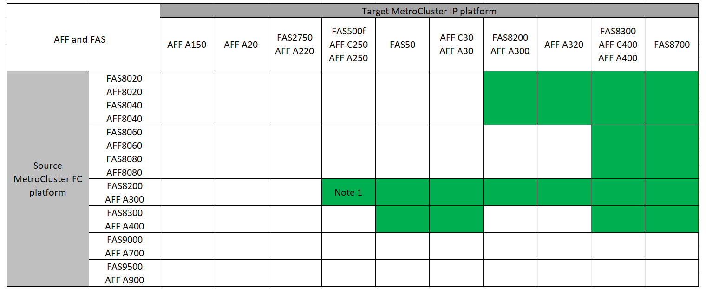

= 选择过渡操作步骤
:allow-uri-read: 
:icons: font
:imagesdir: ../media/

[role="lead"]
过渡到 MetroCluster IP 配置时，您必须同时拥有受支持的平台型号。

此外、您还应确保MetroCluster IP平台的大小适合要从MetroCluster FC配置过渡到MetroCluster IP配置的负载。

== 支持的平台组合

* 除非注释中另有说明或各个平台需要、否则过渡过程都需要使用ONTAP 9.8或更高版本。
* MetroCluster配置中的所有节点都必须运行相同版本的ONTAP。例如、如果您使用的是八节点配置、则所有八个节点都必须运行相同版本的ONTAP。有关您的组合支持的最低ONTAP版本、请参见link:https://hwu.netapp.com["Hardware Universe"^]。

[NOTE]
====
* 请勿超过平台组合中"较低"的任何对象限制。应用这两个平台的下限对象。
* 如果目标平台限制低于MetroCluster 限制、则必须先将MetroCluster 重新配置为等于或低于目标平台限制、然后才能添加新节点。
* 请参见 link:https://hwu.netapp.com["Hardware Universe"^] 平台限制。

====

=== 支持的AFF和FAS过渡组合

下表显示了支持的平台组合。您可以从第一列中的平台过渡到右侧列中列为受支持的平台、如彩色表格单元格所示。

例如，支持从包含 AFF8060 控制器模块的 MetroCluster FC 配置过渡到包含 AFF A400 控制器模块的 IP 配置。

这些表分为两组：

* *组1*显示了过渡到AFF A150、AFF A20、FAS2750、FAS8300、FAS500f、AFF C250、AFF A250、FAS50、AFF C30、AFF A30、FAS8200、AFF C400、AFF A400、AFF A220、AFF A300、AFF A320和FAS8700系统的组合。
* *组2*显示了过渡到AFF C60、AFF A50、FAS70、FAS9000、AFF A700、AFF A70、AFF C800、AFF、AFF A90、AFF A900、AFF A800 C80、FAS90、FAS9500和AFF A1K系统的组合。

以下注意事项同时适用于这两组：

* 注1：此平台组合需要ONTAP 9.11.1或更高版本。
* 注2：FC节点上的本地集群接口必须具有40GbE接口。
* 注3：FC节点上的本地集群接口必须具有100GbE接口。

[role="tabbed-block"]
====
.AFF和FAS组合组1
--
查看过渡到AFF A150、AFF A20、FAS2750、AFF A220、FAS500f、AFF C250、FAS8200、FAS50、AFF C30、AFF A30、AFF A250、AFF C400、AFF A400、FAS8300、AFF A300、AFF A320和FAS8700系统时支持的组合。

--
.AFF和FAS组合组2
--
查看支持过渡到AFF C60、AFF A50、FAS70、FAS9000、AFF A700、AFF A70、AFF A900、AFF、AFF A90、AFF C800、AFF A800 C80、FAS90、FAS9500和AFF A1K系统的组合。

image:../media/transition-combinations-group-2.png["显示了组2平台支持的过渡"]

--
====

=== 支持的ASA过渡平台组合

下表显示了ASA系统支持的平台组合。

[cols="3*"]
|===
| 源MetroCluster FC平台 | 目标MetroCluster IP平台 | supported 

.2+| ASA A400 | ASA A400 | 是的。 

| ASA A900 | 否 

.2+| ASA A900 | ASA A400 | 否 

| ASA A900 | 是的。 
|===

== 选择过渡操作步骤

您必须根据现有 MetroCluster FC 配置选择过渡操作步骤。

过渡操作步骤将后端 FC 交换机网络结构或 FC-VI 连接替换为 IP 交换机网络。确切的操作步骤取决于您的初始配置。

在过渡操作步骤结束时，原始平台和 FC 交换机（如果存在）将停用。

[cols="20,20,20,40"]
|===

| 正在启动配置 | 无中断或无中断 | 要求 | 操作步骤 

 a| 
四节点或八节点
 a| 
无中断
 a| 
新平台上需要新的储物架。过渡完成后，旧的控制器、机架和磁盘将从集群中移除。
 a| 
link:concept_nondisruptively_transitioning_from_a_four_node_mcc_fc_to_a_mcc_ip_configuration.html["指向操作步骤 的链接"]

*注意：*此流程支持以下 FC 到 IP 的转换：

* 从四节点MetroCluster FC 配置到四节点MetroCluster IP 配置
* 从八节点MetroCluster FC 配置到八节点MetroCluster IP 配置

 a| 
双节点
 a| 
造成中断
 a| 
原始平台和新平台均支持新存储架。
 a| 
link:task_disruptively_transition_from_a_two_node_mcc_fc_to_a_four_node_mcc_ip_configuration.html["指向操作步骤 的链接"]

 a| 
双节点
 a| 
造成中断
 a| 
原始平台和新平台均支持新存储架。必须弃用旧存储架。
 a| 
link:task_disruptively_transition_while_move_volumes_from_old_shelves_to_new_shelves.html["指向操作步骤 的链接"]

 a| 
双节点
 a| 
造成中断
 a| 
新平台不支持旧存储架。必须弃用旧存储架。
 a| 
link:task_disruptively_transition_when_exist_shelves_are_not_supported_on_new_controllers.html["指向操作步骤 的链接"]

|===