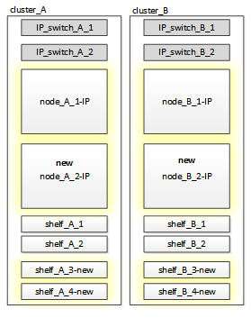

= 为中断 FC-IP 过渡做准备
:allow-uri-read: 
:icons: font
:imagesdir: ../media/

[role="lead"]
在开始过渡过程之前，您必须确保配置满足要求。

== 启用控制台日志记录

NetApp强烈建议您在使用的设备上启用控制台日志记录、并在执行此过程时执行以下操作：

* 在维护期间保持AutoSupport处于启用状态。
* 在维护前后触发维护AutoSupport消息、以便在维护活动期间禁用案例创建。
+
请参阅知识库文章 link:https://kb.netapp.com/Support_Bulletins/Customer_Bulletins/SU92["如何在计划的维护时段禁止自动创建案例"^]。

* 为任何命令行界面会话启用会话日志记录。有关如何启用会话日志记录的说明，请查看知识库文章中的“日志记录会话输出”部分 link:https://kb.netapp.com/on-prem/ontap/Ontap_OS/OS-KBs/How_to_configure_PuTTY_for_optimal_connectivity_to_ONTAP_systems["如何配置PuTTY以优化与ONTAP系统的连接"^]。

== 中断 FC-IP 过渡的一般要求

现有 MetroCluster FC 配置必须满足以下要求：

* 此配置必须为双节点配置，并且所有节点都必须运行 ONTAP 9.8 或更高版本。
+
它可以是双节点光纤连接的 MetroCluster ，也可以是延伸型 。

* 它必须满足 _SCSI MetroCluster 安装和配置 _ 过程中所述的所有要求和布线。
+
link:../install-fc/index.html["光纤连接的 MetroCluster 安装和配置"]

+
link:../install-stretch/concept_considerations_differences.html["延伸型 MetroCluster 安装和配置"]

* 无法使用 NetApp 存储加密（ NSE ）对其进行配置。
* 无法对 MDV 卷进行加密。

您必须能够从 MetroCluster 站点对所有六个节点进行远程控制台访问，或者根据操作步骤的要求计划在站点之间进行传输。

== 驱动器架重复使用和驱动器要求，实现有中断的 FC-IP 过渡

您必须确保存储架上具有足够的备用驱动器和根聚合空间。

=== 重复使用现有存储架

使用此操作步骤时，现有存储架会保留以供新配置使用。删除 node_A_1-FC 和 node_B_1-FC 后，现有驱动器架将连接到 cluster_A 上的 node_A_1-IP 和 node_A_2-IP ，以及 cluster_B 上的 node_B_1-IP 和 node_B_2-IP

* 新平台型号必须支持现有存储架（连接到 node_A_1-FC 和 node_B_1-FC 的存储架）。
+
如果新平台型号不支持现有磁盘架，请参见 link:task_disruptively_transition_when_exist_shelves_are_not_supported_on_new_controllers.html["在新控制器不支持现有磁盘架时进行中断过渡（ ONTAP 9.8 及更高版本）"]。

* 您必须确保不超过驱动器等的平台限制
+
https://hwu.netapp.com["NetApp Hardware Universe"^]

=== 附加控制器的存储要求

如果需要，必须添加额外的存储以容纳两个额外的控制器（ node_A_2-IP 和 node_B_2-IP ），因为配置正在从双节点配置更改为四节点配置。

* 根据现有磁盘架中可用的备用驱动器，必须添加更多驱动器以容纳配置中的其他控制器。
+
这可能需要额外的存储架，如下图所示。

+

+
第三个和第四个控制器（ node_A_2-IP 和 node_B_2-IP ）需要另外配置 14 - 18 个驱动器：

+
** 三个 pool0 驱动器
** 三个 pool1 驱动器
** 两个备用驱动器
** 系统卷需要六到十个驱动器

* 您必须确保配置（包括新节点）不超过配置的平台限制，包括驱动器数，根聚合大小容量等
+
有关每个平台型号的信息，请访问 _NetApp Hardware Universe 。

+
https://hwu.netapp.com["NetApp Hardware Universe"^]

== 用于中断过渡的工作流

您必须遵循特定工作流以确保成功过渡。

在准备过渡时，请规划站点之间的差旅。请注意，在对远程节点进行机架安装和布线后，您需要对这些节点进行串行终端访问。只有在配置节点后，才能访问服务处理器。

image::../media/workflow_2n_transition_bsaic.png[双节点过渡的工作流程]

== 将端口从 MetroCluster FC 节点映射到 MetroCluster IP 节点

您必须调整 MetroCluster FC 节点的端口和 LIF 配置，使其与要替换它的 MetroCluster IP 节点的端口和 LIF 配置兼容。

.关于此任务
在升级过程中首次启动新节点时，每个节点都会使用要替换的节点的最新配置。启动 node_A_1-IP 时， ONTAP 会尝试在 node_A_1-FC 上使用的相同端口上托管 LIF 。

在过渡操作步骤期间，您将对新旧节点执行步骤，以确保正确配置集群，管理和数据 LIF 。

.步骤
. 确定新节点上现有 MetroCluster FC 端口使用情况与 MetroCluster IP 接口的端口使用情况之间的任何冲突。
+
您必须使用下表确定新 MetroCluster IP 控制器上的 MetroCluster IP 端口。然后，检查并记录 MetroCluster FC 节点上的这些端口上是否存在任何数据 LIF 或集群 LIF 。

+
MetroCluster FC 节点上这些冲突的数据 LIF 或集群 LIF 将在过渡操作步骤中的相应步骤进行移动。

+
下表按平台型号显示了 MetroCluster IP 端口。您可以忽略 VLAN ID 列。

+
|===

| 平台型号 | MetroCluster IP 端口 | VLAN ID |  

.2+| AFF A800  a| 
e0b
.8+| 未使用  a| 

 a| 
e1b
 a| 

.2+| AFF A700 和 FAS9000  a| 
e5a
 a| 

 a| 
e5b
 a| 

.2+| AFF A320  a| 
e0g
 a| 

 a| 
e0h
 a| 

.2+| AFF A300 和 FAS8200  a| 
e1a
 a| 

 a| 
e1b
 a| 

.2+| FAS8300/A400/FAS8700  a| 
e1a
 a| 
10
 a| 

 a| 
e1b
 a| 
20
 a| 

.2+| AFF A250 和 FAS500f  a| 
e0c
 a| 
10
 a| 

 a| 
e0b
 a| 
20
 a| 

|===
+
您可以填写下表，稍后在 Transition 操作步骤中进行参考。

+
|===

| 端口 | 对应的 MetroCluster IP 接口端口（上表） | MetroCluster FC 节点上这些端口上的 LIF 发生冲突 

 a| 
node_A_1-FC 上的第一个 MetroCluster IP 端口
 a| 
 a| 

 a| 
node_A_1-FC 上的第二个 MetroCluster IP 端口
 a| 
 a| 

 a| 
node_B_1-FC 上的第一个 MetroCluster IP 端口
 a| 
 a| 

 a| 
node_B_1-FC 上的第二个 MetroCluster IP 端口
 a| 
 a| 

|===
. 确定新控制器上可用的物理端口以及端口上可以托管的 LIF 。
+
控制器的端口使用情况取决于要在 MetroCluster IP 配置中使用的平台型号和 IP 交换机型号。您可以从 _NetApp Hardware Universe _ 收集新平台的端口使用情况。

+
https://hwu.netapp.com["NetApp Hardware Universe"^]

. 如果需要，请记录 node_A_1-FC 和 node_A_1-IP 的端口信息。
+
在执行过渡操作步骤时，您将参考下表。

+
在 node_A_1-IP 列中，为新控制器模块添加物理端口，并为新节点规划 IP 空间和广播域。

+
|===

|  3+| node_A_1-FC 3+| node_A_1-IP 

| LIF | 端口 | IP 空间 | 广播域 | 端口 | IP 空间 | 广播域 

 a| 
集群 1
 a| 
 a| 
 a| 
 a| 
 a| 
 a| 

 a| 
集群 2.
 a| 
 a| 
 a| 
 a| 
 a| 
 a| 

 a| 
集群 3.
 a| 
 a| 
 a| 
 a| 
 a| 
 a| 

 a| 
集群 4.
 a| 
 a| 
 a| 
 a| 
 a| 
 a| 

 a| 
节点管理
 a| 
 a| 
 a| 
 a| 
 a| 
 a| 

 a| 
集群管理
 a| 
 a| 
 a| 
 a| 
 a| 
 a| 

 a| 
数据 1.
 a| 
 a| 
 a| 
 a| 
 a| 
 a| 

 a| 
数据 2.
 a| 
 a| 
 a| 
 a| 
 a| 
 a| 

 a| 
数据 3.
 a| 
 a| 
 a| 
 a| 
 a| 
 a| 

 a| 
数据 4.
 a| 
 a| 
 a| 
 a| 
 a| 
 a| 

 a| 
SAN
 a| 
 a| 
 a| 
 a| 
 a| 
 a| 

 a| 
集群间端口
 a| 
 a| 
 a| 
 a| 
 a| 
 a| 

|===
. 如果需要，请记录 node_B_1-FC 的所有端口信息。
+
在执行升级操作步骤时，您将参考下表。

+
在 node_B_1-ip 列中，为新控制器模块添加物理端口，并规划新节点的 LIF 端口使用情况， IP 空间和广播域。

+
|===

|  3+| node_B_1-FC 3+| node_B_1-ip 

| LIF | 物理端口 | IP 空间 | 广播域 | 物理端口 | IP 空间 | 广播域 

 a| 
集群 1
 a| 
 a| 
 a| 
 a| 
 a| 
 a| 

 a| 
集群 2.
 a| 
 a| 
 a| 
 a| 
 a| 
 a| 

 a| 
集群 3.
 a| 
 a| 
 a| 
 a| 
 a| 
 a| 

 a| 
集群 4.
 a| 
 a| 
 a| 
 a| 
 a| 
 a| 

 a| 
节点管理
 a| 
 a| 
 a| 
 a| 
 a| 
 a| 

 a| 
集群管理
 a| 
 a| 
 a| 
 a| 
 a| 
 a| 

 a| 
数据 1.
 a| 
 a| 
 a| 
 a| 
 a| 
 a| 

 a| 
数据 2.
 a| 
 a| 
 a| 
 a| 
 a| 
 a| 

 a| 
数据 3.
 a| 
 a| 
 a| 
 a| 
 a| 
 a| 

 a| 
数据 4.
 a| 
 a| 
 a| 
 a| 
 a| 
 a| 

 a| 
SAN
 a| 
 a| 
 a| 
 a| 
 a| 
 a| 

 a| 
集群间端口
 a| 
 a| 
 a| 
 a| 
 a| 
 a| 

|===

== 准备 MetroCluster IP 控制器

您必须准备四个新的 MetroCluster IP 节点并安装正确的 ONTAP 版本。

.关于此任务
必须对每个新节点执行此任务：

* node_A_1-IP
* node_A_2-IP
* node_B_1-ip
* node_B_2-ip

节点应连接到任何 * 新 * 存储架。它们必须 * 不 * 连接到包含数据的现有存储架。

现在可以执行这些步骤，或者稍后在将控制器和磁盘架装入机架后在操作步骤中执行这些步骤。在任何情况下，您都必须确保清除配置并准备节点 * 在将其连接到现有存储架之前 * 以及 * 在 * 之前 * 对 MetroCluster FC 节点进行任何配置更改。

NOTE: 请勿在 MetroCluster IP 控制器连接到已连接到 MetroCluster FC 控制器的现有存储架的情况下执行这些步骤。

在这些步骤中，您可以清除节点上的配置并清除新驱动器上的邮箱区域。

.步骤
. 将控制器模块连接到新存储架。
. 在维护模式下，显示控制器模块和机箱的 HA 状态：
+
`ha-config show`

+
所有组件的 HA 状态均应为 `mCCIP` 。

. 如果显示的控制器或机箱系统状态不正确，请设置 HA 状态：
+
`ha-config modify controller mccip``ha-config modify chassis mccip`

. 退出维护模式：
+
`halt`

+
运行此命令后，请等待，直到节点停留在 LOADER 提示符处。

. 对所有四个节点重复以下子步骤以清除配置：
+
.. 将环境变量设置为默认值：
+
`set-defaults`

.. 保存环境：
+
`saveenv`

+
`再见`

. 重复以下子步骤，使用启动菜单上的 9a 选项启动所有四个节点。
+
.. 在 LOADER 提示符处，启动启动菜单：
+
`boot_ontap 菜单`

.. 在启动菜单中，选择选项 "`9a` " 以重新启动控制器。

. 使用启动菜单上的选项 "`5` " 将四个节点中的每个节点启动至维护模式。
. 记录四个节点中每个节点的系统 ID 和：
+
`ssysconfig`

. 对 node_A_1-IP 和 node_B_1-IP 重复以下步骤。
+
.. 为每个站点分配本地所有磁盘的所有权：
+
`dassign adapter.xx.*`

.. 对 node_A_1-IP 和 node_B_1-IP 上连接有驱动器架的每个 HBA 重复上述步骤。

. 对 node_A_1-IP 和 node_B_1-IP 重复以下步骤，以清除每个本地磁盘上的邮箱区域。
+
.. 销毁每个磁盘上的邮箱区域：
+
`mailbox destroy local``mailbox destroy partner`

. 暂停所有四个控制器：
+
`halt`

. 在每个控制器上，显示启动菜单：
+
`boot_ontap 菜单`

. 在四个控制器中的每个控制器上，清除配置：
+
`wipeconfig`

+
wipeconfig 操作完成后，节点将自动返回到启动菜单。

. 重复以下子步骤，使用启动菜单上的 9a 选项重新启动所有四个节点。
+
.. 在 LOADER 提示符处，启动启动菜单：
+
`boot_ontap 菜单`

.. 在启动菜单中，选择选项 "`9a` " 以重新启动控制器。
.. 在移至下一个控制器模块之前，让控制器模块完成启动。

+
在 "`9a` " 完成后，节点将自动返回到启动菜单。

. 关闭控制器。

== 验证 MetroCluster FC 配置的运行状况

在执行过渡之前，您必须验证 MetroCluster FC 配置的运行状况和连接

此任务在 MetroCluster FC 配置上执行。

. 在 ONTAP 中验证 MetroCluster 配置的运行情况：
+
.. 检查系统是否为多路径：
+
`node run -node node-name sysconfig -a`

.. 检查两个集群上是否存在任何运行状况警报：
+
`s系统运行状况警报显示`

.. 确认 MetroCluster 配置以及操作模式是否正常：
+
`MetroCluster show`

.. 执行 MetroCluster 检查：
+
`MetroCluster check run`

.. 显示 MetroCluster 检查的结果：
+
MetroCluster check show`

.. 检查交换机上是否存在任何运行状况警报（如果存在）：
+
`s存储开关显示`

.. 运行 Config Advisor 。
+
https://mysupport.netapp.com/site/tools/tool-eula/activeiq-configadvisor["NetApp 下载： Config Advisor"^]

.. 运行 Config Advisor 后，查看该工具的输出并按照输出中的建议解决发现的任何问题。

. 验证节点是否处于非 HA 模式：
+
`s存储故障转移显示`

== 从 Tiebreaker 或其他监控软件中删除现有配置

如果使用 MetroCluster Tiebreaker 配置或可启动切换的其他第三方应用程序（例如 ClusterLion ）监控现有配置，则必须在过渡之前从 Tiebreaker 或其他软件中删除 MetroCluster 配置。

.步骤
. 从 Tiebreaker 软件中删除现有 MetroCluster 配置。
+
link:../tiebreaker/concept_configuring_the_tiebreaker_software.html#removing-metrocluster-configurations["删除 MetroCluster 配置"]

. 从可以启动切换的任何第三方应用程序中删除现有 MetroCluster 配置。
+
请参见该应用程序的文档。

