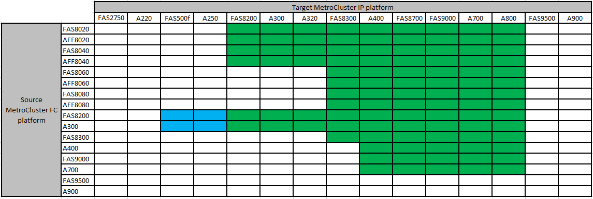

= 支持无中断过渡的平台
:allow-uri-read: 
:icons: font
:imagesdir: ../media/

[role="lead"]
过渡到 MetroCluster IP 配置时，您必须同时拥有受支持的平台型号。此外、您还应确保MetroCluster IP平台的大小适合要从MetroCluster FC配置过渡到MetroCluster IP配置的负载。

下表显示了支持的平台组合。您可以从左侧列中的平台过渡到右侧列中列出的受支持平台、如彩色表单元格所示。

* 绿色单元格显示支持此组合。
* 白色（空白）单元格表示此组合不受支持。
* 从ONTAP 9.11.1开始、蓝色单元格显示支持此组合。

例如，支持从包含 AFF8060 控制器模块的 MetroCluster FC 配置过渡到包含 AFF A400 控制器模块的 IP 配置。

== 过渡到 Cisco 9336C-x2 共享交换机配置

不支持过渡到 Cisco 9336C-x2 共享交换机配置。_shared switch configuration_is one where the switches provide both the MetroCluster connections and the storage shelf connections 。

支持 Cisco 9336C-x2 交换机仅提供 MetroCluster 连接的配置。
