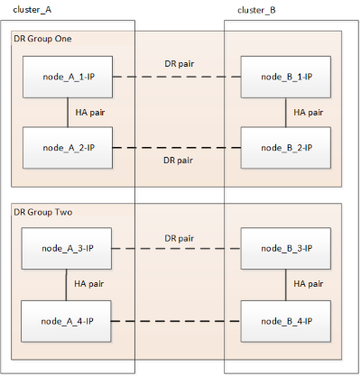

= 无中断 MetroCluster 过渡的工作流
:allow-uri-read: 
:icons: font
:imagesdir: ../media/

[role="lead"]
您必须遵循特定工作流，以确保成功实现无中断过渡。为您的配置选择工作流：

* <<四节点FC配置过渡工作流>>
* <<八节点FC配置过渡工作流>>

== 四节点FC配置过渡工作流

过渡过程从运行正常的四节点 MetroCluster FC 配置开始。

image::../media/transition_dr_group_1_fc_nodes.png[过渡 DR 组 1 的 FC 节点]

新的 MetroCluster IP 节点将作为第二个 DR 组添加。

image::../media/transition_dr_groups_fc_and_ip.png[过渡 DR 组 fc 和 IP]

数据将从旧 DR 组传输到新 DR 组，然后从配置中删除旧节点及其存储并停用。此过程以四节点 MetroCluster IP 配置结束。

image::../media/transition_dr_group_2_ip.png[过渡 DR 组 2 IP]

== 八节点FC配置过渡工作流

过渡过程从运行正常的八节点MetroCluster FC配置开始。

image::../media/mcc_dr_group_c1.png[MCC DR组C1]

新的MetroCluster IP节点将作为第三个DR组添加。

image::../media/mcc_dr_group_c2.png[MCC DR组C2]

数据会从DR_group_1-FC传输到DR_group_1-IP、然后从配置中删除旧节点及其存储并将其停用。

NOTE: 如果要从八节点FC配置过渡到四节点IP配置、则必须将DR_group_1-FC和DR_group_2-FC中的所有数据过渡到新的IP DR组(DR_group_1-IP)。然后、您可以停用这两个FC DR组。删除FC DR组后、此过程将以四节点MetroCluster IP配置结束。

image::../media/mcc_dr_group_c8.png[MCC DR组C1.]

将其余MetroCluster IP节点添加到现有MetroCluster 配置中。重复此过程、将数据从DR_group_2-FC节点传输到DR_group_2-IP节点。

image::../media/mcc_dr_group_c7.png[MCC DR组C7]

删除DR_group_2-FC后、此过程将以八节点MetroCluster IP配置结束。

== 过渡流程工作流

您将使用以下工作流过渡 MetroCluster 配置。

image::../media/workflow_4n_transition_nondisruptive.png[工作流 4n 无中断过渡]
