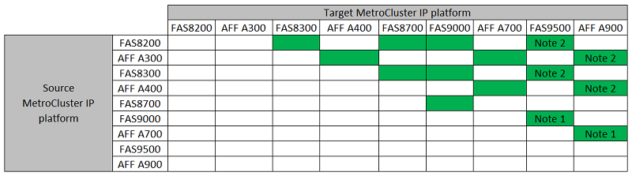

= 选择控制器升级操作步骤
:allow-uri-read: 
:icons: font
:imagesdir: ../media/

[role="lead"]
您使用的控制器升级操作步骤 取决于MetroCluster 配置的平台型号和类型。

在升级操作步骤 中、控制器将替换为新的控制器型号。存储架型号未升级。

* 在切换和切回过程中， MetroCluster 切换操作用于在升级配对集群上的控制器模块时为客户端提供无中断服务。
* 在基于 ARL 的控制器升级操作步骤中，聚合重新定位操作用于无中断地将数据从旧配置移动到升级后的新配置。

== 选择使用切换和切回过程的操作步骤

从下面的FC或IP表中选择当前平台。如果当前平台行和目标平台列的交叉路口为空、则不支持升级。

=== 支持的MetroCluster IP控制器升级

如果未列出您的平台、则表示没有受支持的控制器升级组合。

* 注1：要进行此升级、请使用操作步骤 link:task_upgrade_A700_to_A900_in_a_four_node_mcc_ip_us_switchover_and_switchback.html["使用切换和切回功能将MetroCluster IP配置中的AFF A700/FAS9000控制器升级到AFF A900/FAS9500 (ONTAP 9.10.1或更高版本)"]
* 注2：运行ONTAP 9.13.1或更高版本的系统支持控制器升级。

=== 支持的MetroCluster FC控制器升级

image::../media/metrocluster_fc_upgrade_table_p_13_1.PNG[MetroCluster 光纤信道升级表p 13 1.]

* 注1：如果现有FAS8020或AFF8020节点上的FCVI连接使用端口1c和1d、则要升级控制器、请参见以下内容https://kb.netapp.com/Advice_and_Troubleshooting/Data_Protection_and_Security/MetroCluster/Upgrading_controllers_when_FCVI_connections_on_existing_FAS8020_or_AFF8020_nodes_use_ports_1c_and_1d["知识库文章"^]。
* 注2：只有运行ONTAP 9.1.1的系统才支持从使用板载端口0e和0f作为FC-VI连接的AFF A300或FAS8200平台升级控制器。或更早版本。有关详细信息、请查看 link:https://mysupport.netapp.com/site/bugs-online/product/ONTAP/BURT/1507088["公有 报告"^]。
* 注3：有关此升级、请参见 link:task_upgrade_A700_to_A900_in_a_four_node_mcc_fc_us_switchover_and_switchback.html["使用切换和切回功能将MetroCluster FC配置中的AFF A700/FAS9000控制器升级到AFF A900/FAS9500 (ONTAP 9.10.1或更高版本)"]
* 注4：运行ONTAP 9.13.1或更高版本的系统支持控制器升级。

[cols="2,1,1,2"]
|===

| MetroCluster 类型 | 升级方法 | ONTAP 版本 | 操作步骤 

 a| 
IP
 a| 
使用"系统控制器更换"命令进行升级
 a| 
9.13.1及更高版本
 a| 
link:task_upgrade_controllers_system_control_commands_in_a_four_node_mcc_ip.html["指向操作步骤 的链接"]

 a| 
FC
 a| 
使用"系统控制器更换"命令进行升级
 a| 
9.10.1 及更高版本
 a| 
link:task_upgrade_controllers_system_control_commands_in_a_four_node_mcc_fc.html["指向操作步骤 的链接"]

 a| 
FC
 a| 
使用命令行界面命令手动升级(仅限AFF A700/FAS9000到AFF A900/FAS9500）
 a| 
9.10.1 及更高版本
 a| 
link:task_upgrade_A700_to_A900_in_a_four_node_mcc_fc_us_switchover_and_switchback.html["指向操作步骤 的链接"]

 a| 
IP
 a| 
使用命令行界面命令手动升级(仅限AFF A700/FAS9000到AFF A900/FAS9500）
 a| 
9.10.1 及更高版本
 a| 
link:task_upgrade_A700_to_A900_in_a_four_node_mcc_ip_us_switchover_and_switchback.html["指向操作步骤 的链接"]

 a| 
FC
 a| 
使用命令行界面命令手动升级
 a| 
9.8 及更高版本
 a| 
link:task_upgrade_controllers_in_a_four_node_fc_mcc_us_switchover_and_switchback_mcc_fc_4n_cu.html["指向操作步骤 的链接"]

 a| 
IP
 a| 
使用命令行界面命令手动升级
 a| 
9.8 及更高版本
 a| 
link:task_upgrade_controllers_in_a_four_node_ip_mcc_us_switchover_and_switchback_mcc_ip.html["指向操作步骤 的链接"]

|===

== 使用聚合重新定位选择操作步骤

在基于 ARL 的控制器升级操作步骤中，聚合重新定位操作用于无中断地将数据从旧配置移动到升级后的新配置。

|===
| MetroCluster 类型 | 聚合重新定位 | ONTAP 版本 | 操作步骤 

 a| 
FC
 a| 
使用 `system controller replace` 命令并交换控制器模块和NVM (仅限从AFF A700升级到AFF A900)
 a| 
9.10.1 及更高版本
 a| 
https://docs.netapp.com/us-en/ontap-systems-upgrade/upgrade-arl-auto-affa900/index.html["指向操作步骤 的链接"^]

 a| 
FC
 a| 
使用 `ssystem controller replace` 命令
 a| 
9.8 及更高版本
 a| 
https://docs.netapp.com/us-en/ontap-systems-upgrade/upgrade-arl-auto-app/index.html["指向操作步骤 的链接"^]

 a| 
FC
 a| 
使用 `ssystem controller replace` 命令
 a| 
9.5 到 9.7
 a| 
https://docs.netapp.com/us-en/ontap-systems-upgrade/upgrade-arl-auto/index.html["指向操作步骤 的链接"^]

 a| 
FC
 a| 
使用手动 ARL 命令
 a| 
9.8
 a| 
https://docs.netapp.com/us-en/ontap-systems-upgrade/upgrade-arl-manual-app/index.html["指向操作步骤 的链接"^]

 a| 
FC
 a| 
使用手动 ARL 命令
 a| 
9.7 及更早版本
 a| 
https://docs.netapp.com/us-en/ontap-systems-upgrade/upgrade-arl-manual/index.html["指向操作步骤 的链接"^]

|===