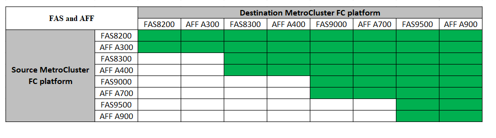
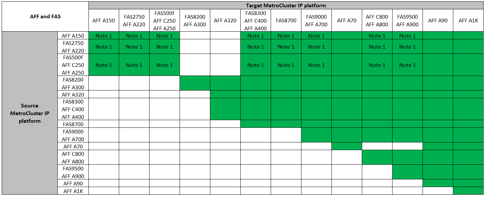

= 选择系统刷新方法
:allow-uri-read: 
:icons: font
:imagesdir: ../media/

[role="lead"]
您使用的系统刷新操作步骤 取决于平台型号和MetroCluster 配置类型。更新过程适用于控制器和存储架。在刷新过程中，会将新控制器和磁盘架添加到 MetroCluster 配置中，从而创建第二个 DR 组，然后无中断地将数据迁移到新节点。然后，原始控制器将停用。

=== 支持的MetroCluster FC技术更新组合

* 您必须先完成技术更新操作步骤 、然后才能添加新负载。

[NOTE]
====
* 请勿超过平台组合中"较低"的任何对象限制。应用这两个平台的下限对象。
* 如果目标平台限制低于MetroCluster 限制、则必须先将MetroCluster 重新配置为等于或低于目标平台限制、然后才能添加新节点。
* 请参见 link:https://hwu.netapp.html["Hardware Universe"^] 平台限制。

====

=== 支持的MetroCluster IP技术更新组合

* 您必须先完成技术更新操作步骤 、然后才能添加新负载。

[NOTE]
====
* 请勿超过平台组合中"较低"的任何对象限制。应用这两个平台的下限对象。
* 如果目标平台限制低于MetroCluster 限制、则必须先将MetroCluster 重新配置为等于或低于目标平台限制、然后才能添加新节点。
* 请参见 link:https://hwu.netapp.html["Hardware Universe"^] 平台限制。

====
[cols="2,1,1,2"]
|===
| 刷新方法 | 配置类型 | ONTAP 版本 | 操作步骤 

 a| 
* 方法：展开 MetroCluster 配置，然后删除旧节点

 a| 
四节点FC
 a| 
9.6 及更高版本
 a| 
link:task_refresh_4n_mcc_fc.html["指向操作步骤 的链接"]

 a| 
* 方法：展开 MetroCluster 配置，然后删除旧节点

 a| 
四节点IP
 a| 
9.8 及更高版本
 a| 
link:task_refresh_4n_mcc_ip.html["指向操作步骤 的链接"]

|===