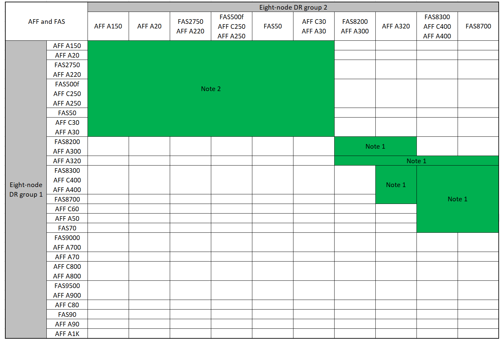
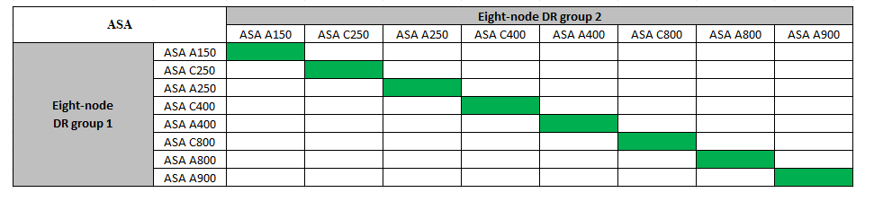

= 扩展MetroCluster IP配置
:allow-uri-read: 
:icons: font
:imagesdir: ../media/

[role="lead"]
根据您的ONTAP 版本、您可以通过将四个新节点添加为新的DR组来扩展MetroCluster IP配置。

从ONTAP 9.13.1开始、您可以临时扩展八节点MetroCluster配置以刷新控制器和存储。请参见 link:task_refresh_4n_mcc_ip.html["刷新四节点或八节点MetroCluster IP配置(ONTAP 9.8及更高版本)"] 有关详细信息 ...

从 ONTAP 9.1.1 开始，您可以将四个新节点作为第二个 DR 组添加到 MetroCluster IP 配置中。这将创建一个八节点 MetroCluster 配置。

.重要信息
在过渡、刷新、八节点安装和四节点扩展过程中，您可能会向 MetroCluster 配置中添加新的平台模型。在这些过程的任何阶段，如果现有 MetroCluster 配置包含使用 *共享集群/HA 端口* 的平台，则您必须将 ONTAP 版本升级到 ONTAP 9.15.1P11 或 ONTAP 9.16.1P4 或更高版本，才能将使用 *共享 MetroCluster/HA 端口* 的平台添加到配置中。

在决定使用此过程之前，请仔细查看下表中的信息。如果第一列列出了您现有的平台，而第二列列出了要添加到配置中的平台，则配置中的所有节点都必须运行 ONTAP 9.15.1P11 或 ONTAP 9.16.1P4 或更高版本才能支持此过程。

CAUTION: 现有平台和要添加到配置中的平台必须都运行 ONTAP 9.15.1P11 或 ONTAP 9.16.1P4 或更高版本。

[cols="20,20,20,20,20"]
|===
2+| 如果您现有的 MetroCluster 包含... 2+| 您要添加的平台是... | 那么 ... 

 a| 
使用*共享集群/HA 端口*的 AFF 系统：

* AFF A20
* AFF A30
* AFF C30
* AFF A50
* AFF C60
* AFF C80
* AFF A70
* AFF A90
* AFF A1K

 a| 
使用*共享集群/HA 端口*的 FAS 系统：

* FAS50
* FAS70
* FAS90

 a| 
使用*共享 MetroCluster/HA 端口*的 AFF 系统：

* AFF A150、ASA A150
* AFF A220
* AFF C250、ASA C250
* AFF A250、ASA A250
* AFF A300
* AFF A320
* AFF C400、ASA C400
* AFF A400、ASA A400
* AFF A700
* AFF C800、ASA C800
* AFF A800、ASA A800
* AFF A900、ASA A900

 a| 
使用*共享 MetroCluster/HA 端口*的 FAS 系统：

* FAS2750
* FAS500f
* FAS8200
* FAS8300
* FAS8700
* FAS9000
* FAS9500

| 在将新平台添加到现有 MetroCluster 配置之前，请将现有配置和新配置中的所有节点升级到 ONTAP 9.15.1P11 或 ONTAP 9.16.1P4 或更高版本。 
|===
.开始之前
* 新旧节点必须运行相同版本的 ONTAP 。
* 本操作步骤介绍了向现有MetroCluster IP配置添加一个四节点DR组所需的步骤。如果要刷新八节点配置、则必须对每个DR组重复整个操作步骤、一次添加一个。
* 验证是否支持使用新旧平台型号进行平台混合。
+
https://hwu.netapp.com["NetApp Hardware Universe"^]

* 确认新旧平台型号均受IP交换机支持。
+
https://hwu.netapp.com["NetApp Hardware Universe"^]

* 如果您是 link:task_refresh_4n_mcc_ip.html["刷新四节点或八节点MetroCluster IP配置"]新节点必须具有足够的存储空间来容纳旧节点的数据、并具有足够的磁盘来容纳根聚合和备用磁盘。
* 验证是否已在旧节点上创建默认广播域。
+
向不具有默认广播域的现有集群添加新节点时、系统会使用通用唯一标识符(UID)(而不是预期名称)为新节点创建节点管理生命周期。有关详细信息、请参见知识库文章 https://kb.netapp.com/onprem/ontap/os/Node_management_LIFs_on_newly-added_nodes_generated_with_UUID_names["使用UUID名称生成的新添加节点上的节点管理生命周期"^]。

== 启用控制台日志记录

NetApp强烈建议您在使用的设备上启用控制台日志记录、并在执行此过程时执行以下操作：

* 在维护期间保持AutoSupport处于启用状态。
* 在维护前后触发维护AutoSupport消息、以便在维护活动期间禁用案例创建。
+
请参阅知识库文章 link:https://kb.netapp.com/Support_Bulletins/Customer_Bulletins/SU92["如何在计划的维护时段禁止自动创建案例"^]。

* 为任何命令行界面会话启用会话日志记录。有关如何启用会话日志记录的说明，请查看知识库文章中的“日志记录会话输出”部分 link:https://kb.netapp.com/on-prem/ontap/Ontap_OS/OS-KBs/How_to_configure_PuTTY_for_optimal_connectivity_to_ONTAP_systems["如何配置PuTTY以优化与ONTAP系统的连接"^]。

== 此操作步骤中的命名示例

此操作步骤会在整个过程中使用示例名称来标识涉及的 DR 组，节点和交换机。

|===

| DR 组 | cluster_A 位于 site_A | site_B 上的 cluster_B 

 a| 
dr_group_1-old
 a| 
* node_A_1-old
* node_A_2-old

 a| 
* node_B_1-old
* node_B_2-old

 a| 
dr_group_2-new
 a| 
* node_A_3-new
* node_A_4-new

 a| 
* node_B_3-new
* node_B_4-new

|===

== 添加第二个DR组时支持的平台组合

下表显示了八节点MetroCluster IP配置支持的平台组合。

[IMPORTANT]
====
* MetroCluster配置中的所有节点都必须运行相同版本的ONTAP。例如、如果您使用的是八节点配置、则所有八个节点都必须运行相同版本的ONTAP。有关您的组合支持的最低ONTAP版本、请参见link:https://hwu.netapp.com["Hardware Universe"^]。
* 此表中的组合仅适用于常规或永久八节点配置。
* 如果您使用的是过渡或刷新过程，*不*表中显示的平台组合将适用。
* 一个灾难恢复组中的所有节点都必须具有相同的类型和配置。

====

=== 支持的AFF和FAS MetroCluster IP扩展组合

下表显示了在MetroCluster IP配置中扩展AFF或FAS系统时支持的平台组合。这些表分为两组：

* *组1*显示了AFF A150、AFF A20、FAS2750、FAS8300、FAS500f、AFF C250、AFF A250、FAS50、AFF C30、AFF A30、FAS8200、AFF C400、AFF A400、AFF A220、AFF A300、AFF A320和FAS8700系统的组合。
* *组2*显示了AFF C60、AFF A50、FAS70、FAS9000、AFF A700、AFF A70、AFF C800、AFF A800、AFF A90、AFF A900、AFF C80、FAS90、FAS9500和AFF A1K系统的组合。

以下注意事项同时适用于这两组：

* 注1：这些组合需要9.9.1 9.9.1或更高版本(或平台支持的最低ONTAP版本)。
* 注2：这些组合需要9.13.1 9.13.1或更高版本(或平台支持的最低ONTAP版本)。

[role="tabbed-block"]
====
.AFF和FAS组合组1
--
查看AFF A150、AFF A20、FAS2750、AFF A220、FAS500f、AFF C250、FAS8200、FAS50、AFF C30、AFF A30、AFF A250、AFF C400、AFF A400、FAS8300、AFF A300、AFF A320和FAS8700系统的扩展组合。

--
.AFF和FAS组合组2
--
查看AFF C60、AFF A50、FAS70、FAS9000、AFF A700、AFF A70、AFF A900、AFF、AFF A90、AFF C800、AFF A800 C80、FAS90、FAS9500和AFF A1K系统的扩展组合。

image:../media/expand-ip-group-2-updated.png[""]

--
====

=== 支持的ASA MetroCluster IP扩展组合

下表显示了在MetroCluster IP配置中扩展ASA系统时支持的平台组合：

== 在维护之前发送自定义 AutoSupport 消息

在执行维护问题描述之前，您应发送 AutoSupport 消息以通知 NetApp 技术支持正在进行维护。告知技术支持正在进行维护，可防止他们在假定已发生中断的情况下创建案例。

.关于此任务
必须在每个 MetroCluster 站点上执行此任务。

.步骤
. 要防止自动生成支持案例，请发送一条 AutoSupport 消息以指示升级正在进行中。
+
.. 问题描述以下命令：
+
`system node autosupport invoke -node * -type all -message "MAINT=10h Upgrading <old-model> to <new-model>`

+
此示例指定了一个 10 小时的维护时段。根据您的计划，您可能需要留出更多时间。

+
如果在该时间过后完成维护，您可以调用一条 AutoSupport 消息，指示维护期结束：

+
`ssystem node AutoSupport invoke -node * -type all -message MAINT=end`

.. 在配对集群上重复此命令。

== 添加新DR组时VLAN的注意事项

* 扩展MetroCluster IP配置时、需要考虑以下VLAN注意事项：
+
某些平台使用 VLAN 作为 MetroCluster IP 接口。默认情况下，这两个端口中的每个端口都使用不同的 VLAN ： 10 和 20 。

+
如果支持、您还可以使用命令中的参数指定一个高于100 (介于101和4095之间)的其他(非默认) VLAN `-vlan-id` `metrocluster configuration-settings interface create` 。

+
以下平台*不*支持 `-vlan-id` 参数：

+
** FAS8200 和 AFF A300
** AFF A320
** FAS9000和AFF A700
** AFF C800、ASA C800、AFF A800和ASA A800
+
所有其他平台均支持 `-vlan-id` 参数。

+
默认VLAN分配和有效VLAN分配取决于平台是否支持 `-vlan-id` 以下参数：

+
[role="tabbed-block"]
====
.支持<code>－VLAN－</code>的平台
--
默认VLAN：

*** 如果 `-vlan-id` 未指定参数、则会使用VLAN 10为"A"端口创建接口、并使用VLAN 20为"B"端口创建接口。
*** 指定的VLAN必须与在RC框架 中选择的VLAN匹配。

有效VLAN范围：

*** 默认VLAN 10和20
*** VLAN 101及更高版本(介于101和4095之间)

--
.不支持<code>－VLAN－</code>的平台
--
默认VLAN：

*** 不适用。此接口不需要在MetroCluster接口上指定VLAN。交换机端口用于定义所使用的VLAN。

有效VLAN范围：

*** 生成RC框架 时未明确排除所有VLAN。如果VLAN无效、RCZ将向您发出警报。

--
====

* 从四节点配置扩展为八节点MetroCluster配置时、这两个DR组使用相同的VLAN。
* 如果不能使用同一个VLAN配置两个DR组、则必须升级不支持参数的DR组 `vlan-id` 、以使用另一个DR组支持的VLAN。

== 验证 MetroCluster 配置的运行状况

在执行扩展之前、您必须验证MetroCluster配置的运行状况和连接性。

.步骤
. 在 ONTAP 中验证 MetroCluster 配置的运行情况：
+
.. 检查系统是否为多路径：
+
`node run -node <node-name> sysconfig -a`

.. 检查两个集群上是否存在任何运行状况警报：
+
`s系统运行状况警报显示`

.. 确认 MetroCluster 配置以及操作模式是否正常：
+
`MetroCluster show`

.. 执行 MetroCluster 检查：
+
`MetroCluster check run`

.. 显示 MetroCluster 检查的结果：
+
MetroCluster check show`

.. 运行 Config Advisor 。
+
https://mysupport.netapp.com/site/tools/tool-eula/activeiq-configadvisor["NetApp 下载： Config Advisor"]

.. 运行 Config Advisor 后，查看该工具的输出并按照输出中的建议解决发现的任何问题。

. 验证集群是否运行正常：
+
`cluster show`

+
[listing]
----
cluster_A::> cluster show
Node           Health  Eligibility
-------------- ------  -----------
node_A_1       true    true
node_A_2       true    true

cluster_A::>
----
. 验证所有集群端口是否均已启动：
+
`network port show -ipspace cluster`

+
[listing]
----
cluster_A::> network port show -ipspace Cluster

Node: node_A_1-old

                                                  Speed(Mbps) Health
Port      IPspace      Broadcast Domain Link MTU  Admin/Oper  Status
--------- ------------ ---------------- ---- ---- ----------- --------
e0a       Cluster      Cluster          up   9000  auto/10000 healthy
e0b       Cluster      Cluster          up   9000  auto/10000 healthy

Node: node_A_2-old

                                                  Speed(Mbps) Health
Port      IPspace      Broadcast Domain Link MTU  Admin/Oper  Status
--------- ------------ ---------------- ---- ---- ----------- --------
e0a       Cluster      Cluster          up   9000  auto/10000 healthy
e0b       Cluster      Cluster          up   9000  auto/10000 healthy

4 entries were displayed.

cluster_A::>
----
. 验证所有集群 LIF 是否均已启动且正常运行：
+
`network interface show -vserver cluster`

+
每个集群 LIF 应为 "Is Home" 显示 true ，并且状态为 "Admin/Oper" 为 "up/up"

+
[listing]
----
cluster_A::> network interface show -vserver cluster

            Logical      Status     Network          Current       Current Is
Vserver     Interface  Admin/Oper Address/Mask       Node          Port    Home
----------- ---------- ---------- ------------------ ------------- ------- -----
Cluster
            node_A_1-old_clus1
                       up/up      169.254.209.69/16  node_A_1   e0a     true
            node_A_1-old_clus2
                       up/up      169.254.49.125/16  node_A_1   e0b     true
            node_A_2-old_clus1
                       up/up      169.254.47.194/16  node_A_2   e0a     true
            node_A_2-old_clus2
                       up/up      169.254.19.183/16  node_A_2   e0b     true

4 entries were displayed.

cluster_A::>
----
. 验证是否已在所有集群 LIF 上启用自动还原：
+
`network interface show - vserver cluster -fields auto-revert`

+
[listing]
----
cluster_A::> network interface show -vserver Cluster -fields auto-revert

          Logical
Vserver   Interface     Auto-revert
--------- ------------- ------------
Cluster
           node_A_1-old_clus1
                        true
           node_A_1-old_clus2
                        true
           node_A_2-old_clus1
                        true
           node_A_2-old_clus2
                        true

    4 entries were displayed.

cluster_A::>
----

== 从监控应用程序中删除配置

如果使用 MetroCluster Tiebreaker 软件， ONTAP 调解器或可启动切换的其他第三方应用程序（例如 ClusterLion ）监控现有配置，则必须在升级之前从监控软件中删除 MetroCluster 配置。

.步骤
. 从 Tiebreaker ，调解器或其他可启动切换的软件中删除现有 MetroCluster 配置。
+
[cols="2*"]
|===

| 如果您使用的是 ... | 使用此操作步骤 ... 

 a| 
Tiebreaker
 a| 
link:../tiebreaker/concept_configuring_the_tiebreaker_software.html#commands-for-modifying-metrocluster-tiebreaker-configurations["删除 MetroCluster 配置"]。

 a| 
调解器
 a| 
在 ONTAP 提示符处问题描述以下命令：

`MetroCluster configuration-settings mediator remove`

 a| 
第三方应用程序
 a| 
请参见产品文档。

|===
. 从可以启动切换的任何第三方应用程序中删除现有 MetroCluster 配置。
+
请参见该应用程序的文档。

== 准备新控制器模块

您必须准备四个新的 MetroCluster 节点并安装正确的 ONTAP 版本。

.关于此任务
必须对每个新节点执行此任务：

* node_A_3-new
* node_A_4-new
* node_B_3-new
* node_B_4-new

在这些步骤中，您可以清除节点上的配置并清除新驱动器上的邮箱区域。

.步骤
. 将新控制器装入机架。
. 将新的MetroCluster IP节点连接到IP交换机，如所示 link:../install-ip/using_rcf_generator.html["为IP交换机布线"]。
. 使用以下过程配置MetroCluster IP节点：
+
.. link:../install-ip/task_sw_config_gather_info.html["收集所需信息"]
.. link:../install-ip/task_sw_config_restore_defaults.html["还原控制器模块上的系统默认值"]
.. link:../install-ip/task_sw_config_verify_haconfig.html["验证组件的 ha-config 状态"]
.. link:../install-ip/task_sw_config_assign_pool0.html#manually-assigning-drives-for-pool-0-ontap-9-4-and-later["手动为池0分配驱动器(ONTAP 9.4及更高版本)"]

. 在维护模式下，问题描述 halt 命令退出维护模式，然后问题描述 boot_ontap 命令启动系统并进入集群设置。
+
此时请勿完成集群向导或节点向导。

== 升级 RCF 文件

如果要安装新的交换机固件，则必须先安装交换机固件，然后再升级 RCF 文件。

.关于此任务
此操作步骤会中断升级 RCF 文件的交换机上的流量。应用新 RCF 文件后，流量将恢复。

.步骤
. 验证配置的运行状况。
+
.. 验证 MetroCluster 组件是否运行正常：
+
`MetroCluster check run`

+
[listing]
----
cluster_A::*> metrocluster check run

----

+
此操作将在后台运行。

+
.. 在 `MetroCluster check run` 操作完成后，运行 `MetroCluster check show` 以查看结果。
+
大约五分钟后，将显示以下结果：

+
[listing]
----
-----------
::*> metrocluster check show

Component           Result
------------------- ---------
nodes               ok
lifs                ok
config-replication  ok
aggregates          ok
clusters            ok
connections         not-applicable
volumes             ok
7 entries were displayed.
----
.. 检查正在运行的 MetroCluster 检查操作的状态：
+
MetroCluster 操作历史记录显示 -job-id 38`

.. 验证是否没有运行状况警报：
+
`s系统运行状况警报显示`

. 准备 IP 交换机以应用新的 RCF 文件。
+
按照适用于您的交换机供应商的步骤进行操作：

+
** link:../install-ip/task_switch_config_broadcom.html["将 Broadcom IP 交换机重置为出厂默认值"]
** link:../install-ip/task_switch_config_cisco.html["将Cisco IP交换机重置为出厂默认值"]
** link:../install-ip/task_switch_config_nvidia.html["将NVIDIA IP SN2100交换机重置为出厂默认值"]

. 根据交换机供应商的不同、下载并安装IP RCF文件。
+

NOTE: 按以下顺序更新交换机：switch_A_1、Switch_B_1、Switch_A_2、Switch_B_2

+
** link:../install-ip/task_switch_config_broadcom.html["下载并安装Broadcom IP RC框架 文件"]
** link:../install-ip/task_switch_config_cisco.html["下载并安装Cisco IP RCC文件"]
** link:../install-ip/task_switch_config_nvidia.html["下载并安装NVIDIA IP RCP文件"]
+

NOTE: 如果您使用的是L2共享或L3网络配置、则可能需要调整中间/客户交换机上的ISL端口。交换机端口模式可能会从"访问"模式更改为"中继"模式。只有在交换机A_1和B_1之间的网络连接完全正常且网络运行状况良好的情况下、才能继续升级第二个交换机对(A_2、B_2)。

== 将新节点加入集群

您必须将四个新的 MetroCluster IP 节点添加到现有 MetroCluster 配置中。

.关于此任务
您必须在两个集群上执行此任务。

.步骤
. 将新的 MetroCluster IP 节点添加到现有 MetroCluster 配置中。
+
.. 将第一个新的 MetroCluster IP 节点（ node_A_1-new ）加入现有 MetroCluster IP 配置。
+
[listing]
----

Welcome to the cluster setup wizard.

You can enter the following commands at any time:
  "help" or "?" - if you want to have a question clarified,
  "back" - if you want to change previously answered questions, and
  "exit" or "quit" - if you want to quit the cluster setup wizard.
     Any changes you made before quitting will be saved.

You can return to cluster setup at any time by typing "cluster setup".
To accept a default or omit a question, do not enter a value.

This system will send event messages and periodic reports to NetApp Technical
Support. To disable this feature, enter
autosupport modify -support disable
within 24 hours.

Enabling AutoSupport can significantly speed problem determination and
resolution, should a problem occur on your system.
For further information on AutoSupport, see:
http://support.netapp.com/autosupport/

Type yes to confirm and continue {yes}: yes

Enter the node management interface port [e0M]: 172.17.8.93

172.17.8.93 is not a valid port.

The physical port that is connected to the node management network. Examples of
node management ports are "e4a" or "e0M".

You can type "back", "exit", or "help" at any question.

Enter the node management interface port [e0M]:
Enter the node management interface IP address: 172.17.8.93
Enter the node management interface netmask: 255.255.254.0
Enter the node management interface default gateway: 172.17.8.1
A node management interface on port e0M with IP address 172.17.8.93 has been created.

Use your web browser to complete cluster setup by accessing https://172.17.8.93

Otherwise, press Enter to complete cluster setup using the command line
interface:

Do you want to create a new cluster or join an existing cluster? {create, join}:
join

Existing cluster interface configuration found:

Port    MTU     IP              Netmask
e0c     9000    169.254.148.217 255.255.0.0
e0d     9000    169.254.144.238 255.255.0.0

Do you want to use this configuration? {yes, no} [yes]: yes
.
.
.
----
.. 将第二个新的 MetroCluster IP 节点（ node_A_2-new ）加入现有 MetroCluster IP 配置。

. 重复上述步骤将 node_B_1-new 和 node_B_2-new 加入 cluster_B

== 配置集群间 LIF ，创建 MetroCluster 接口以及镜像根聚合

您必须创建集群对等 LIF ，并在新的 MetroCluster IP 节点上创建 MetroCluster 接口。

.关于此任务
* 示例中使用的主端口是特定于平台的。您应使用特定于MetroCluster IP节点平台的主端口。
* 在执行此任务之前、请查看中的信息 <<添加新DR组时VLAN的注意事项>> 。

.步骤
. 在新的 MetroCluster IP 节点上，使用以下过程配置集群间 LIF ：
+
link:../install-ip/task_sw_config_configure_clusters.html#peering-the-clusters["在专用端口上配置集群间 LIF"]

+
link:../install-ip/task_sw_config_configure_clusters.html#peering-the-clusters["在共享数据端口上配置集群间 LIF"]

. 在每个站点上，验证是否已配置集群对等：
+
`cluster peer show`

+
以下示例显示了 cluster_A 上的集群对等配置：

+
[listing]
----
cluster_A:> cluster peer show
Peer Cluster Name         Cluster Serial Number Availability   Authentication
------------------------- --------------------- -------------- --------------
cluster_B                 1-80-000011           Available      ok
----
+
以下示例显示了 cluster_B 上的集群对等配置：

+
[listing]
----
cluster_B:> cluster peer show
Peer Cluster Name         Cluster Serial Number Availability   Authentication
------------------------- --------------------- -------------- --------------
cluster_A                 1-80-000011           Available      ok
cluster_B::>
----
. 为 MetroCluster IP 节点创建 DR 组：
+
MetroCluster configuration-settings dr-group create -partner-cluster`

+
有关 MetroCluster 配置设置和连接的详细信息，请参见以下内容：

+
link:../install-ip/concept_considerations_mcip.html["MetroCluster IP 配置的注意事项"]

+
link:../install-ip/task_sw_config_configure_clusters.html#creating-the-dr-group["正在创建 DR 组"]

+
[listing]
----
cluster_A::> metrocluster configuration-settings dr-group create -partner-cluster
cluster_B -local-node node_A_1-new -remote-node node_B_1-new
[Job 259] Job succeeded: DR Group Create is successful.
cluster_A::>
----
. 验证是否已创建灾难恢复组。
+
`MetroCluster configuration-settings dr-group show`

+
[listing]
----
cluster_A::> metrocluster configuration-settings dr-group show

DR Group ID Cluster                    Node               DR Partner Node
----------- -------------------------- ------------------ ------------------
1           cluster_A
                                       node_A_1-old        node_B_1-old
                                       node_A_2-old        node_B_2-old
            cluster_B
                                       node_B_1-old        node_A_1-old
                                       node_B_2-old        node_A_2-old
2           cluster_A
                                       node_A_1-new        node_B_1-new
                                       node_A_2-new        node_B_2-new
            cluster_B
                                       node_B_1-new        node_A_1-new
                                       node_B_2-new        node_A_2-new
8 entries were displayed.

cluster_A::>
----
. 为新加入的 MetroCluster IP 节点配置 MetroCluster IP 接口：
+
[NOTE]
====
** 创建MetroCluster IP接口时、请勿使用169.254.17.x或169.254.18.x IP地址、以避免与系统自动生成的同一范围内的接口IP地址冲突。
** 如果支持、您可以使用命令中的参数指定一个高于100 (介于101和4095之间)的其他(非默认) VLAN `-vlan-id` `metrocluster configuration-settings interface create` 。有关支持的平台信息、请参见 <<添加新DR组时VLAN的注意事项>> 。
** 您可以从任一集群配置 MetroCluster IP 接口。

====
+
MetroCluster configuration-settings interface create -cluster-name`

+
[listing]
----
cluster_A::> metrocluster configuration-settings interface create -cluster-name cluster_A -home-node node_A_1-new -home-port e1a -address 172.17.26.10 -netmask 255.255.255.0
[Job 260] Job succeeded: Interface Create is successful.

cluster_A::> metrocluster configuration-settings interface create -cluster-name cluster_A -home-node node_A_1-new -home-port e1b -address 172.17.27.10 -netmask 255.255.255.0
[Job 261] Job succeeded: Interface Create is successful.

cluster_A::> metrocluster configuration-settings interface create -cluster-name cluster_A -home-node node_A_2-new -home-port e1a -address 172.17.26.11 -netmask 255.255.255.0
[Job 262] Job succeeded: Interface Create is successful.

cluster_A::> :metrocluster configuration-settings interface create -cluster-name cluster_A -home-node node_A_2-new -home-port e1b -address 172.17.27.11 -netmask 255.255.255.0
[Job 263] Job succeeded: Interface Create is successful.

cluster_A::> metrocluster configuration-settings interface create -cluster-name cluster_B -home-node node_B_1-new -home-port e1a -address 172.17.26.12 -netmask 255.255.255.0
[Job 264] Job succeeded: Interface Create is successful.

cluster_A::> metrocluster configuration-settings interface create -cluster-name cluster_B -home-node node_B_1-new -home-port e1b -address 172.17.27.12 -netmask 255.255.255.0
[Job 265] Job succeeded: Interface Create is successful.

cluster_A::> metrocluster configuration-settings interface create -cluster-name cluster_B -home-node node_B_2-new -home-port e1a -address 172.17.26.13 -netmask 255.255.255.0
[Job 266] Job succeeded: Interface Create is successful.

cluster_A::> metrocluster configuration-settings interface create -cluster-name cluster_B -home-node node_B_2-new -home-port e1b -address 172.17.27.13 -netmask 255.255.255.0
[Job 267] Job succeeded: Interface Create is successful.
----

. 验证是否已创建 MetroCluster IP 接口：
+
`MetroCluster configuration-settings interface show`

+
[listing]
----
cluster_A::>metrocluster configuration-settings interface show

DR                                                                    Config
Group Cluster Node    Network Address Netmask         Gateway         State
----- ------- ------- --------------- --------------- --------------- ---------
1     cluster_A
             node_A_1-old
                 Home Port: e1a
                      172.17.26.10    255.255.255.0   -               completed
                 Home Port: e1b
                      172.17.27.10    255.255.255.0   -               completed
              node_A_2-old
                 Home Port: e1a
                      172.17.26.11    255.255.255.0   -               completed
                 Home Port: e1b
                      172.17.27.11    255.255.255.0   -               completed
      cluster_B
             node_B_1-old
                 Home Port: e1a
                      172.17.26.13    255.255.255.0   -               completed
                 Home Port: e1b
                      172.17.27.13    255.255.255.0   -               completed
              node_B_1-old
                 Home Port: e1a
                      172.17.26.12    255.255.255.0   -               completed
                 Home Port: e1b
                      172.17.27.12    255.255.255.0   -               completed
2     cluster_A
             node_A_3-new
                 Home Port: e1a
                      172.17.28.10    255.255.255.0   -               completed
                 Home Port: e1b
                      172.17.29.10    255.255.255.0   -               completed
              node_A_3-new
                 Home Port: e1a
                      172.17.28.11    255.255.255.0   -               completed
                 Home Port: e1b
                      172.17.29.11    255.255.255.0   -               completed
      cluster_B
             node_B_3-new
                 Home Port: e1a
                      172.17.28.13    255.255.255.0   -               completed
                 Home Port: e1b
                      172.17.29.13    255.255.255.0   -               completed
              node_B_3-new
                 Home Port: e1a
                      172.17.28.12    255.255.255.0   -               completed
                 Home Port: e1b
                      172.17.29.12    255.255.255.0   -               completed
8 entries were displayed.

cluster_A>
----
. 连接 MetroCluster IP 接口：
+
`MetroCluster configuration-settings connection connect`

+

NOTE: 此命令可能需要几分钟才能完成。

+
[listing]
----
cluster_A::> metrocluster configuration-settings connection connect

cluster_A::>
----
. 确认已正确建立连接： `MetroCluster configuration-settings connection show`
+
[listing]
----
cluster_A::> metrocluster configuration-settings connection show

DR                    Source          Destination
Group Cluster Node    Network Address Network Address Partner Type Config State
----- ------- ------- --------------- --------------- ------------ ------------
1     cluster_A
              node_A_1-old
                 Home Port: e1a
                      172.17.28.10    172.17.28.11    HA Partner   completed
                 Home Port: e1a
                      172.17.28.10    172.17.28.12    DR Partner   completed
                 Home Port: e1a
                      172.17.28.10    172.17.28.13    DR Auxiliary completed
                 Home Port: e1b
                      172.17.29.10    172.17.29.11    HA Partner   completed
                 Home Port: e1b
                      172.17.29.10    172.17.29.12    DR Partner   completed
                 Home Port: e1b
                      172.17.29.10    172.17.29.13    DR Auxiliary completed
              node_A_2-old
                 Home Port: e1a
                      172.17.28.11    172.17.28.10    HA Partner   completed
                 Home Port: e1a
                      172.17.28.11    172.17.28.13    DR Partner   completed
                 Home Port: e1a
                      172.17.28.11    172.17.28.12    DR Auxiliary completed
                 Home Port: e1b
                      172.17.29.11    172.17.29.10    HA Partner   completed
                 Home Port: e1b
                      172.17.29.11    172.17.29.13    DR Partner   completed
                 Home Port: e1b
                      172.17.29.11    172.17.29.12    DR Auxiliary completed

DR                    Source          Destination
Group Cluster Node    Network Address Network Address Partner Type Config State
----- ------- ------- --------------- --------------- ------------ ------------
1     cluster_B
              node_B_2-old
                 Home Port: e1a
                      172.17.28.13    172.17.28.12    HA Partner   completed
                 Home Port: e1a
                      172.17.28.13    172.17.28.11    DR Partner   completed
                 Home Port: e1a
                      172.17.28.13    172.17.28.10    DR Auxiliary completed
                 Home Port: e1b
                      172.17.29.13    172.17.29.12    HA Partner   completed
                 Home Port: e1b
                      172.17.29.13    172.17.29.11    DR Partner   completed
                 Home Port: e1b
                      172.17.29.13    172.17.29.10    DR Auxiliary completed
              node_B_1-old
                 Home Port: e1a
                      172.17.28.12    172.17.28.13    HA Partner   completed
                 Home Port: e1a
                      172.17.28.12    172.17.28.10    DR Partner   completed
                 Home Port: e1a
                      172.17.28.12    172.17.28.11    DR Auxiliary completed
                 Home Port: e1b
                      172.17.29.12    172.17.29.13    HA Partner   completed
                 Home Port: e1b
                      172.17.29.12    172.17.29.10    DR Partner   completed
                 Home Port: e1b
                      172.17.29.12    172.17.29.11    DR Auxiliary completed

DR                    Source          Destination
Group Cluster Node    Network Address Network Address Partner Type Config State
----- ------- ------- --------------- --------------- ------------ ------------
2     cluster_A
              node_A_1-new**
                 Home Port: e1a
                      172.17.26.10    172.17.26.11    HA Partner   completed
                 Home Port: e1a
                      172.17.26.10    172.17.26.12    DR Partner   completed
                 Home Port: e1a
                      172.17.26.10    172.17.26.13    DR Auxiliary completed
                 Home Port: e1b
                      172.17.27.10    172.17.27.11    HA Partner   completed
                 Home Port: e1b
                      172.17.27.10    172.17.27.12    DR Partner   completed
                 Home Port: e1b
                      172.17.27.10    172.17.27.13    DR Auxiliary completed
              node_A_2-new
                 Home Port: e1a
                      172.17.26.11    172.17.26.10    HA Partner   completed
                 Home Port: e1a
                      172.17.26.11    172.17.26.13    DR Partner   completed
                 Home Port: e1a
                      172.17.26.11    172.17.26.12    DR Auxiliary completed
                 Home Port: e1b
                      172.17.27.11    172.17.27.10    HA Partner   completed
                 Home Port: e1b
                      172.17.27.11    172.17.27.13    DR Partner   completed
                 Home Port: e1b
                      172.17.27.11    172.17.27.12    DR Auxiliary completed

DR                    Source          Destination
Group Cluster Node    Network Address Network Address Partner Type Config State
----- ------- ------- --------------- --------------- ------------ ------------
2     cluster_B
              node_B_2-new
                 Home Port: e1a
                      172.17.26.13    172.17.26.12    HA Partner   completed
                 Home Port: e1a
                      172.17.26.13    172.17.26.11    DR Partner   completed
                 Home Port: e1a
                      172.17.26.13    172.17.26.10    DR Auxiliary completed
                 Home Port: e1b
                      172.17.27.13    172.17.27.12    HA Partner   completed
                 Home Port: e1b
                      172.17.27.13    172.17.27.11    DR Partner   completed
                 Home Port: e1b
                      172.17.27.13    172.17.27.10    DR Auxiliary completed
              node_B_1-new
                 Home Port: e1a
                      172.17.26.12    172.17.26.13    HA Partner   completed
                 Home Port: e1a
                      172.17.26.12    172.17.26.10    DR Partner   completed
                 Home Port: e1a
                      172.17.26.12    172.17.26.11    DR Auxiliary completed
                 Home Port: e1b
                      172.17.27.12    172.17.27.13    HA Partner   completed
                 Home Port: e1b
                      172.17.27.12    172.17.27.10    DR Partner   completed
                 Home Port: e1b
                      172.17.27.12    172.17.27.11    DR Auxiliary completed
48 entries were displayed.

cluster_A::>
----
. 验证磁盘自动分配和分区：
+
`disk show -pool Pool1`

+
[listing]
----
cluster_A::> disk show -pool Pool1
                     Usable           Disk    Container   Container
Disk                   Size Shelf Bay Type    Type        Name      Owner
---------------- ---------- ----- --- ------- ----------- --------- --------
1.10.4                    -    10   4 SAS     remote      -         node_B_2
1.10.13                   -    10  13 SAS     remote      -         node_B_2
1.10.14                   -    10  14 SAS     remote      -         node_B_1
1.10.15                   -    10  15 SAS     remote      -         node_B_1
1.10.16                   -    10  16 SAS     remote      -         node_B_1
1.10.18                   -    10  18 SAS     remote      -         node_B_2
...
2.20.0              546.9GB    20   0 SAS     aggregate   aggr0_rha1_a1 node_a_1
2.20.3              546.9GB    20   3 SAS     aggregate   aggr0_rha1_a2 node_a_2
2.20.5              546.9GB    20   5 SAS     aggregate   rha1_a1_aggr1 node_a_1
2.20.6              546.9GB    20   6 SAS     aggregate   rha1_a1_aggr1 node_a_1
2.20.7              546.9GB    20   7 SAS     aggregate   rha1_a2_aggr1 node_a_2
2.20.10             546.9GB    20  10 SAS     aggregate   rha1_a1_aggr1 node_a_1
...
43 entries were displayed.

cluster_A::>
----
. 镜像根聚合：
+
`storage aggregate mirror -aggregate aggr0_node_A_1-new`

+

NOTE: 您必须在每个 MetroCluster IP 节点上完成此步骤。

+
[listing]
----
cluster_A::> aggr mirror -aggregate aggr0_node_A_1-new

Info: Disks would be added to aggregate "aggr0_node_A_1-new"on node "node_A_1-new"
      in the following manner:

      Second Plex

        RAID Group rg0, 3 disks (block checksum, raid_dp)
                                                            Usable Physical
          Position   Disk                      Type           Size     Size
          ---------- ------------------------- ---------- -------- --------
          dparity    4.20.0                    SAS               -        -
          parity     4.20.3                    SAS               -        -
          data       4.20.1                    SAS         546.9GB  558.9GB

      Aggregate capacity available forvolume use would be 467.6GB.

Do you want to continue? {y|n}: y

cluster_A::>
----
. 验证根聚合是否已镜像：
+
`s存储聚合显示`

+
[listing]
----
cluster_A::> aggr show

Aggregate     Size Available Used% State   #Vols  Nodes            RAID Status
--------- -------- --------- ----- ------- ------ ---------------- ------------
aggr0_node_A_1-old
           349.0GB   16.84GB   95% online       1 node_A_1-old      raid_dp,
                                                                   mirrored,
                                                                   normal
aggr0_node_A_2-old
           349.0GB   16.84GB   95% online       1 node_A_2-old      raid_dp,
                                                                   mirrored,
                                                                   normal
aggr0_node_A_1-new
           467.6GB   22.63GB   95% online       1 node_A_1-new      raid_dp,
                                                                   mirrored,
                                                                   normal
aggr0_node_A_2-new
           467.6GB   22.62GB   95% online       1 node_A_2-new      raid_dp,
                                                                   mirrored,
                                                                   normal
aggr_data_a1
            1.02TB    1.01TB    1% online       1 node_A_1-old      raid_dp,
                                                                   mirrored,
                                                                   normal
aggr_data_a2
            1.02TB    1.01TB    1% online       1 node_A_2-old      raid_dp,
                                                                   mirrored,
----

== 完成新节点的添加

您必须将新的 DR 组加入 MetroCluster 配置，并在新节点上创建镜像数据聚合。

.步骤
. 刷新 MetroCluster 配置：
+
.. 进入高级权限模式：
+
`set -privilege advanced`

.. 刷新任一节点上的MetroCluster配置：
+
[cols="30,70"]
|===

| 如果您的 MetroCluster 配置 ... | 然后执行此操作 ... 

 a| 
多个数据聚合
 a| 
从任何节点的提示符处、运行：

`metrocluster configure <node-name>`

 a| 
一个或两个站点上的一个镜像数据聚合
 a| 
在任一节点的提示符处、使用 `-allow-with-one-aggregate true`参数配置MetroCluster：

`metrocluster configure -allow-with-one-aggregate true <node-name>`

|===
.. 重新启动每个新节点：
+
`node reboot -node <node_name> -inhibit-takeover true`

+

NOTE: 您无需按特定顺序重新启动节点、但应等待一个节点完全启动并建立所有连接后、再重新启动下一个节点。

.. 返回到管理权限模式：
+
`set -privilege admin`

. 在每个新 MetroCluster 节点上创建镜像数据聚合：
+
`storage aggregate create -aggregate <aggregate-name> -node <node-name> -diskcount <no-of-disks> -mirror true`

+

NOTE: 每个站点必须至少创建一个镜像数据聚合。建议在 MetroCluster IP 节点上为每个站点配置两个镜像数据聚合以托管 MDV 卷，但支持每个站点一个聚合（但不建议这样做）。MetroCluster的一个站点具有一个镜像数据聚合、而另一个站点具有多个镜像数据聚合、这是可以接受的。

+
以下示例显示了如何在 node_A_1-new 上创建聚合。

+
[listing]
----
cluster_A::> storage aggregate create -aggregate data_a3 -node node_A_1-new -diskcount 10 -mirror t

Info: The layout for aggregate "data_a3" on node "node_A_1-new" would be:

      First Plex

        RAID Group rg0, 5 disks (block checksum, raid_dp)
                                                            Usable Physical
          Position   Disk                      Type           Size     Size
          ---------- ------------------------- ---------- -------- --------
          dparity    5.10.15                   SAS               -        -
          parity     5.10.16                   SAS               -        -
          data       5.10.17                   SAS         546.9GB  547.1GB
          data       5.10.18                   SAS         546.9GB  558.9GB
          data       5.10.19                   SAS         546.9GB  558.9GB

      Second Plex

        RAID Group rg0, 5 disks (block checksum, raid_dp)
                                                            Usable Physical
          Position   Disk                      Type           Size     Size
          ---------- ------------------------- ---------- -------- --------
          dparity    4.20.17                   SAS               -        -
          parity     4.20.14                   SAS               -        -
          data       4.20.18                   SAS         546.9GB  547.1GB
          data       4.20.19                   SAS         546.9GB  547.1GB
          data       4.20.16                   SAS         546.9GB  547.1GB

      Aggregate capacity available for volume use would be 1.37TB.

Do you want to continue? {y|n}: y
[Job 440] Job succeeded: DONE

cluster_A::>
----
. 验证节点是否已添加到其 DR 组。
+
[listing]
----
cluster_A::*> metrocluster node show

DR                               Configuration  DR
Group Cluster Node               State          Mirroring Mode
----- ------- ------------------ -------------- --------- --------------------
1     cluster_A
              node_A_1-old        configured     enabled   normal
              node_A_2-old        configured     enabled   normal
      cluster_B
              node_B_1-old        configured     enabled   normal
              node_B_2-old        configured     enabled   normal
2     cluster_A
              node_A_3-new        configured     enabled   normal
              node_A_4-new        configured     enabled   normal
      cluster_B
              node_B_3-new        configured     enabled   normal
              node_B_4-new        configured     enabled   normal
8 entries were displayed.

cluster_A::*>
----
. 在高级权限模式下移动MDV_CRS卷。
+
.. 显示卷以标识 MDV 卷：
+
如果每个站点有一个镜像数据聚合，则将两个 MDV 卷移动到此一个聚合。如果您有两个或更多镜像数据聚合，请将每个 MDV 卷移动到其他聚合。

+
如果要将四节点MetroCluster配置扩展为永久八节点配置、则应将其中一个MDV卷移动到新的DR组。

+
以下示例显示了 `volume show` 输出中的 MDV 卷：

+
[listing]
----
cluster_A::> volume show
Vserver   Volume       Aggregate    State      Type       Size  Available Used%
--------- ------------ ------------ ---------- ---- ---------- ---------- -----
...

cluster_A   MDV_CRS_2c78e009ff5611e9b0f300a0985ef8c4_A
                       aggr_b1      -          RW            -          -     -
cluster_A   MDV_CRS_2c78e009ff5611e9b0f300a0985ef8c4_B
                       aggr_b2      -          RW            -          -     -
cluster_A   MDV_CRS_d6b0b313ff5611e9837100a098544e51_A
                       aggr_a1      online     RW         10GB     9.50GB    0%
cluster_A   MDV_CRS_d6b0b313ff5611e9837100a098544e51_B
                       aggr_a2      online     RW         10GB     9.50GB    0%
...
11 entries were displayed.mple
----
.. 设置高级权限级别：
+
`set -privilege advanced`

.. 一次移动一个 MDV 卷：
+
`volume move start -volume <mdv-volume> -destination-aggregate <aggr-on-new-node> -vserver <svm-name>`

+
以下示例显示了将 "MDV_CRS_d6b0b313ff5611e9837100a098544e51_a" 移动到 "node_A_3" 上的 "data_a3" 的命令和输出。

+
[listing]
----
cluster_A::*> vol move start -volume MDV_CRS_d6b0b313ff5611e9837100a098544e51_A -destination-aggregate data_a3 -vserver cluster_A

Warning: You are about to modify the system volume
         "MDV_CRS_d6b0b313ff5611e9837100a098544e51_A". This might cause severe
         performance or stability problems. Do not proceed unless directed to
         do so by support. Do you want to proceed? {y|n}: y
[Job 494] Job is queued: Move "MDV_CRS_d6b0b313ff5611e9837100a098544e51_A" in Vserver "cluster_A" to aggregate "data_a3". Use the "volume move show -vserver cluster_A -volume MDV_CRS_d6b0b313ff5611e9837100a098544e51_A" command to view the status of this operation.
----
.. 使用 volume show 命令检查是否已成功移动 MDV 卷：
+
`volume show <mdv-name>`

+
以下输出显示 MDV 卷已成功移动。

+
[listing]
----
cluster_A::*> vol show MDV_CRS_d6b0b313ff5611e9837100a098544e51_B
Vserver     Volume       Aggregate    State      Type       Size  Available Used%
---------   ------------ ------------ ---------- ---- ---------- ---------- -----
cluster_A   MDV_CRS_d6b0b313ff5611e9837100a098544e51_B
                       aggr_a2      online     RW         10GB     9.50GB    0%
----

. 将 epsilon 从旧节点移动到新节点：
+
.. 确定哪个节点当前具有 epsilon ：
+
`cluster show -fields epsilon`

+
[listing]
----
cluster_B::*> cluster show -fields epsilon
node             epsilon
---------------- -------
node_A_1-old      true
node_A_2-old      false
node_A_3-new      false
node_A_4-new      false
4 entries were displayed.
----
.. 在旧节点（ node_A_1-old ）上将 epsilon 设置为 false ：
+
`cluster modify -node <old-node> -epsilon false*`

.. 在新节点（ node_A_3-new ）上将 epsilon 设置为 true ：
+
`cluster modify -node <new-node> -epsilon true`

.. 验证 epsilon 是否已移至正确的节点：
+
`cluster show -fields epsilon`

+
[listing]
----
cluster_A::*> cluster show -fields epsilon
node             epsilon
---------------- -------
node_A_1-old      false
node_A_2-old      false
node_A_3-new      true
node_A_4-new      false
4 entries were displayed.
----

. 如果您的系统支持端到端加密、您可以 link:../maintain/task-configure-encryption.html#enable-end-to-end-encryption["启用端到端加密"] 在新DR组上。

