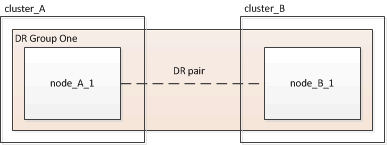

= 将双节点 MetroCluster FC 配置扩展为四节点配置
:allow-uri-read: 
:icons: font
:imagesdir: ../media/

[role="lead"]
要将双节点 MetroCluster FC 配置扩展为四节点 MetroCluster FC 配置，需要向每个集群添加一个控制器，以便在每个 MetroCluster 站点上形成一个 HA 对，然后刷新 MetroCluster FC 配置。

.开始之前
* 在 MetroCluster FC 配置中，节点必须运行 ONTAP 9 或更高版本。
+
早期版本的 ONTAP 或 MetroCluster IP 配置不支持此操作步骤。

* 如果双节点配置中的平台在 ONTAP 9.2 中不受支持，而您计划升级到 ONTAP 9.2 支持的平台，并扩展到四节点集群，则必须先升级双节点配置中的平台，然后再扩展 MetroCluster FC 配置。
* 现有 MetroCluster FC 配置必须运行状况良好。
* 您要添加的设备必须受支持并满足以下过程中所述的所有要求：
+
link:../install-fc/index.html["光纤连接的 MetroCluster 安装和配置"]

+
link:../install-stretch/concept_considerations_differences.html["延伸型 MetroCluster 安装和配置"]

* 您必须具有可用的 FC 交换机端口以容纳新控制器和任何新网桥。
* 您需要管理员密码以及对 FTP 或 SCP 服务器的访问权限。

.关于此任务
* 此操作步骤仅适用于 MetroCluster FC 配置。
* 此操作步骤会造成系统中断，大约需要四小时才能完成。
* 在执行此操作步骤之前， MetroCluster FC 配置包含两个单节点集群：
+

+
完成此操作步骤后， MetroCluster FC 配置包含两个 HA 对，每个站点一个：

+
image::../media/mcc_dr_groups_4_node.gif[MCC DR 组 4 节点]

* 这两个站点必须均衡扩展。
+
MetroCluster 配置不能包含数量不等的节点。

* 每个站点的此操作步骤可能需要一个多小时的时间，同时还需要更多时间来执行初始化磁盘和通过网络启动新节点等任务。
+
初始化磁盘的时间取决于磁盘的大小。

* 此操作步骤使用以下工作流：

image::../media/workflow_mcc_2_to_4_node_expansion_high_level.gif[工作流 MCC 2 到 4 节点扩展高级别]
