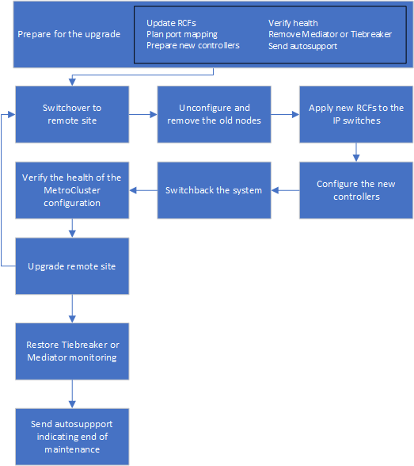

= 使用切换和切回功能将 AFF IP 配置中的 AFF A700 控制器升级到 MetroCluster A900 （ ONTAP 9.10.1 及更高版本）
:allow-uri-read: 

[role="lead"]
升级配对集群上的控制器模块时，您可以使用 MetroCluster 切换操作为客户端提供无中断服务。无法在此操作步骤中升级其他组件（例如存储架或交换机）。

.关于此任务
* 控制器必须运行 ONTAP 9.10.1 或更高版本。
* 此操作步骤适用场景 AFF A700 控制器模块将升级到 MetroCluster IP 配置中的 AFF A900 。
+
|===

| 旧平台型号 | 新平台型号 

 a| 
** AFF A700

 a| 
** AFF A900

|===
* 配置中的所有控制器都应在同一维护期间进行升级。
+
在此维护活动之外，不支持使用 AFF A700 和 AFF A900 控制器运行 MetroCluster 配置。

* IP 交换机必须运行受支持的固件版本。
* 您将在新平台上重复使用原始平台的 IP 地址，网络掩码和网关。
* 此操作步骤使用以下示例名称：
+
** site_A
+
*** 升级前：
+
**** node_A_1-A700
**** node_A_2-A700

*** 升级后：
+
**** node_A_1-A900
**** node_A_2-A900

** 站点 B
+
*** 升级前：
+
**** node_B_1-A700
**** node_B_2-A700

*** 升级后：
+
**** node_B_1-A900
**** node_B_2-A900

== 用于升级 MetroCluster IP 配置中控制器的工作流

您可以使用工作流图帮助您规划升级任务。

== 准备升级。

在对现有 MetroCluster 配置进行任何更改之前，您必须检查此配置的运行状况，准备新平台并执行其他各种任务。

=== 清除 AFF A700 控制器上的插槽 7

AFF A900 上的 MetroCluster 配置使用插槽 5 和 7 中 DR 卡上的每个端口之一。在开始升级之前，如果 AFF A700 上的插槽 7 中有卡，则必须将其移动到集群中所有节点的其他插槽中。

=== 升级控制器之前，请更新 MetroCluster 交换机 RCF 文件

AFF A700 上的 MetroCluster IP 配置不使用 VLAN 。AFF A900 上的 MetroCluster 配置确实使用 VLAN 。因此，在从 AFF A700 升级到 AFF A900 时，您需要更改 RCF 文件。

|===

| 平台型号 | 支持的 VLAN ID 

 a| 
* AFF A900

 a| 
* 10
* 20
* 介于 101 到 4096 之间的任何值（含 101 到 4096 ）。

|===
* 如果交换机未配置支持的最低 RCF 文件版本，则必须更新 RCF 文件。有关适用于您的交换机型号的正确 RCF 文件版本，请参见 link:https://mysupport.netapp.com/site/tools/tool-eula/rcffilegenerator["RcfFileGenerator 工具"^]。以下步骤适用于 RCF 文件应用程序。

.步骤
. 准备 IP 交换机以应用新的 RCF 文件。
+
按照中适用于您的交换机供应商的一节中的步骤进行操作 link:../install-ip/index.html["MetroCluster IP 安装和配置"] 内容

+
** link:../install-ip/task_switch_config_broadcom.html#resetting-the-broadcom-ip-switch-to-factory-defaults["将 Broadcom IP 交换机重置为出厂默认值"]
** link:../install-ip/task_switch_config_broadcom.html#resetting-the-cisco-ip-switch-to-factory-defaults["将 Cisco IP 交换机重置为出厂默认值"]

. 下载并安装 RCF 文件。
+
按照中的步骤进行操作 link:../install-ip/index.html["MetroCluster IP 安装和配置"] 内容

+
** link:../install-ip/task_switch_config_broadcom.html#downloading-and-installing-the-broadcom-rcf-files["下载并安装 Broadcom RCF 文件"]
** link:../install-ip/task_switch_config_broadcom.html#downloading-and-installing-the-cisco-ip-rcf-files["下载并安装 Cisco IP RCF 文件"]

=== 将端口从旧节点映射到新节点

从 AFF A700 升级到 AFF A900 时，您不会更改数据网络端口， FCP SAN 适配器端口以及 SAS 和 NVMe 存储端口。数据 LIF 在升级期间和升级后始终保持在原位。因此，您不需要将网络端口从旧节点映射到新节点。

=== 在站点升级之前验证 MetroCluster 运行状况

在执行升级之前，您必须验证 MetroCluster 配置的运行状况和连接。

.步骤
. 在 ONTAP 中验证 MetroCluster 配置的运行情况：
+
.. 检查节点是否为多路径： + `node run -node _node-name_ sysconfig -a`
+
您应对 MetroCluster 配置中的每个节点使用此命令问题描述。

.. 验证配置中是否没有损坏的磁盘： + `storage disk show -broken`
+
您应在 MetroCluster 配置中的每个节点上问题描述此命令。

.. 检查是否存在任何运行状况警报：
+
`s系统运行状况警报显示`

+
您应在每个集群上问题描述此命令。

.. 验证集群上的许可证：
+
`s系统许可证显示`

+
您应在每个集群上问题描述此命令。

.. 验证连接到节点的设备：
+
`network device-discovery show`

+
您应在每个集群上问题描述此命令。

.. 验证两个站点上的时区和时间设置是否正确：
+
`集群日期显示`

+
您应在每个集群上问题描述此命令。您可以使用 `cluster date` 命令配置时间和时区。

. 确认 MetroCluster 配置的运行模式并执行 MetroCluster 检查。
+
.. 确认 MetroCluster 配置，并且操作模式为 `normal` ： + MetroCluster show`
.. 确认显示所有预期节点： + MetroCluster node show`
.. 问题描述以下命令：
+
`MetroCluster check run`

.. 显示 MetroCluster 检查的结果：
+
MetroCluster check show`

. 使用 Config Advisor 工具检查 MetroCluster 布线。
+
.. 下载并运行 Config Advisor 。
+
https://mysupport.netapp.com/site/tools/tool-eula/activeiq-configadvisor["NetApp 下载： Config Advisor"^]

.. 运行 Config Advisor 后，查看该工具的输出并按照输出中的建议解决发现的任何问题。

=== 在升级之前收集信息

在升级之前，您必须收集每个节点的信息，并在必要时调整网络广播域，删除任何 VLAN 和接口组以及收集加密信息。

.步骤
. 记录每个节点的物理布线，根据需要为缆线添加标签，以便为新节点正确布线。
. 收集每个节点的以下命令输出：
+
** `MetroCluster interconnect show`
** `MetroCluster configuration-settings connection show`
** `network interface show -role cluster ， node-mgmt`
** `network port show -node node_name -type physical`
** `network port vlan show -node _node-name_`
** `network port ifgrp show -node _node_name_ -instance`
** `network port broadcast-domain show`
** `网络端口可访问性 show -detail`
** `network IPspace show`
** `volume show`
** `s存储聚合显示`
** `ssystem node run -node _node-name_ sysconfig -a`
** `SVM FCP 启动程序 show`
** `s存储磁盘显示`
** `MetroCluster configuration-settings interface show`

. 收集 site_B （当前正在升级其平台的站点）的 UUID ： `MetroCluster node show -fields node-cluster-uuid ， node-uuid`
+
必须在新的 site_B 控制器模块上准确配置这些值，以确保成功升级。将这些值复制到文件，以便稍后在升级过程中将其复制到正确的命令中。+ 以下示例显示了包含 UUID 的命令输出：

+
[listing]
----
cluster_B::> metrocluster node show -fields node-cluster-uuid, node-uuid
   (metrocluster node show)
dr-group-id cluster     node   node-uuid                            node-cluster-uuid
----------- --------- -------- ------------------------------------ ------------------------------
1           cluster_A node_A_1-A700 f03cb63c-9a7e-11e7-b68b-00a098908039 ee7db9d5-9a82-11e7-b68b-00a098908039
1           cluster_A node_A_2-A700 aa9a7a7a-9a81-11e7-a4e9-00a098908c35 ee7db9d5-9a82-11e7-b68b-00a098908039
1           cluster_B node_B_1-A700 f37b240b-9ac1-11e7-9b42-00a098c9e55d 07958819-9ac6-11e7-9b42-00a098c9e55d
1           cluster_B node_B_2-A700 bf8e3f8f-9ac4-11e7-bd4e-00a098ca379f 07958819-9ac6-11e7-9b42-00a098c9e55d
4 entries were displayed.
cluster_B::*

----
+
建议您将 UUID 记录到如下表中。

+
|===

| 集群或节点 | UUID 

 a| 
集群 B
 a| 
07958819-9ac6-11e7-9b42-00a098c9e55d

 a| 
node_B_1-A700
 a| 
f37b240b-9ac1-11e7-9b42-00a098c9e55d

 a| 
node_B_2-A700
 a| 
bf8e3f8f-9ac4-11e7-bd4e-00a098ca379f

 a| 
cluster_A
 a| 
ee7db9d5-9a82-11e7-b68b-00a098908039

 a| 
node_A_1-A700
 a| 
f03cb63c-9a7e-11e7-b68b-00a098908039

 a| 
node_A_2-A700
 a| 
aa9a7a7a-9a81-11e7-a4e9-00a098908c35

|===
. 如果 MetroCluster 节点采用 SAN 配置，请收集相关信息。
+
您应收集以下命令的输出：

+
** `fcp adapter show -instance`
** `fcp interface show -instance`
** `iscsi interface show`
** `ucadmin show`

. 如果根卷已加密，请收集并保存用于 key-manager 的密码短语： `security key-manager backup show`
. 如果 MetroCluster 节点对卷或聚合使用加密，请复制有关密钥和密码短语的信息。对于追加信息，请参见 https://docs.netapp.com/us-en/ontap/encryption-at-rest/backup-key-management-information-manual-task.html["手动备份板载密钥管理信息"^]。
+
.. 如果配置了板载密钥管理器： `security key-manager on板 载 show-backup` + 您稍后将在升级操作步骤中需要密码短语。
.. 如果配置了企业密钥管理（ KMIP ），请问题描述执行以下命令：
+
....
security key-manager external show -instance
security key-manager key query
....

. 收集现有节点的系统 ID ： `MetroCluster node show -fields node-systemID ， ha-partner-systemID ， dr-partner-systemID ， dr-auxiliary-systemID`
+
以下输出显示了重新分配的驱动器。

+
[listing]
----
::> metrocluster node show -fields node-systemid,ha-partner-systemid,dr-partner-systemid,dr-auxiliary-systemid

dr-group-id cluster     node     node-systemid ha-partner-systemid dr-partner-systemid dr-auxiliary-systemid
----------- ----------- -------- ------------- ------------------- ------------------- ---------------------
1           cluster_A node_A_1-A700   537403324     537403323           537403321           537403322
1           cluster_A node_A_2-A700   537403323     537403324           537403322          537403321
1           cluster_B node_B_1-A700   537403322     537403321           537403323          537403324
1           cluster_B node_B_2-A700   537403321     537403322           537403324          537403323
4 entries were displayed.
----

=== 删除调解器或 Tiebreaker 监控

升级平台之前，如果使用 Tiebreaker 或调解器实用程序监控 MetroCluster 配置，则必须删除监控。

.步骤
. 收集以下命令的输出：
+
`storage iscsi-initiator show`

. 从 Tiebreaker ，调解器或其他可启动切换的软件中删除现有 MetroCluster 配置。
+
|===

| 如果您使用的是 ... | 使用此操作步骤 ... 

 a| 
Tiebreaker
 a| 
link:../tiebreaker/concept_configuring_the_tiebreaker_software.html#removing-metrocluster-configurations["删除 MetroCluster 配置"] 在 _Tiebreaker MetroCluster 安装和配置内容 _ 中

 a| 
调解器
 a| 
在 ONTAP 提示符处问题描述以下命令：

`MetroCluster configuration-settings mediator remove`

 a| 
第三方应用程序
 a| 
请参见产品文档。

|===

=== 在维护之前发送自定义 AutoSupport 消息

在执行维护问题描述之前，您应发送 AutoSupport 消息以通知技术支持正在进行维护。告知技术支持正在进行维护，可防止他们在假定已发生中断的情况下创建案例。

必须在每个 MetroCluster 站点上执行此任务。

.步骤
. 登录到集群。
. 调用指示维护开始的 AutoSupport 消息：
+
`ssystem node AutoSupport invoke -node * -type all -message MAIN=_maintenance-window-in-hours_`

+
`maintenance-window-in-hours` 参数指定维护窗口的长度，最长为 72 小时。如果在该时间过后完成维护，您可以调用一条 AutoSupport 消息，指示维护期结束：

+
`ssystem node AutoSupport invoke -node * -type all -message MAINT=end`

. 在配对站点上重复上述步骤。

== 切换 MetroCluster 配置

您必须将配置切换到 site_A ，以便可以升级 site_B 上的平台。

必须在 site_A 上执行此任务

完成此任务后， site_A 处于活动状态，并为两个站点提供数据。site_B 处于非活动状态，并已准备好开始升级过程。

image::../media/mcc_upgrade_cluster_a_in_switchover_A900.png[切换 A900 中的 MCC 升级集群 A]

.步骤
. 将 MetroCluster 配置切换到 site_A ，以便可升级 site_B 的节点：
+
.. 对 site_A 执行问题描述以下命令：
+
MetroCluster switchover -controller-replacement true`

+
此操作可能需要几分钟才能完成。

.. 监控切换操作：
+
`MetroCluster 操作显示`

.. 操作完成后，确认节点处于切换状态：
+
`MetroCluster show`

.. 检查 MetroCluster 节点的状态：
+
`MetroCluster node show`

+
在控制器升级期间禁用协商切换后自动修复聚合。site_B 上的节点会在 `LOADER` 提示符处暂停和停止。

== 卸下 AFF A700 平台控制器模块和 NVS

如果您尚未接地，请正确接地。

.步骤
. 从 site_B 的两个节点收集 bootarg 值： `printenv`
. 关闭 site_B 上的机箱

=== 卸下 AFF A700 控制器模块

使用以下操作步骤删除 AFF A700 控制器模块

.步骤
. 在卸下控制器模块之前，请断开控制台缆线（如果有）以及管理缆线与控制器模块的连接。
. 解锁控制器模块并将其从机箱中卸下。
+
.. Slide the orange button on the cam handle downward until it unlocks.
+
image::../media/drw_9500_remove_PCM.png[控制器模块]

+
|===

| image:../media/number1.png["数字 1"] | Cam handle release button 

| image:../media/number2.png["数字 2."] | Cam handle 
|===
.. Rotate the cam handle so that it completely disengages the controller module from the chassis, and then slide the controller module out of the chassis.Make sure that you support the bottom of the controller module as you slide it out of the chassis.

=== 卸下 AFF A700 NVS 模块

使用以下操作步骤删除 AFF A700 NVS 模块。

注意： AFF A700 NVS 模块 NVS 模块位于插槽 6 中，与系统中的其他模块相比，高度是原来的两倍。

.步骤
. 从插槽 6 解锁 NVS 并将其卸下。
+
.. 按下带字母和编号的 "CAB" 按钮。The cam button moves away from the chassis.
.. Rotate the cam latch down until it is in a horizontal position.NVS 从机箱中分离并移动几英寸。
.. 拉动模块侧面的拉片，将 NVS 从机箱中卸下。
+
image::../media/drw_a900_move-remove_NVRAM_module.png[删除模块]

+
|===

| image:../media/number1.png["数字 1"] | Lettered and numbered I/O cam latch 

| image:../media/number2.png["数字 2"] | I/O latch completely unlocked 
|===

. 如果您使用的附加模块在 AFF A700 NVS 上用作核心转储设备，请勿将其传输到 AFF A900 NVS 。请勿将任何部件从 AFF A700 控制器模块和 NVS 传输到 AFF A900 。

== 安装 AFF A900 NVS 和控制器模块

您必须在 site_B 的两个节点上安装升级套件中提供的 AFF A900 NVS 和控制器模块请勿将核心转储设备从 AFF A700 NVS 模块移至 AFF A900 NVS 模块。

如果您尚未接地，请正确接地。

=== 安装 AFF A900 NVS

使用以下操作步骤在 site_B 的两个节点的插槽 6 中安装 AFF A900 NVS

.步骤
. 将 NVS 与插槽 6 中机箱开口的边缘对齐。
. 将 NVS 轻轻滑入插槽，直到带字母和编号的 I/O 凸轮闩锁开始与 I/O 凸轮销啮合，然后将 I/O 凸轮闩锁一直向上推，以将 NVS 锁定到位。
+
image::../media/drw_a900_move-remove_NVRAM_module.png[删除模块]

+
|===

| image:../media/number1.png["数字 1"] | Lettered and numbered I/O cam latch 

| image:../media/number2.png["数字 2"] | I/O latch completely unlocked 
|===

=== 安装 AFF A900 控制器模块。

使用以下操作步骤安装 AFF A900 控制器模块。

.步骤
. Align the end of the controller module with the opening in the chassis, and then gently push the controller module halfway into the system.
. Firmly push the controller module into the chassis until it meets the midplane and is fully seated.控制器模块完全就位后，锁定闩锁会上升。注意：为避免损坏连接器，请勿在将控制器模块滑入机箱时用力过大。
. 使用缆线将管理和控制台端口连接到控制器模块。
+
image::../media/drw_9500_remove_PCM.png[控制器模块]

+
|===

| image:../media/number1.png["数字 1"] | Cam handle release button 

| image:../media/number2.png["数字 2."] | Cam handle 
|===
. 在每个节点的插槽 7 中安装第二个 X91146A 卡。
+
.. 将 e5b 连接移动到 e7b 。
.. 将 e5a 连接移至 e5b 。
+

NOTE: 集群中所有节点上的插槽 7 均应为空，如中所述 <<Map ports from the old nodes to the new nodes>> 部分。

. 打开机箱电源并连接到串行控制台。
. BIOS 初始化后，如果节点启动自动启动，请按 Ctrl-C 中断自动启动
. 自动启动中断后，节点将在 LOADER 提示符处停止。如果您未及时中断自动启动，而 node1 开始启动，请等待提示符按 Ctrl-C 进入启动菜单。节点停留在启动菜单后，使用选项 8 重新启动节点并在重新启动期间中断自动启动。
. 在 LOADER 提示符处，设置默认环境变量： set-defaults
. 保存默认环境变量设置： `saveenv`

=== site_B 上的网络启动节点

在交换 AFF A900 控制器模块和 NVS 后，您需要通过网络启动 AFF A900 节点，并安装与集群上运行的相同 ONTAP 版本和修补程序级别。术语 netboot 表示从远程服务器上存储的 ONTAP 映像启动。在准备网络启动时，您必须将 ONTAP 9 启动映像的副本添加到系统可以访问的 Web 服务器上。无法检查 AFF A900 控制器模块启动介质上安装的 ONTAP 版本，除非该模块安装在机箱中并已启动。AFF A900 启动介质上的 ONTAP 版本必须与要升级的 AFF A700 系统上运行的 ONTAP 版本相同，并且主启动映像和备份启动映像都应匹配。您可以通过在启动菜单中依次执行 netboot 和 `wipeconfig` 命令来配置映像。如果控制器模块先前已在另一个集群中使用，则 `wipeconfig` 命令将清除启动介质上的任何剩余配置。

.开始之前
* 确认您可以使用系统访问 HTTP 服务器。
* 您需要从 NetApp 支持站点下载适用于您的系统和正确版本的 ONTAP 所需的系统文件。

如果安装的 ONTAP 版本与原始控制器上安装的版本不同，则必须通过网络启动新控制器。安装每个新控制器后，您可以从 Web 服务器上存储的 ONTAP 9 映像启动系统。然后，您可以将正确的文件下载到启动介质设备，以供后续系统启动。

.步骤
. 访问 https://mysupport.netapp.com/site/["NetApp 支持站点"^] 下载用于执行系统网络启动的文件。
. `步骤 2-download-software]] 从 NetApp 支持站点的软件下载部分下载相应的 ONTAP 软件，并将` ontap-version_image.tgz 文件存储在可通过 Web 访问的目录中。
. 切换到可通过 Web 访问的目录，并验证所需文件是否可用。
. 您的目录列表应包含 <ontap_version>\\_image.tgz 。
. 通过选择以下操作之一来配置网络启动连接。
+

NOTE: 您应使用管理端口和 IP 作为网络启动连接。请勿使用数据 LIF IP ，否则在执行升级期间可能会发生数据中断。

+
|===

| 动态主机配置协议（ DCHP ） | 那么 ... 

 a| 
正在运行
 a| 
在启动环境提示符处使用以下命令自动配置连接： `ifconfig e0M -auto`

 a| 
未运行
 a| 
在启动环境提示符处使用以下命令手动配置连接： `ifconfig e0M -addr=<filer_addr> -mask=<netmask> -gw=< 网关 > - dns=<dns_addr> domain=<dns_domain>`

` <filer_addr>` 是存储系统的 IP 地址。` < 网络掩码 >` 是存储系统的网络掩码。` < 网关 >` 是存储系统的网关。` <dns_addr>` 是网络上名称服务器的 IP 地址。此参数是可选的。` <dns_domain>` 是域名服务（ DNS ）域名。此参数是可选的。注意：您的接口可能需要其他参数。有关详细信息，请在固件提示符处输入 `help ifconfig` 。

|===
. 对 node_B_1 执行 netboot ： `netboot` `http://<web_server_ip/path_to_web_accessible_directory>/netboot/kernel`
+
` <path_to_the_web-accessible_directory>` 应指向您在中下载 ` <ontap_version>\_image.tgz` 的位置 <<step2-download-software,第 2 步>>。

+

NOTE: 请勿中断启动。

. 等待 AFF A900 控制器模块上当前运行的 node_B_1 启动，并显示启动菜单选项，如下所示：
+
[listing]
----
Please choose one of the following:

(1)  Normal Boot.
(2)  Boot without /etc/rc.
(3)  Change password.
(4)  Clean configuration and initialize all disks.
(5)  Maintenance mode boot.
(6)  Update flash from backup config.
(7)  Install new software first.
(8)  Reboot node.
(9)  Configure Advanced Drive Partitioning.
(10) Set Onboard Key Manager recovery secrets.
(11) Configure node for external key management.
Selection (1-11)?
----
. 从启动菜单中，选择选项 `` （ 7 ） Install new software first.`` 此菜单选项可下载新的 ONTAP 映像并将其安装到启动设备中。注意：请忽略以下消息： `HA 对上的无中断升级不支持此操作步骤。` 本说明将适用场景无中断 ONTAP 软件升级，而不是控制器升级。
+
请始终使用 netboot 将新节点更新为所需映像。如果您使用其他方法在新控制器上安装映像，则可能会安装不正确的映像。此问题描述适用场景所有 ONTAP 版本。

. 如果系统提示您继续运行操作步骤 ，请输入 `y` ，然后在系统提示您输入软件包时，输入 URL ： `http://<web_server_ip/path_to_web-accessible_directory>/<ontap_version>\_image.tgz`
. 完成以下子步骤以重新启动控制器模块：
+
.. 出现以下提示时，输入 `n` 以跳过备份恢复： `do you want to restore the backup configuration now ？｛ y|n ｝`
.. 当您看到以下提示时，输入 ``y 以重新启动： `必须重新启动节点才能开始使用新安装的软件。是否要立即重新启动？｛ y|n ｝`` 控制器模块重新启动，但停留在启动菜单处，因为启动设备已重新格式化，并且需要还原配置数据。

. 在提示符处，运行 `wipeconfig` 命令以清除启动介质上先前的任何配置：
+
.. 当您看到以下消息时，问题解答 `yes` ： `此操作将删除关键系统配置，包括集群成员资格。警告：不要在已被接管的 HA 节点上运行此选项。确实要继续？：`
.. 节点将重新启动以完成 `wipeconfig` ，然后停留在启动菜单处。

. 从启动菜单中选择选项 `5` 以转到维护模式。按问题解答 `yes` 显示提示，直到节点在维护模式和命令提示符 \* > 处停止。
. 对 netboot node_B_2 重复上述步骤。

=== 还原 HBA 配置

根据控制器模块中是否存在 HBA 卡以及 HBA 卡的配置，您需要根据站点的使用情况正确配置这些卡。

.步骤
. 在维护模式下，为系统中的任何 HBA 配置设置：
+
.. 检查端口的当前设置：
+
`ucadmin show`

.. 根据需要更新端口设置。

+
|===

| 如果您具有此类型的 HBA 和所需模式 ... | 使用此命令 ... 

 a| 
CNA FC
 a| 
`ucadmin modify -m fc -t initiator _adapter-name_`

 a| 
CNA 以太网
 a| 
`ucadmin modify -mode cna _adapter-name_`

 a| 
FC 目标
 a| 
`fcadmin config -t target _adapter-name_`

 a| 
FC 启动程序
 a| 
`fcadmin config -t initiator _adapter-name_`

|===
. 退出维护模式：
+
`halt`

+
运行此命令后，请等待，直到节点停留在 LOADER 提示符处。

. 将节点重新启动至维护模式，以使配置更改生效：
+
`boot_ontap maint`

. 验证所做的更改：
+
|===

| 如果您使用的是此类型的 HBA... | 使用此命令 ... 

 a| 
CNA
 a| 
`ucadmin show`

 a| 
FC
 a| 
`fcadmin show`

|===

=== 在新控制器和机箱上设置 HA 状态

您必须验证控制器和机箱的 HA 状态，并在必要时更新此状态以匹配您的系统配置。

.步骤
. 在维护模式下，显示控制器模块和机箱的 HA 状态：
+
`ha-config show`

+
所有组件的 HA 状态均应为 `mCCIP` 。

. 如果显示的控制器或机箱系统状态不正确，请设置 HA 状态：
+
`ha-config modify controller mccip`

+
`ha-config modify chassis mccip`

. 暂停节点： `halt`
+
节点应停止在 `loader>` 提示符处。

. 在每个节点上，检查系统日期，时间和时区： `show date`
. 如有必要，请以 UTC 或 GMT 格式设置日期： `set date <MM/dd/yyy>`
. 在启动环境提示符处使用以下命令检查时间： `show time`
. 如有必要，请以 UTC 或 GMT 格式设置时间： `set time <hh ： mm ： ss>`
. 保存设置： `saveenv`
. 收集环境变量： `printenv`

== 更新交换机 RCF 文件以适应新平台

您必须将交换机更新为支持新平台型号的配置。

您可以在包含当前正在升级的控制器的站点上执行此任务。在此操作步骤中显示的示例中，我们首先升级 site_B 。

当 site_A 上的控制器升级后， site_A 上的交换机将进行升级。

.步骤
. 准备 IP 交换机以应用新的 RCF 文件。
+
按照 _IP MetroCluster 安装和配置 _ 部分中适用于您的交换机供应商一节中的步骤进行操作。

+
link:../install-ip/index.html["MetroCluster IP 安装和配置"]

+
** link:../install-ip/task_switch_config_broadcom.html#resetting-the-broadcom-ip-switch-to-factory-defaults["将 Broadcom IP 交换机重置为出厂默认值"]
** link:../install-ip/task_switch_config_broadcom.html#resetting-the-cisco-ip-switch-to-factory-defaults["将 Cisco IP 交换机重置为出厂默认值"]

. 下载并安装 RCF 文件。
+
按照中适用于您的交换机供应商的一节中的步骤进行操作 link:../install-ip/index.html["MetroCluster IP 安装和配置"]。

+
** link:../install-ip/task_switch_config_broadcom.html#downloading-and-installing-the-broadcom-rcf-files["下载并安装 Broadcom RCF 文件"]
** link:../install-ip/task_switch_config_broadcom.html#downloading-and-installing-the-cisco-ip-rcf-files["下载并安装 Cisco IP RCF 文件"]

== 配置新控制器

此时应准备好新控制器并为其布线。

=== 设置 MetroCluster IP bootarg 变量

必须在新控制器模块上配置某些 MetroCluster IP bootarg 值。这些值必须与旧控制器模块上配置的值匹配。

在此任务中，您将使用先前在中的升级操作步骤中标识的 UUID 和系统 ID link:task_upgrade_controllers_in_a_four_node_ip_mcc_us_switchover_and_switchback_mcc_ip.html#gathering-information-before-the-upgrade["升级前收集信息"]。

.步骤
. 在 `loader>` 提示符处，在 site_B 的新节点上设置以下 bootarg ：
+
`setenv bootarg.mcc.port_a_ip_config _local-ip-address/local-ip-mask ， 0 ， ha-partner-ip-address ， DR-partner-ip-address ， DR-aux-partnerip-address ， vlan-id_`

+
`setenv bootarg.mcc.port_b_ip_config _local-ip-address/local-ip-mask ， 0 ， ha-partner-ip-address ， DR-partner-ip-address ， DR-aux-partnerip-address ， vlan-id_`

+
以下示例将为 node_B_1-A900 设置值，其中第一个网络使用 VLAN 120 ，第二个网络使用 VLAN 130 ：

+
[listing]
----
setenv bootarg.mcc.port_a_ip_config 172.17.26.10/23,0,172.17.26.11,172.17.26.13,172.17.26.12,120
setenv bootarg.mcc.port_b_ip_config 172.17.27.10/23,0,172.17.27.11,172.17.27.13,172.17.27.12,130
----
+
以下示例将为 node_B_2-A900 设置值，其中第一个网络使用 VLAN 120 ，第二个网络使用 VLAN 130 ：

+
[listing]
----
setenv bootarg.mcc.port_a_ip_config 172.17.26.11/23,0,172.17.26.10,172.17.26.12,172.17.26.13,120
setenv bootarg.mcc.port_b_ip_config 172.17.27.11/23,0,172.17.27.10,172.17.27.12,172.17.27.13,130
----
. 在新节点的 `LOADER` 提示符处，设置 UUID ：
+
`setenv bootarg.mgwd.partner_cluster_uuid _partner-cluster-UUUID_`

+
`setenv bootarg.mgwd.cluster_uuid _local-cluster-UUUID_`

+
`setenv bootarg.mcc.pri_partner_uuid _DR-partner-node-UUUID_`

+
`setenv bootarg.mcc.aux_partner_uuid _DR-aux-partner-node-UUUUID_`

+
`setenv bootarg.mcc_iscsi.node_uuid _local-node-UUUUID_`

+
.. 设置 node_B_1-A900 上的 UUID 。
+
以下示例显示了用于设置 node_B_1-A900 上的 UUID 的命令：

+
[listing]
----
setenv bootarg.mgwd.cluster_uuid ee7db9d5-9a82-11e7-b68b-00a098908039
setenv bootarg.mgwd.partner_cluster_uuid 07958819-9ac6-11e7-9b42-00a098c9e55d
setenv bootarg.mcc.pri_partner_uuid f37b240b-9ac1-11e7-9b42-00a098c9e55d
setenv bootarg.mcc.aux_partner_uuid bf8e3f8f-9ac4-11e7-bd4e-00a098ca379f
setenv bootarg.mcc_iscsi.node_uuid f03cb63c-9a7e-11e7-b68b-00a098908039
----
.. 设置 node_B_2-A900 上的 UUID ：
+
以下示例显示了用于设置 node_B_2-A900 上的 UUID 的命令：

+
[listing]
----
setenv bootarg.mgwd.cluster_uuid ee7db9d5-9a82-11e7-b68b-00a098908039
setenv bootarg.mgwd.partner_cluster_uuid 07958819-9ac6-11e7-9b42-00a098c9e55d
setenv bootarg.mcc.pri_partner_uuid bf8e3f8f-9ac4-11e7-bd4e-00a098ca379f
setenv bootarg.mcc.aux_partner_uuid f37b240b-9ac1-11e7-9b42-00a098c9e55d
setenv bootarg.mcc_iscsi.node_uuid aa9a7a7a-9a81-11e7-a4e9-00a098908c35
----

. 如果原始系统配置了 ADP ，请在每个替代节点的 LOADER 提示符处启用 ADP ：
+
`setenv bootarg.mcc.ADP 启用 true`

. 设置以下变量：
+
`setenv bootarg.mcc.local_config_id _original-sys-id_`

+
`setenv bootarg.mcc.dr_partner _dr-partner-sys-id_`

+

NOTE: 必须将 `setenv bootarg.mcc.local_config_id` 变量设置为 * 原始 * 控制器模块 node_B_1-A700 的 sys-id 。

+
.. 设置 node_B_1-A900 上的变量。
+
以下示例显示了用于设置 node_B_1-A900 上的值的命令：

+
[listing]
----
setenv bootarg.mcc.local_config_id 537403322
setenv bootarg.mcc.dr_partner 537403324
----
.. 设置 node_B_2-A900 上的变量。
+
以下示例显示了用于设置 node_B_2-A900 上的值的命令：

+
[listing]
----
setenv bootarg.mcc.local_config_id 537403321
setenv bootarg.mcc.dr_partner 537403323
----

. 如果对外部密钥管理器使用加密，请设置所需的 boottargets ：
+
`setenv bootarg.kmip.init.ipaddr`

+
`setenv bootarg.kmip.kmip.init.netmask`

+
`setenv bootarg.kmip.kmip.init.gateway`

+
`setenv bootarg.kmip.kmip.init.interface`

=== 重新分配根聚合磁盘

使用先前收集的系统将根聚合磁盘重新分配给新控制器模块。

这些步骤在维护模式下执行。

.步骤
. 将系统启动至维护模式：
+
`boot_ontap maint`

. 从维护模式提示符处显示 node_B_1-A900 上的磁盘：
+
`d` 展示 -A

+
命令输出将显示新控制器模块（ 1574774970 ）的系统 ID 。但是，根聚合磁盘仍归旧系统 ID （ 537403322 ）所有。此示例不显示 MetroCluster 配置中其他节点拥有的驱动器。

+
[listing]
----
*> disk show -a
Local System ID: 1574774970
DISK                  OWNER                 POOL   SERIAL NUMBER   HOME                  DR HOME
------------          ---------             -----  -------------   -------------         -------------
prod3-rk18:9.126L44   node_B_1-A700(537403322)  Pool1  PZHYN0MD     node_B_1-A700(537403322)  node_B_1-A700(537403322)
prod4-rk18:9.126L49  node_B_1-A700(537403322)  Pool1  PPG3J5HA     node_B_1-A700(537403322)  node_B_1-700(537403322)
prod4-rk18:8.126L21   node_B_1-A700(537403322)  Pool1  PZHTDSZD     node_B_1-A700(537403322)  node_B_1-A700(537403322)
prod2-rk18:8.126L2    node_B_1-A700(537403322)  Pool0  S0M1J2CF     node_B_1-(537403322)  node_B_1-A700(537403322)
prod2-rk18:8.126L3    node_B_1-A700(537403322)  Pool0  S0M0CQM5     node_B_1-A700(537403322)  node_B_1-A700(537403322)
prod1-rk18:9.126L27   node_B_1-A700(537403322)  Pool0  S0M1PSDW     node_B_1-A700(537403322)  node_B_1-A700(537403322)
.
.
.
----
. 将驱动器架上的根聚合磁盘重新分配给新控制器。
+
|===

| 如果您使用的是 ADP | 然后使用此命令 ... 

 a| 
是的。
 a| 
`dreassign -s _old-sysid_ -d _new-sysid_ -r _dr-partner-sysid_`

 a| 
否
 a| 
`dreassign -s _old-sysid_ -d _new-sysid_`

|===
. 将驱动器架上的根聚合磁盘重新分配给新控制器：
+
`dreassign -s old-sysid -d new-sysid`

+
以下示例显示了在非 ADP 配置中重新分配驱动器的情况：

+
[listing]
----
*> disk reassign -s 537403322 -d 1574774970
Partner node must not be in Takeover mode during disk reassignment from maintenance mode.
Serious problems could result!!
Do not proceed with reassignment if the partner is in takeover mode. Abort reassignment (y/n)? n

After the node becomes operational, you must perform a takeover and giveback of the HA partner node to ensure disk reassignment is successful.
Do you want to continue (y/n)? y
Disk ownership will be updated on all disks previously belonging to Filer with sysid 537403322.
Do you want to continue (y/n)? y
----
. 验证是否已正确重新分配根聚合中的磁盘 old-remove ：
+
`d展示`

+
`s存储聚合状态`

+
[listing]
----

*> disk show
Local System ID: 537097247

  DISK                    OWNER                    POOL   SERIAL NUMBER   HOME                     DR HOME
------------              -------------            -----  -------------   -------------            -------------
prod03-rk18:8.126L18 node_B_1-A900(537097247)  Pool1  PZHYN0MD        node_B_1-A900(537097247)   node_B_1-A900(537097247)
prod04-rk18:9.126L49 node_B_1-A900(537097247)  Pool1  PPG3J5HA        node_B_1-A900(537097247)   node_B_1-A900(537097247)
prod04-rk18:8.126L21 node_B_1-A900(537097247)  Pool1  PZHTDSZD        node_B_1-A900(537097247)   node_B_1-A900(537097247)
prod02-rk18:8.126L2  node_B_1-A900(537097247)  Pool0  S0M1J2CF        node_B_1-A900(537097247)   node_B_1-A900(537097247)
prod02-rk18:9.126L29 node_B_1-A900(537097247)  Pool0  S0M0CQM5        node_B_1-A900(537097247)   node_B_1-A900(537097247)
prod01-rk18:8.126L1  node_B_1-A900(537097247)  Pool0  S0M1PSDW        node_B_1-A900(537097247)   node_B_1-A900(537097247)
::>
::> aggr status
           Aggr          State           Status                Options
aggr0_node_B_1           online          raid_dp, aggr         root, nosnap=on,
                                         mirrored              mirror_resync_priority=high(fixed)
                                         fast zeroed
                                         64-bit
----

=== 启动新控制器

您必须启动新控制器，并注意确保 bootarg 变量正确无误，如果需要，请执行加密恢复步骤。

.步骤
. 暂停新节点：
+
`halt`

. 如果配置了外部密钥管理器，请设置相关的 boottargets ：
+
`setenv bootarg.kmip.init.ipaddr _ip-address_`

+
`setenv bootarg.kmip.init.netmask _netmask_`

+
`setenv bootarg.kmip.init.gateway _gateway-address_`

+
`setenv bootarg.kmip.init.interface _interface-id_`

. 检查 partner-sysid 是否为最新版本：
+
`printenv partner-sysid`

+
如果 partner-sysid 不正确，请将其设置为：

+
`setenv partner-sysid _partner-sysID_`

. 显示 ONTAP 启动菜单：
+
`boot_ontap 菜单`

. 如果使用根加密，请为密钥管理配置选择启动菜单选项。
+
|===

| 如果您使用的是 ... | 选择此启动菜单选项 ... 

 a| 
板载密钥管理
 a| 
选项 10 ，然后按照提示提供所需的输入以恢复或还原密钥管理器配置

 a| 
外部密钥管理
 a| 
选项 11 ，然后按照提示提供所需的输入以恢复或还原密钥管理器配置

|===
. 从启动菜单中，选择 ` （ 6 ） Update flash from backup config` 。
+

NOTE: 选项 6 将重新启动节点两次，然后再完成

+
对系统 ID 更改提示回答 `y` 。等待第二条重新启动消息：

+
[listing]
----
Successfully restored env file from boot media...

Rebooting to load the restored env file...
----
. 中断自动启动以停止加载程序上的控制器。
+

NOTE: 在每个节点上，检查中设置的 bootarg link:task_upgrade_controllers_in_a_four_node_ip_mcc_us_switchover_and_switchback_mcc_ip.html["设置 MetroCluster IP bootarg 变量"] 并更正任何不正确的值。请仅在检查 bootarg 值后再移至下一步。

. 仔细检查 partner-sysid 是否正确：
+
`printenv partner-sysid`

+
如果 partner-sysid 不正确，请将其设置为：

+
`setenv partner-sysid _partner-sysID_`

. 如果使用根加密，请为密钥管理配置选择启动菜单选项。
+
|===

| 如果您使用的是 ... | 选择此启动菜单选项 ... 

 a| 
板载密钥管理
 a| 
选项 10 ，然后按照提示提供所需的输入以恢复或还原密钥管理器配置

 a| 
外部密钥管理
 a| 
选项 11 ，然后按照提示提供所需的输入以恢复或还原密钥管理器配置

|===
+
您需要根据密钥管理器设置和启动菜单提示符处的选项 6 选择选项 10 或选项 11 来执行恢复操作步骤。要完全启动节点，您可能需要执行恢复操作步骤，然后继续执行选项 1 （正常启动）。

. 等待新节点 node_B_1-A900 和 node_B_2-A900 启动。
+
如果任一节点处于接管模式，请使用 `storage failover giveback` 命令执行交还。

. 如果使用加密，请使用适用于您的密钥管理配置的正确命令还原密钥。
+
|===

| 如果您使用的是 ... | 使用此命令 ... 

 a| 
板载密钥管理
 a| 
`sSecurity key-manager 板载同步`

有关详细信息，请参见 https://docs.netapp.com/us-en/ontap/encryption-at-rest/restore-onboard-key-management-encryption-keys-task.html["还原板载密钥管理加密密钥"^]。

 a| 
外部密钥管理
 a| 
`sSecurity key-manager external restore -vserver _svm_ -node _node_-key-server _host_name_ip_address ： port_ -key-id key_id -key-tag key_tag _node-name_`

有关详细信息，请参见 https://docs.netapp.com/us-en/ontap/encryption-at-rest/restore-external-encryption-keys-93-later-task.html["还原外部密钥管理加密密钥"^]。

|===
. 验证所有端口是否都位于广播域中：
+
.. 查看广播域：
+
`network port broadcast-domain show`

.. 根据需要向广播域添加任何端口。
+
https://docs.netapp.com/us-en/ontap/networking/add_or_remove_ports_from_a_broadcast_domain97.html["从广播域添加或删除端口"^]

.. 根据需要重新创建 VLAN 和接口组。
+
VLAN 和接口组成员资格可能与旧节点不同。

+
https://docs.netapp.com/us-en/ontap/networking/configure_vlans_over_physical_ports.html#create-a-vlan["创建 VLAN"^]

+
https://docs.netapp.com/us-en/ontap/networking/combine_physical_ports_to_create_interface_groups.html["组合物理端口以创建接口组"^]

=== 验证并还原 LIF 配置

验证 LIF 是否托管在升级操作步骤开始时映射的相应节点和端口上。

.关于此任务
* 此任务在 site_B 上执行
* 请参见您在中创建的端口映射计划 link:task_upgrade_controllers_in_a_four_node_ip_mcc_us_switchover_and_switchback_mcc_ip.html#mapping-ports-from-the-old-nodes-to-the-new-nodes["将端口从旧节点映射到新节点"]。

.步骤
. 在切回之前，验证 LIF 是否托管在相应的节点和端口上。
+
.. 更改为高级权限级别：
+
`set -privilege advanced`

.. 覆盖端口配置以确保 LIF 放置正确：
+
`vserver config override -command "network interface modify -vserver _vserver_name_ -home-port _active_port_after_upgrade_-lif _lif_name_ -home-node _new_node_name_"`

+
在 `vserver config override` 命令中输入 network interface modify 命令时，您不能使用选项卡自动完成功能。您可以使用 autoscomplete 创建网络 `interface modify` ，然后将其括在 `vserver config override` 命令中。

.. 返回到管理权限级别：
+
`set -privilege admin`

. 将接口还原到其主节点：
+
`network interface revert * -vserver _vserver-name_`

+
根据需要对所有 SVM 执行此步骤。

== 切回 MetroCluster 配置

在此任务中，您将执行切回操作， MetroCluster 配置将恢复正常运行。site_A 上的节点仍在等待升级。

image::../media/mcc_upgrade_cluster_a_switchback_A900.png[MCC 升级集群 A 切回 A900]

.步骤
. 从 site_B 运行 `MetroCluster node show` 命令并检查输出。问题描述
+
.. 验证新节点的表示是否正确。
.. 验证新节点是否处于 " 正在等待切回状态 " 。

. 从活动集群（未进行升级的集群）中的任何节点运行所需的命令，以执行修复和切回。
+
.. 修复数据聚合： + MetroCluster heal aggregates`
.. 修复根聚合：
+
MetroCluster 修复根`

.. 切回集群：
+
`MetroCluster 切回`

. 检查切回操作的进度：
+
`MetroCluster show`

+
当输出显示 `waiting for-switchback` 时，切回操作仍在进行中：

+
[listing]
----
cluster_B::> metrocluster show
Cluster                   Entry Name          State
------------------------- ------------------- -----------
 Local: cluster_B         Configuration state configured
                          Mode                switchover
                          AUSO Failure Domain -
Remote: cluster_A         Configuration state configured
                          Mode                waiting-for-switchback
                          AUSO Failure Domain -
----
+
当输出显示正常时，切回操作完成：

+
[listing]
----
cluster_B::> metrocluster show
Cluster                   Entry Name          State
------------------------- ------------------- -----------
 Local: cluster_B         Configuration state configured
                          Mode                normal
                          AUSO Failure Domain -
Remote: cluster_A         Configuration state configured
                          Mode                normal
                          AUSO Failure Domain -
----
+
如果切回需要很长时间才能完成，您可以使用 `MetroCluster config-replication resync-status show` 命令检查正在进行的基线的状态。此命令处于高级权限级别。

== 检查 MetroCluster 配置的运行状况

升级控制器模块后，您必须验证 MetroCluster 配置的运行状况。

此任务可在 MetroCluster 配置中的任何节点上执行。

.步骤
. 验证 MetroCluster 配置的运行情况：
+
.. 确认 MetroCluster 配置以及操作模式是否正常： + MetroCluster show`
.. 执行 MetroCluster check ： + MetroCluster check run`
.. 显示 MetroCluster 检查的结果：
+
MetroCluster check show`

. 验证 MetroCluster 连接和状态。
+
.. 检查 MetroCluster IP 连接：
+
`storage iscsi-initiator show`

.. 检查节点是否正在运行：
+
`MetroCluster node show`

.. 检查 MetroCluster IP 接口是否已启动：
+
`MetroCluster configuration-settings interface show`

.. 检查本地故障转移是否已启用：
+
`s存储故障转移显示`

== 升级 site_A 上的节点

您必须对 site_A 重复升级任务

.步骤
. 从开始，重复上述步骤升级 site_A 上的节点 link:task_upgrade_controllers_in_a_four_node_ip_mcc_us_switchover_and_switchback_mcc_ip.html#preparing-for-the-upgrade["准备升级。"]。
+
在执行任务时，对站点和节点的所有示例引用都将反转。例如，如果提供了从 site_A 切换的示例，则您将从 site_B 切换

== 还原 Tiebreaker 或调解器监控

完成 MetroCluster 配置升级后，您可以使用 Tiebreaker 或调解器实用程序恢复监控。

.步骤
. 根据需要使用适用于您的配置的操作步骤还原监控。
+
|===
| 如果您使用的是 ... | 使用此操作步骤 

 a| 
Tiebreaker
 a| 
link:../tiebreaker/concept_configuring_the_tiebreaker_software.html#adding-metrocluster-configurations["正在添加 MetroCluster 配置"] 在 _Tiebreaker MetroCluster 安装和配置 _ 部分。

 a| 
调解器
 a| 
链接： ./install-IP/concept_mediator_requirements.html _ MetroCluster IP 安装和配置 _ 部分中的 " 从 MetroCluster IP 配置配置 ONTAP 调解器服务 " 。

 a| 
第三方应用程序
 a| 
请参见产品文档。

|===

== 维护后发送自定义 AutoSupport 消息

完成升级后，您应发送一条 AutoSupport 消息，指示维护结束，以便可以恢复自动创建案例。

.步骤
. 要恢复自动生成支持案例，请发送 AutoSupport 消息以指示维护已完成。
+
.. 问题描述以下命令： + `ssystem node AutoSupport invoke -node * -type all -message MAINT=end`
.. 在配对集群上重复此命令。

