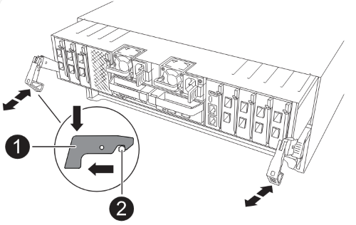

= 设置并通过网络启动新的MetroCluster IP控制器
:allow-uri-read: 
:icons: font
:imagesdir: ../media/

[role="lead"]
在通过网络启动控制器之前设置新控制器、以确认新节点运行的ONTAP版本与原始节点相同。

== 设置新控制器

您必须将新控制器装入机架并进行布线。

.步骤
. 根据需要规划新控制器模块和存储架的位置。
+
机架空间取决于控制器模块的平台型号，交换机类型以及配置中的存储架数量。

. 正确接地。
. 如果您的升级需要更换控制器模块、例如从AFF A800升级到AFF A90系统或从AFF C800升级到AFF C80系统、则在更换控制器模块时、您必须从机箱中卸下控制器模块。对于所有其他升级，请跳至 <<ip_upgrades_replace_4,第 4 步>>。
+
在机箱正面、用拇指用力推入每个驱动器、直到您感觉到有一定的停机。这可确认驱动器已牢固地固定在机箱中板上。

+
image::../media/drw-a800-drive-seated.png[显示了如何从机箱中卸下控制器模块]

. [[IP_U台 升级_REPLACE _4]]安装控制器模块。
+
您需要执行的安装步骤取决于您的升级是否需要更换控制器模块、或者是否需要使用IOM模块将旧控制器转换为外部磁盘架。

+
[cols="2*"]
|===
| 升级条件 | 请按照以下步骤操作... 

 a| 
** AFF 2020系统的AFF A150
** AFF 2020系统的AFF A220

| 控制器到外部磁盘架的转换 

 a| 
** AFF A90系统的AFF A800
** AFF C80系统的AFF C800

| 更换控制器模块 

| 任何其他控制器升级组合 | 所有其他升级 
|===
+
[role="tabbed-block"]
====
.控制器到外部磁盘架的转换
--
如果原始MetroCluster IP控制器为AFF A150或AFF A220型号、则可以将AFF A150或AFF A220 HA对转换为DS224C驱动器架、然后将其连接到新节点。

例如、在从AFF A150或AFF A220系统升级到AFF 2020系统时、您可以通过将AFF A150或AFF A220控制器模块更换为IOM12模块来将AFF A150或AFF A220 HA对转换为DS224C磁盘架。

.步骤
.. 更换要使用IOM12磁盘架模块转换的节点中的控制器模块。
+
https://hwu.netapp.com["Hardware Universe"^]

.. 设置驱动器架 ID 。
+
每个驱动器架（包括机箱）都需要一个唯一 ID 。

.. 根据需要重置其他驱动器架 ID 。
.. 关闭磁盘架。
.. 将转换后的驱动器架连接到新系统上的 SAS 端口，如果使用带外 ACP 布线，则连接到新节点上的 ACP 端口。
.. 打开转换后的驱动器架以及连接到新节点的任何其他驱动器架的电源。
.. 打开新节点的电源，然后按 Ctrl-C 访问启动环境提示符，以中断每个节点上的启动过程。

--
.更换控制器模块
--
单独安装新控制器不适用于磁盘和控制器位于同一机箱中的集成系统的升级、例如、从AFF A800系统升级到AFF A90系统。关闭旧控制器后、您必须交换新控制器模块和I/O卡、如下图所示。

以下示例图像仅用于表示、控制器模块和I/O卡可能因系统而异。

--
.所有其他升级
--
在机架或机柜中安装控制器模块。

--
====
. 按照中所述、为控制器的电源、串行控制台和管理连接布线 link:../install-ip/using_rcf_generator.html["为 MetroCluster IP 交换机布线"]
+
此时，请勿连接与旧控制器断开连接的任何其他缆线。

+
https://docs.netapp.com/us-en/ontap-systems/index.html["ONTAP硬件系统文档"^]

. 打开新节点的电源、并在系统提示时按Ctrl-C以显示 `LOADER` 提示符。

== 通过网络启动新控制器

安装新节点后，您需要通过网络启动来确保新节点运行的 ONTAP 版本与原始节点相同。术语 netboot 表示从远程服务器上存储的 ONTAP 映像启动。在准备网络启动时，您必须将 ONTAP 9 启动映像的副本放在系统可以访问的 Web 服务器上。

此任务将对每个新控制器模块执行。

.步骤
. 访问 link:https://mysupport.netapp.com/site/["NetApp 支持站点"^] 下载用于执行系统网络启动的文件。
. 从 NetApp 支持站点的软件下载部分下载相应的 ONTAP 软件，并将 `ontap-version_image.tgz` 文件存储在可通过 Web 访问的目录中。
. 转到可通过 Web 访问的目录，并验证所需文件是否可用。
+
您的目录列表应包含一个包含内核文件的网络启动文件夹： `ontap-version_image.tgz`

+
您不需要提取 `ontap-version_image.tgz`文件。

. 在提示符处 `LOADER` 、为管理LIF配置网络启动连接：
+
** 如果 IP 地址为 DHCP ，请配置自动连接：
+
`ifconfig e0M -auto`

** 如果 IP 地址是静态的，请配置手动连接：
+
`ifconfig e0M -addr=ip_addr -mask=netmask` ` gw=gateway`

. 执行网络启动。
+
`netboot \http://web_server_ip/path_to_web-accessible_directory/ontap-version_image.tgz`

. 从启动菜单中，选择选项 * （ 7 ） Install new software first* ，将新软件映像下载并安装到启动设备。
+
 Disregard the following message: "This procedure is not supported for Non-Disruptive Upgrade on an HA pair". It applies to nondisruptive upgrades of software, not to upgrades of controllers.
. 如果系统提示您继续运行操作步骤，请输入 `y` ，然后在系统提示您输入软件包时，输入映像文件的 URL ： ` \http://web_server_ip/path_to_web-accessible_directory/ontap-version_image.tgz`
+
....
Enter username/password if applicable, or press Enter to continue.
....
. 进入 `n` 当您看到类似以下的提示时，请跳过备份恢复：
+
....
Do you want to restore the backup configuration now? {y|n} n
....
. 当您看到类似以下内容的提示时，输入 `y` 以重新启动：
+
....
The node must be rebooted to start using the newly installed software. Do you want to reboot now? {y|n} y
....
+

NOTE: 您必须重启节点才能使用新安装的软件。

== 清除控制器模块上的配置

在 MetroCluster 配置中使用新控制器模块之前，必须清除现有配置。

.步骤
. 如有必要、暂停节点以显示 `LOADER`提示符：
+
`halt`

. 在提示符处 `LOADER`、将环境变量设置为默认值：
+
`set-defaults`

. 保存环境：
+
`saveenv`

. 在提示符处 `LOADER`、启动启动菜单：
+
`boot_ontap 菜单`

. 在启动菜单提示符处，清除配置：
+
`wipeconfig`

+
对确认提示回答 `yes` 。

+
节点将重新启动，并再次显示启动菜单。

. 在启动菜单中，选择选项 * 5* 将系统启动至维护模式。
+
对确认提示回答 `yes` 。

.下一步是什么？
link:upgrade-mcc-ip-system-controller-replace-restore-hba-set-ha.html["还原HBA配置并设置HA状态"](英文)
